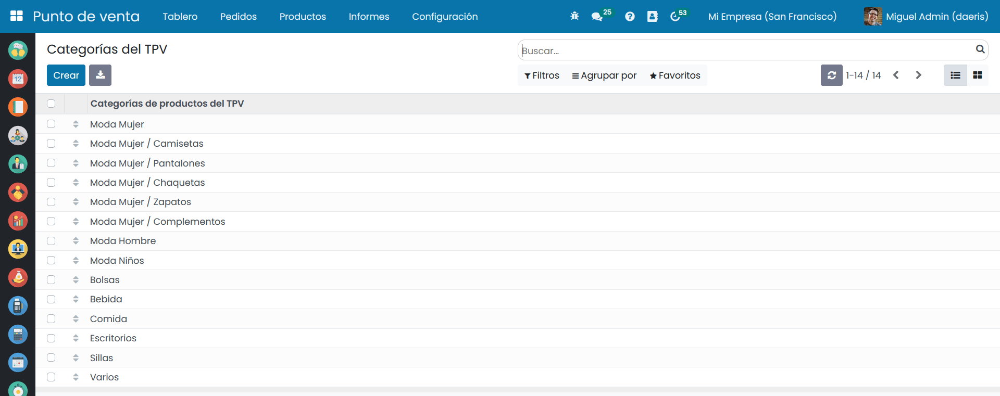

============
Productos
============

Configuración
=============

Crear categorías y subcategorías 
----------------------------------

Una de las tareas iniciales a la hora de configurar los productos que aparecerán en el TPV es la de crear **categorías**
de forma que los empleados se sientan cómodos a la hora de buscarlos.

Para que los TPV muestren los productos categorizados, navega a la pantalla
:menuselection:`Punto de Venta --> Configuración --> Categorías del TPV` y pulsa el botón *Crear*:

Al crear nuevas categorías, dispones de los siguientes campos:
    - **Imagen**: Aunque no es imprescindible, se recomienda incorporar una imagen intuitiva que haga referencia a la categoría. Se pueden incorporar diferentes tamaños de imagen, aunque se recomienda incorporar imágenes de 400x340 pixeles.
    - **Nombre**: Nombre de la categoría. Se recomienda incorporar nombres cortos.
    - **Categoría Padre**: En el caso de que sea una subcategoría, debes incorporar aquí la categoría padre.
    - **Secuencia**: Valor numérico que indica el orden en el que se mostrará la categoría.

.. image:: productos/categorias_form.png
   :align: center
   :alt: Formulario de categorías de productos del TPV

Una vez informados los campos necesarios, pulsa el botón *Guardar*.

A partir de ese momento, al iniciar sesión sobre el TPV, desde la pantalla :menuselection:`Punto de Venta --> Tablero`,
puedes ver una barra superior con el nombre de cada una de las **categorías**.

.. image:: productos/categorias_tpv_ini.png
   :align: center
   :alt: Al iniciar sesión sobre el TPV puedes ver una barra superior con el nombre de cada una de las categorías

Al hacer clic sobre una categoría, podrás visualizar las subcategorías que dispone.

Al pulsar sobre una categoría, el TPV realizará un filtro, mostrando los productos de esa categoría.

.. image:: productos/categorias_tpv_clic.png
   :align: center
   :alt: Al pulsar sobre una categoría, el TPV realizará un filtro, mostrando los productos de esa categoría.

En el caso de que quieras visualizar las imágenes de la categoría en un punto de venta, navega a la pantalla
:menuselection:`Punto de Venta --> Configuración --> Punto de Venta`, accede al detalle del TPV e informa la opción
**Imágenes de la categoría**.

.. image:: productos/categorias_opcion_imagen.png
   :align: center
   :alt: Accede al detalle del TPV e informa la opción Imágenes de la categoría

Una vez realizado el cambio, pulsa el botón Guardar. Al reanudar la sesión del TPV desde la pantalla
:menuselection:`Punto de Venta --> Tablero`, será posible visualizar las imágenes de las categorías y subcategorías.

.. image:: productos/categorias_ver_imagen.png
   :align: center
   :alt: Visualizar las imágenes de las categorías y subcategorías.

Asociar categorías al TPV
---------------------------------

En función del negocio, puedes llegar a disponer de varios TPVs, y cada uno de ellos puede configurarse de forma
distinta para adaptarse a sus necesidades. Por ejemplo, puedes disponer de una tienda física y una cafetería,
y un TPV en cada una de las ubicaciones.

A la hora de iniciar una venta, puedes indicar que cada TPV muestre exclusivamente, una seríe de categorías.
Para ello, navega a la pantalla :menuselection:`Punto de Venta --> Configuración --> Punto de Venta`, accede al detalle
de cada TPV e informa la opción **Restringir categorías de productos**. Posteriormente, selecciona todas las
categorías que necesites mostrar sobre el TPV y pulsa el botón **Guardar**.

.. image:: productos/categorias_restringir.png
   :align: center
   :alt: Indicar que un TPV muestre exclusivamente, una seríe de categorías

Al iniciar la sesión del TPV desde la pantalla :menuselection:`Punto de Venta --> Tablero`, se puede observar que,
solo se muestran las categorías previamente indicadas y sus productos asociados.

.. image:: productos/categorias_ver_imagen.png
   :align: center
   :alt: Solo se muestran las categorías previamente indicadas y sus productos asociados

Establecer una categoría inicial  
---------------------------------

En función del negocio, puedes llegar a disponer de varios TPVs, y cada uno de ellos puede configurarse de forma
distinta para adaptarse a sus necesidades. Por ejemplo, puedes disponer de una tienda física, separada por dos
espacios diferenciados (moda mujer, moda hombre) y un TPV en cada una de las secciones.

A la hora de iniciar una venta, puedes indicar que cada TPV disponga por defecto de una categoría establecida.
Para ello, navega a la pantalla :menuselection:`Punto de Venta --> Configuración --> Punto de Venta`, accede al detalle del TPV e informa
la opción **Categoría inicial**, que te permitirá seleccionar una categoría.

.. image:: productos/categorias_inicial.png
   :align: center
   :alt: Configurar que cada TPV disponga por defecto de una categoría establecida

Al reanudar la sesión del TPV desde la pantalla :menuselection:`Punto de Venta --> Tablero`, se puede observar que,
por defecto, se posiciona sobre la categoría indicada.

.. image:: productos/categorias_ver_inicial.png
   :align: center
   :alt: por defecto, se posiciona sobre la categoría inicial

Añadir productos 
---------------------------------

Para **añadir productos a los TPV**, navega a la pantalla :menuselection:`Punto de Venta --> Productos --> Productos` y
elimina el filtro predefinido *Disponible en TPV*.

.. image:: productos/productos_filtro.png
   :align: center
   :alt: Elimina el filtro predefinido , Disponible en TPV

Accede al detalle del producto y verifica que como mínimo, dispone de los siguientes campos informados:
    - **Nombre**
    - **Imagen** (se recomienda un tamaño de 340 x 400 pixeles)
    - **Puede ser vendido**
    - **Tipo de producto** (Almacenable)
    - **Precio de venta**
    - **Impuestos cliente**

Sobre la pestaña **Ventas**, debes informar el campo **Disponible en TPV** y la **Categoría**. Una vez finalizados
los cambios pulsa el botón *Guardar*.

.. image:: productos/productos_edita2.png
   :align: center
   :alt: Sobre la pestaña Ventas, debes informar el campo Disponible en TPV y la Categoría

Al navegar a la pantalla :menuselection:`Punto de Venta --> Productos --> Productos`, aparecerán todos los productos
disponibles en el TPV.

.. image:: productos/productos_filtro.png
   :align: center
   :alt: Al navegar a la pantalla aparecerán todos los productos disponibles en el TPV

Al iniciar la sesión del TPV desde la pantalla :menuselection:`Punto de Venta --> Tablero`, puedes encontrar los
productos configurados, que serán mostrados en base a la categoría sobre la que estés posicionado.

.. seealso::
   * :doc:`../../ventas/ventas/productos_precios`

Añadir código de barras a un producto
------------------------------------------

Para **añadir un código de barras a un producto**, navega a la pantalla :menuselection:`Punto de Venta --> Productos --> Productos`, aparecerán todos los productos
disponibles en el TPV. Posteriormente, haz clic sobre el producto que quieras editar y sobre la pestaña
información general, posiciónate sobre el campo **codigo de barras**.

Si dispones de lector de código de barras, puedes leer el código de barras del producto, acción que informará el código
sobre el campo. También puedes informar el campo manualmente.
Por último, haz clic sobre el botón **Guardar**.

.. image:: productos/productos_barras.png
   :align: center
   :alt: Puedes leer el código de barras del producto, acción que informará el código sobre el campo.

.. seealso::
   * :doc:`../../inventario_y_fabricacion/inventario/codigos_de_barras`

Productos y variantes
---------------------------------

Para 

Números de serie y lotes 
---------------------------------

Para 

