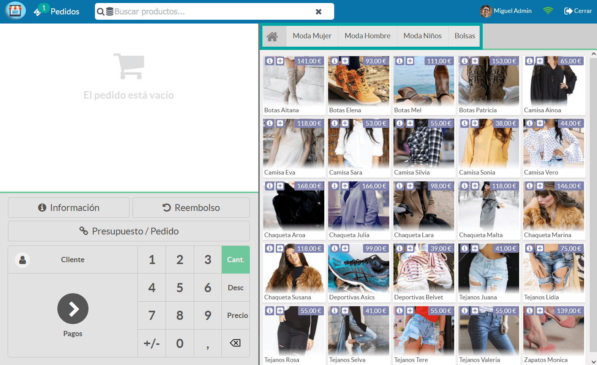
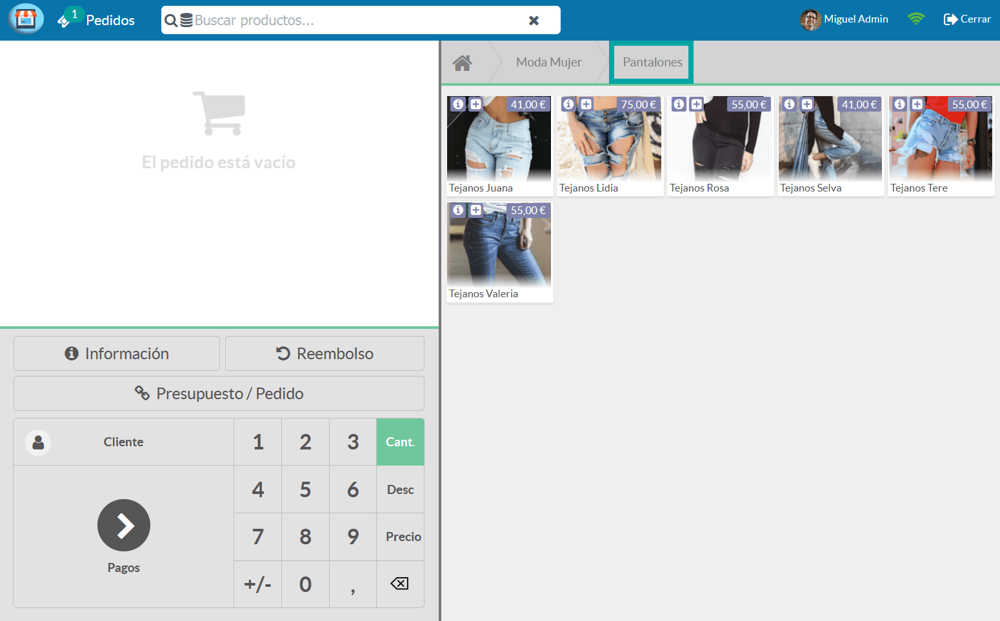
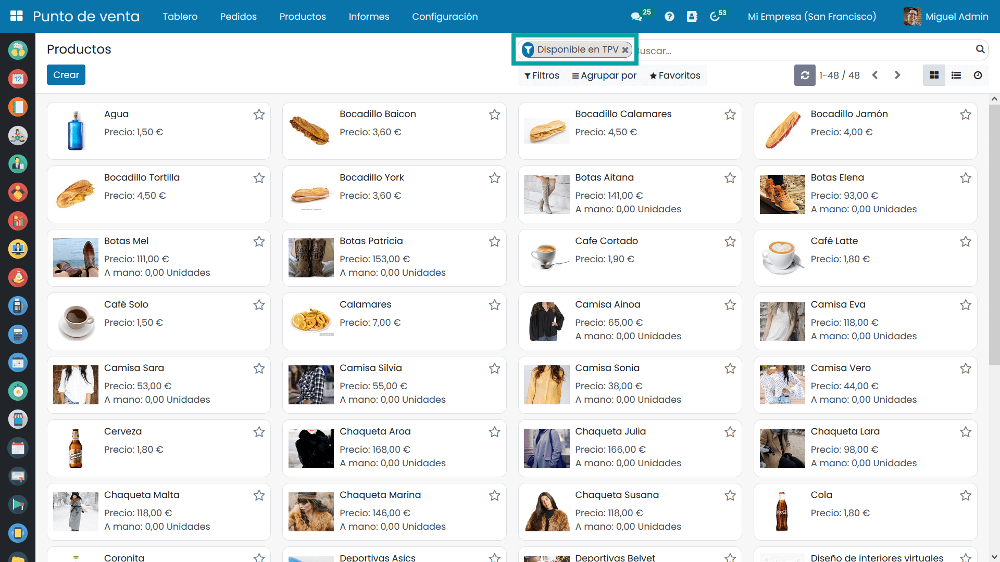
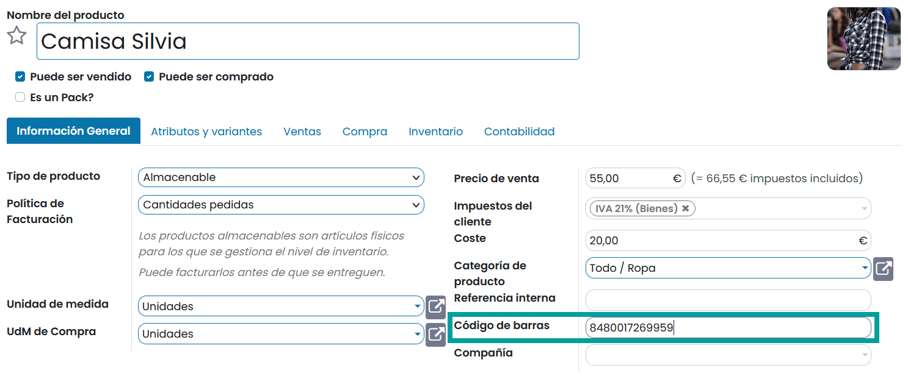
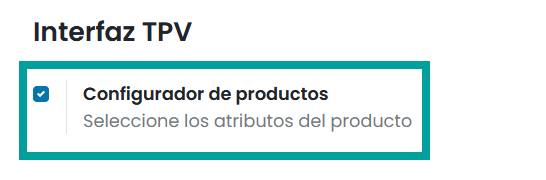
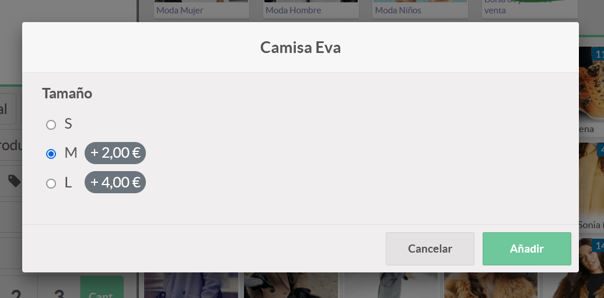
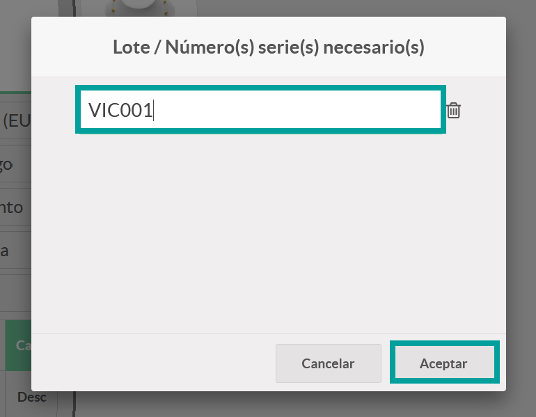

============
Productos
============

Categorías
=============

Crear categorías y subcategorías 
----------------------------------

Una de las tareas iniciales a la hora de configurar los productos que aparecerán en el TPV es la de crear **categorías**
de forma que los empleados se sientan cómodos a la hora de buscarlos.

Para que los TPV muestren los productos categorizados, navega a la pantalla
:menuselection:`Punto de Venta --> Configuración --> Categorías del TPV` y pulsa el botón *Crear*:

.. image:: productos/categorias.png
   :align: center
   :alt: Lista de categorías de productos del TPV

Al crear nuevas categorías, dispones de los siguientes campos:
    - **Imagen**: Aunque no es imprescindible, se recomienda incorporar una imagen intuitiva que haga referencia a la categoría. Se pueden incorporar diferentes tamaños de imagen, aunque se recomienda incorporar imágenes de 400x340 pixeles.
    - **Nombre**: Nombre de la categoría. Se recomienda incorporar nombres cortos.
    - **Categoría Padre**: En el caso de que sea una subcategoría, debes incorporar aquí la categoría padre.
    - **Secuencia**: Valor numérico que indica el orden en el que se mostrará la categoría.

Una vez informados los campos necesarios, pulsa el botón *Guardar*.

A partir de ese momento, al iniciar sesión sobre el TPV, desde la pantalla :menuselection:`Punto de Venta --> Tablero`,
puedes ver una barra superior con el nombre de cada una de las **categorías**.

Al hacer clic sobre una categoría, podrás visualizar las subcategorías que dispone.

.. image:: productos/categorias_tpv_sub.png
   :align: center
   :alt: Al hacer clic sobre una categoría, podrás visualizar las subcategorías que dispone

Al pulsar sobre una categoría, el TPV realizará un filtro, mostrando los productos de esa categoría.

En el caso de que quieras visualizar las imágenes de la categoría en un punto de venta, navega a la pantalla
:menuselection:`Punto de Venta --> Configuración --> Punto de Venta`, accede al detalle del TPV e informa la opción
**Imágenes de la categoría**.

Una vez realizado el cambio, pulsa el botón Guardar. Al reanudar la sesión del TPV desde la pantalla
:menuselection:`Punto de Venta --> Tablero`, será posible visualizar las imágenes de las categorías y subcategorías.

Asociar categorías al TPV
---------------------------------

En función del negocio, puedes llegar a disponer de varios TPVs, y cada uno de ellos puede configurarse de forma
distinta para adaptarse a sus necesidades. Por ejemplo, puedes disponer de una tienda física y una cafetería,
y un TPV en cada una de las ubicaciones.

A la hora de iniciar una venta, puedes indicar que cada TPV muestre exclusivamente, una serie de categorías.
Para ello, navega a la pantalla :menuselection:`Punto de Venta --> Configuración --> Punto de Venta`, accede al detalle
de cada TPV e informa la opción **Restringir categorías de productos**. Posteriormente, selecciona todas las
categorías que necesites mostrar sobre el TPV y pulsa el botón **Guardar**.

Al iniciar la sesión del TPV desde la pantalla :menuselection:`Punto de Venta --> Tablero`, se puede observar que,
solo se muestran las categorías previamente indicadas y sus productos asociados.

Establecer una categoría inicial  
---------------------------------

En función del negocio, puedes llegar a disponer de varios TPVs, y cada uno de ellos puede configurarse de forma
distinta para adaptarse a sus necesidades. Por ejemplo, puedes disponer de una tienda física, separada por dos
espacios diferenciados (moda mujer, moda hombre) y un TPV en cada una de las secciones.

A la hora de iniciar una venta, puedes indicar que cada TPV disponga por defecto de una categoría establecida.
Para ello, navega a la pantalla :menuselection:`Punto de Venta --> Configuración --> Punto de Venta`, accede al detalle del TPV e informa
la opción **Categoría inicial**, que te permitirá seleccionar una categoría.

Al reanudar la sesión del TPV desde la pantalla :menuselection:`Punto de Venta --> Tablero`, se puede observar que,
por defecto, se posiciona sobre la categoría indicada.

Gestionar productos
====================

Añadir productos
---------------------------------

Para **añadir productos a los TPV**, navega a la pantalla :menuselection:`Punto de Venta --> Productos --> Productos` y
elimina el filtro predefinido *Disponible en TPV*.

Accede al detalle del producto y verifica que como mínimo, dispone de los siguientes campos informados:
    - **Nombre**
    - **Imagen** (se recomienda un tamaño de 340 x 400 pixeles)
    - **Puede ser vendido**
    - **Tipo de producto** (Almacenable)
    - **Precio de venta**
    - **Impuestos cliente**

.. image:: productos/productos_edita.png
   :align: center
   :alt: Verifica que como mínimo, dispone de los campos Nombre, Imagen , Puede ser vendido, Tipo de producto, Precio de venta, Impuestos cliente, informados.

Sobre la pestaña **Ventas**, debes informar el campo **Disponible en TPV** y la **Categoría**. Una vez finalizados
los cambios pulsa el botón *Guardar*.

.. image:: productos/productos_edita2.png
   :align: center
   :alt: Sobre la pestaña Ventas, debes informar el campo Disponible en TPV y la Categoría

Al navegar a la pantalla :menuselection:`Punto de Venta --> Productos --> Productos`, aparecerán todos los productos
disponibles en el TPV.

Al iniciar la sesión del TPV desde la pantalla :menuselection:`Punto de Venta --> Tablero`, puedes encontrar los
productos configurados, que serán mostrados en base a la categoría sobre la que estés posicionado.

.. image:: productos/productos_tpv.png
   :align: center
   :alt: Puedes encontrar los productos configurados, que serán mostrados en base a la categoría sobre la que estés posicionado

.. seealso::
   * :doc:`../../ventas/ventas/productos_precios`

Añadir código de barras a un producto
------------------------------------------

Para **añadir un código de barras a un producto**, navega a la pantalla :menuselection:`Punto de Venta --> Productos --> Productos`, aparecerán todos los productos
disponibles en el TPV. Posteriormente, haz clic sobre el producto que quieras editar y sobre la pestaña
información general, posiciónate sobre el campo **código de barras**.

Si dispones de lector de código de barras, puedes leer el código de barras del producto, acción que informará el código
sobre el campo. También puedes informar el campo manualmente.
Por último, haz clic sobre el botón **Guardar**.

.. seealso::
   * :doc:`../../inventario_y_fabricacion/inventario/codigos_de_barras`

Gestionar variantes de productos
=================================

Las variantes de productos son usadas para administrar productos que tienen diferentes variaciones, como talla, color, etc.
Permite administrar el producto a nivel de modelo (para todas las variaciones) y a nivel de variante (atributos específicos).

Por ejemplo, una compañía que vende camisetas puede tener el siguiente producto:

-  Camiseta EVA

   -  Tamaño: S, M, L

En este ejemplo, **Camiseta EVA** es la denominación del modelo y **Camiseta EVA, S** es una variante. El tamaño es un **atributo**.

El ejemplo anterior tiene un total de 3 productos diferentes (3 tamaños). Cada uno de estos productos tiene
su propio inventario, ventas, etc.

.. seealso::
   * :doc:`../../ventas/ventas/productos_precios/productos/variantes`

Por defecto, el TPV de Daeris muestra las variantes de producto en base al modo de creación del atributo.

Recordamos que existen tres modos de creación de variantes sobre los atributos:
   -  **Instantáneamente**: todas las variantes se crean cuando se asocian los atributos y sus valores al producto.
   -  **Dinámicamente**: todas las variantes se crean cuando productos que disponen de atributos se asocian al pedido de venta.
   -  **Nunca**: No se crean variantes de producto

En función del modo de creación del atributo asociado al producto, el TPV mostrará el producto de un modo u otro:

   -  **Instantáneamente**: El TPV mostrará un producto por cada variante.
   -  **Dinámicamente**: El TPV no mostrará el producto si no se ha creado previamente a partir de su venta a través de un pedido.
   -  **Nunca**: El TPV mostrará el producto sin variantes.

Si vamos a vender nuestros productos con variantes desde el TPV es recomendable que el modo de creación de sus
atributos sea:

   -  **Instantáneamente**: Esta opción muestra todas las variantes como productos. Si disponemos de muchas variantes puede provocar confusión a la hora de seleccionar el producto con una variante determinada.
   -  **Nunca**: Esta opción muestra un único producto, sin seleccionar variante alguna, aunque como veremos en el siguiente apartado, esta opción puede ser muy recomendable.

Configurador de productos
--------------------------

En el caso que nuestros productos dispongan de variantes cuyos atributos tengan el modo de creación **Nunca**,
es posible activar el **configurador de productos** del TPV.

Si activamos esta opción, cada vez que seleccionemos el producto, se mostrará por pantalla un **asistente de selección**
que permitirá escoger una variante determinada.

Para activar el configurador de productos , navega a la pantalla :menuselection:`Punto de Venta --> Configuración --> Punto de Venta`, accede al detalle
del TPV y marca la opción **Configurador de productos**. Recuerda hacer clic sobre el botón **Guardar** para que tus
cambios queden registrados.

Al iniciar una sesión de TPV, tus productos que dispongan de variantes cuyos atributos tengan el modo
de creación **Nunca**, se visualizarán como un único producto.

.. image:: productos/producto1.png
   :align: center
   :alt: Configurador de productos del TPV

Si hacemos clic sobre el botón **(i)**, incorporado sobre la imagen del producto, aparecerá una nueva pantalla
con información relacionada con el producto, dese dónde es posible visualizar sus atributos.

Si hacemos clic sobre el producto, se muestra una ventana de selección con los atributos del producto.

Si seleccionamos un atributo y hacemos clic sobre el botón **Añadir**, la variante se asocia al pedido.

Al realizar el pago, la variante aparece sobre el recibo. Sobre el apartado descuentos aparece el importe
añadido sobre la variante (en el caso de disponer de él).

Números de serie y lotes
==========================

Usar los números de serie y lotes permite rastrear los movimientos de los productos e identificar su ubicación
en función de su último movimiento.

Para habilitar la trazabilidad, navega a la pantalla :menuselection:`Punto de Venta --> Productos --> Productos`,
accede al detalle del producto que desees configurar y posiciónate sobre la pestaña **Inventario**.

Sobre el campo **Seguimiento** informa la opción **Por número de serie único** y haz clic sobre el botón **Guardar**.

.. seealso::
   * :doc:`../../inventario_y_fabricacion/inventario/gestion/productos/lotes_numeros_serie`

Introducir números de serie y lotes
-------------------------------------

Daeris permite importar números de serie sobre el punto de venta.

Para ello, tan solo has de seleccionar desde el TPV un producto configurado con seguimiento por número de serie o lote.
El sistema solicita introducir el número de serie o el lote asociado al producto.

.. image:: productos/serie2.png
   :align: center
   :alt: Informar la opción por número de serie único

Introduce el número y si necesitas incorporar más de uno, haz clic sobre la tecla **Intro** para generar una nueva línea.
Finalmente haz clic sobre el botón **Aceptar**.

Los números de serie o lote, aparecen en la línea de pedido. Es posible volver a abrir la ventana en el caso que
necesites corregir algún dato, haciendo clic sobre el icono que aparece junto al nombre del producto.

Cambiar la cantidad de un producto rastreado usando el teclado numérico cambiará el color del botón
de apertura de ventana de introducción de números a rojo.

Haga clic sobre él para añadir los números de serie/lote pendientes de introducir.

.. image:: productos/serie6.png
   :align: center
   :alt: Informar la opción por número de serie único

Los números de serie aparecerán sobre el ticket de compra cuando el cliente realice el pago.

Es importante indicar que los números de lote y de serie son obligatorios  en la gestión de los productos rastreados, pero no incorporarlos al pedido **no impide completar la venta**.
El sistema realizará un aviso que puede ser ignorado por el vendedor.

Añadir números de serie y lotes sobre pedidos
-----------------------------------------------

Daeris permite finalizar la venta de un pedido de venta no completado a través del TPV.
Si este pedido dispone de productos rastreados, los números de serie/lotes serán solicitados al seleccionar el pedido.

Para cargar un pedido haz clic sobre el botón **Pedido** del TPV.

Al hacer clic sobre el botón pedido se muestra un listado con los pedidos disponibles.
Al seleccionar un pedido que disponga de productos rastreados se solicitará si deseas cargarlos.

En el caso de confirmar, los números de serie serán incorporados sobre la línea del pedido

