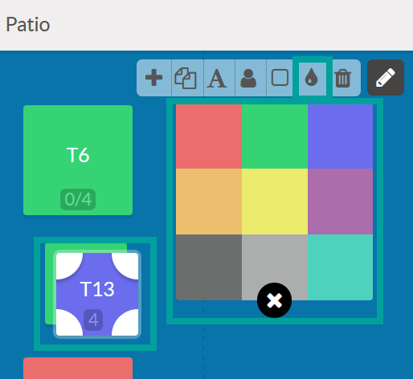
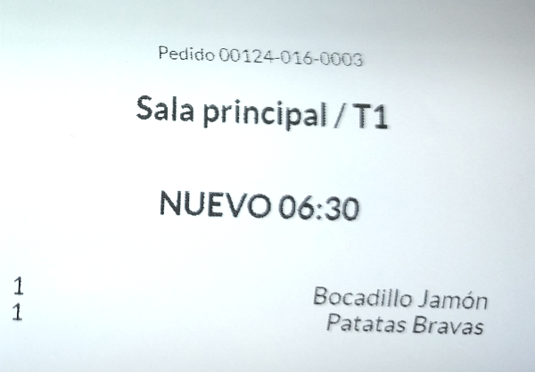
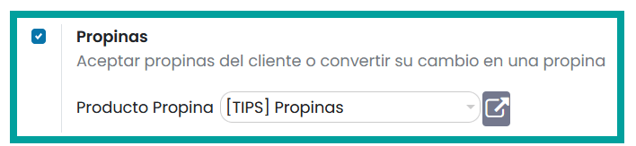

============================
Modo Restaurante/Bar
============================

Configuración inicial
======================

Función en modo restaurante/bar
--------------------------------

Daeris permite disponer de múltiples TPVs y cada TPV se puede configurar para que funcione en modo normal o
modo restaurante.

En el caso de configurar el TPV de un bar/restaurante, navega a la pantalla
:menuselection:`Punto de Venta --> Configuración --> Punto de Venta`, accede al detalle
del TPV y sobre el apartado **Configuración del TPV marca la opción **Es un bar/restaurante**.

Una vez marcada la opción,se habilitarán todas las opciones disponibles en exclusiva para TPVs configurados en modo
restaurante. Dichas opciones están acompañadas del siguiente símbolo:

.. note::
   El resto de opciones disponibles se utilizan del mismo modo que para los TPVs genéricos, es decir, aquellos que no tienen la marca de bar/restaurante activa.

Configurar las mesas de las salas
-----------------------------------

Daeris permite crear mapas de las mesas de las distintas salas para que se puedan gestionar desde el TPV.

Para habilitar esta opción, navega a la pantalla :menuselection:`Punto de Venta --> Configuración --> Punto de Venta`, accede al detalle
del TPV y sobre el apartado **Interfaz TPV** marca la opción **Salas y mesas** e incorpora las salas
correspondientes.

En el caso de no disponer de salas creadas, se pueden dar de alta haciendo clic sobre el enlace **Salas** que aparece
al activar la opción.

.. image:: restaurante/mesas02.png
   :align: center
   :alt: Salas

Desde la pantalla de gestión de salas, es posible crear nuevas salas mediante el botón **Crear**.

Sobre cada sala, debes seleccionar el nombre de la sala, el TPV relacionado, así como los nombres, número de
asientos y forma de cada una de las mesas.

.. note::
   No es necesario crear las mesas en este punto. Si lo deseas, puedes crear las mesas, seleccionar sus asientos, forma, tamaño y distribución, al iniciar sesión en el terminal de punto de venta.

Al iniciar una nueva sesión de TPV desde la pantalla :menuselection:`Punto de Venta --> Tablero`,
se navega a una pantalla donde aparecen botones con los nombres de las salas.

Sobre esta pantalla debes incorporar el mapa de las mesas que conforman la sala.
Para crear el mapa, pulsa el botón **Editar**.

.. note::
   La opción de editar solo esta disponible para administradores del TPV. El botón puede aparecer parcialmente oculto si el fondo de la sala usa un color muy oscuro.

Al editar la sala, dispones de una barra de edición del mapa que ofrece diversas opciones.

.. image:: restaurante/mesas06.png
   :align: center
   :alt: Opciones de edición de la sala

Mediante el botón **Añadir**, es posible crear una nueva mesa sobre el salón.

Con el botón **Duplicar**, se duplica la mesa seleccionada.

Además, con el botón de **Texto**, es posible incorporar el nombre de la mesa seleccionada.

.. image:: restaurante/mesas09.png
   :align: center
   :alt: Nombre de la mesa

También es posible incorporar el número de comensales que pueden llegar a ocupar la mesa, utilizando el botón
de **Comensales**. Cada mesa muestra el número de comensales mediante un número.

Con el botón de **Forma** es posible convertir la mesa seleccionada en redonda o cuadrada.

Por otro lado, con el botón de **Color** se despliega una paleta de colores que permite seleccionar el color de
las mesas y del suelo de la sala.

Por último, el botón **Borrar** permite borrar el objeto seleccionado.

Mediante este sistema es posible crear los mapas de distintas salas usando distintos nombres para las mesas,
distintos colores de mesas y salas, etc. También es posible arrastrar y soltar las mesas en la ubicación deseada, así como modificar su tamaño.

.. image:: restaurante/mesas14.png
   :align: center
   :alt: Salón del TPV

Cada una de las salas puede mantener su propio diseño y composición, sin afectar al resto de salas.

Una vez diseñadas las salas, al hacer clic sobre una mesa, se abre un nuevo pedido de TPV atendiendo a la mesa
indicada.

Pedidos
=============

Indicar el número de comensales de una mesa 
--------------------------------------------

Para indicar el número de comensales de una mesa, inicia sesión en el TPV desde la pantalla
:menuselection:`Punto de Venta --> Tablero`, y haz clic sobre la mesa donde deseas incorporar los comensales.

Sobre la pantalla de pedido, pulsa el **botón Clientes**.

A continuación, incorpora el número de clientes de la mesa.

.. image:: restaurante/comensales03.png
   :align: center
   :alt: Clientes de la mesa

Sobre el botón **clientes**, se puede consultar el número total de clientes seleccionado.

.. image:: restaurante/comensales04.png
   :align: center
   :alt: Clientes de la mesa

Sobre el mapa de la sala, la mesa queda **sombreada** por la parte proporcional de clientes en relación al
número máximo de clientes que soporta la mesa.

Añadir notas internas un pedido
---------------------------------

Para añadir notas internas a las líneas del pedido,
navega a la pantalla :menuselection:`Punto de Venta --> Configuración --> Punto de Venta`, accede al detalle
del TPV y sobre el apartado **Interfaz TPV** marca la opción **Notas internas**.

Al iniciar una nueva sesión de TPV desde la pantalla :menuselection:`Punto de Venta --> Tablero`,
tras iniciar un pedido, se habilita un nuevo botón **Nota interna**.

Al pulsar el botón, el sistema abre un formulario que permite informar una nota sobre la línea de pedido actual.

Una vez introducida la nota, esta quedará asociada a la línea del pedido.

Gestionar la impresión de pedidos de barra / cocina
----------------------------------------------------

Cuando un empleado toma nota de un pedido, puede tener la necesidad de indicar a cocina que debe elaborar
una serie de platos del pedido o a la barra que debe preparar ciertas bebidas.

Estas peticiones se suelen realizar emitiendo una **impresión del pedido** sobre una impresora que deben gestionar los
empleados de cocina.

Para permitir emitir impresiones de pedidos, navega a la pantalla :menuselection:`Punto de Venta --> Configuración --> Punto de Venta`, accede al detalle
del TPV y sobre el apartado **Dispositivos conectados** marca la opción **Pedido en impresora**.

Para usar esa opción es necesario incorporar una impresora. Si no dispones de impresoras configuradas
puedes crear una nueva haciendo clic sobre el enlace **Impresoras**.

.. image:: restaurante/imprimir02.png
   :align: center
   :alt: Impresoras

El sistema navega a la pantalla de impresoras de pedido, donde puedes crear una nueva impresora mediante el botón
**Crear**.

Al crear una nueva impresora debes informar un **nombre** , la **dirección IP** de la impresora Epson y
las **categorías** de productos que puedan llegar a imprimirse sobre un pedido.

.. note::
   Por ejemplo, si en un bar tienes la categoría comida y la categoría bebida, y solo quieres que se impriman los productos de la categoría comida, añade únicamente la categoría comida a la impresora. Todos los productos de la categoría bebida no se imprimirán sobre esa impresora.

Al iniciar una nueva sesión de TPV desde la pantalla :menuselection:`Punto de Venta --> Tablero`, tras iniciar
un pedido, se habilita un nuevo botón Pedido,

Cada vez que selecciones un producto que pertenezca a la categoría de la impresora, dicho producto se establecerá
con **color verde** sobre la línea del pedido. El botón **pedido** también se sombreará en verde.

.. image:: restaurante/imprimir05.png
   :align: center
   :alt: Pedido de impresora

Al pulsar el botón **Pedido**, se pedirá confirmación para imprimir mediante una nueva ventana del navegador.

.. image:: restaurante/imprimir06.png
   :align: center
   :alt: Imprimir pedido

Sobre la impresión, puedes encontrar el número de pedido, la ubicación, la hora, la instrucción y el contenido
de productos de la categoría.

Las líneas de pedido verdes, así como el sombreado verde del propio botón, desaparecerán una vez impreso el pedido.

Actualizar pedidos de cocina
-------------------------------

Una vez hayas gestionado un pedido y emitido la correspondiente nota a cocina, puede darse el caso de que tengas que
corregir, ampliar o reducir el pedido e informar a cocina.

Para ello, inicia sesión en el TPV desde la pantalla :menuselection:`Punto de Venta --> Tablero`, y desde el pedido a actualizar,
realiza los cambios correspondientes sobre las líneas de pedido afectadas.

Cada cambio se verá reflejado en color verde. Además, el botón **Pedido** volverá a disponer del sombreado verde.

Al pulsar el botón **Pedido**, se solicitará confirmación para **imprimir** mediante una nueva ventana del navegador.

.. image:: restaurante/imprimirmas02.png
   :align: center
   :alt: Imprimir pedido

Sobre la impresión, puedes encontrar el número de pedido, la ubicación, la hora, la instrucción y el contenido de productos de la categoría.

Las líneas de pedido verdes, así como el sombreado verde del propio botón, desaparecerán una vez impreso el pedido.

.. note::
   Para permitir emitir impresiones de pedidos, debes tener habilitada la opción **Pedido en impresora** en la configuración de la TPV, y haber informado al menos una impresora.

Transferir los clientes de una mesa a otra
-------------------------------------------
En ocasiones ocurre que existe la necesidad de mover a clientes de una mesa a otra cuando ya han iniciado un pedido.
Esta acción puede convertirse en un problema si el sistema no es capaz de controlar esta situación.

Al iniciar una nueva sesión de TPV desde la pantalla :menuselection:`Punto de Venta --> Tablero`,
tras iniciar un pedido, se habilita un nuevo botón **Transferir**.

El sistema navegará a la pantalla de selección de mesa, desde donde será posible escoger sala y mesa.

Al seleccionar la nueva ubicación, se transferirá el pedido a la ubicación deseada manteniendo los detalles
del pedido.

.. image:: restaurante/transferir03.png
   :align: center
   :alt: Pedido TPV

Pagos
=======

Dividir el pago de una cuenta
-------------------------------
Para permitir que los clientes fraccionen el pago de una cuenta por productos,
navega a la pantalla :menuselection:`Punto de Venta --> Configuración --> Punto de Venta`, accede al detalle
del TPV y sobre el apartado **Facturas y recibos** marca la opción **Separación de la cuenta**.

Al iniciar una nueva sesión de TPV desde la pantalla :menuselection:`Punto de Venta --> Tablero`, tras iniciar un
pedido, se habilita un nuevo botón **Dividir**.

Al pulsar el botón **Dividir**, el sistema navega a la pantalla de pagos, donde será posible efectuar el pago de
los productos indicando las **unidades de cada producto**. Mediante este sistema, el resto del pago se realizará
posteriormente.

Al seleccionar los productos a cobrar, se actualizará el precio de dichos productos, y se podrá realizar el pago
de los mismos mediante el botón **Pagos**.

De esta manera, se completará el primer pago.

Y se imprimirá el ticket correspondiente.

Al finalizar el primer pago, si vuelves al detalle del pedido, aparecen el resto de productos pendientes de cobrar.

El procedimiento a realizar puede ser el re realizar el pago restante mediante el botón **pagos** o el de continuar
dividiendo la cuenta mediante el botón **Dividir**.

Imprimir una cuenta antes de realizar el pago
-------------------------------------------------

Para permitir ofrecer a un cliente su cuenta impresa sin tener que mantenerse a la espera de la gestión del pago,
navega a la pantalla :menuselection:`Punto de Venta --> Configuración --> Punto de Venta`, accede al detalle
del TPV y sobre el apartado **Facturas y recibos** marca la opción **Impresión de la cuenta**.

.. note::
   Una cuenta impresa o recibo no puede considerarse una factura, ni una factura simplificada ya que para ello debe disponer de un código de secuencia único. Dicho código de secuencia se facilita tras haber realizado el correspondiente pago.

Al iniciar una nueva sesión de TPV desde la pantalla :menuselection:`Punto de Venta --> Tablero`, tras iniciar
un pedido, se habilita un nuevo botón **Recibo** precedido del icono de una impresora.

Al pulsar el botón, el sistema navega a la pantalla de impresión de la cuenta.

Al hacer clic sobre el botón Imprimir, se llevará a cabo la impresión.

Gestionar las propinas antes de completar un pago
--------------------------------------------------

Para permitir registrar las propinas ofrecidas por los clientes y descontarlas del cambio a devolver,
navega a la pantalla :menuselection:`Punto de Venta --> Configuración --> Punto de Venta`, accede al detalle
del TPV y sobre el apartado **Pagos** marca la opción **Propinas**.

Al habilitar esta opción, dispondrás del producto “[TIPS] Propinas” configurado en el campo Producto Propina.
Para no alterar la funcionalidad de gestión de propinas, se recomienda no editar este producto, a excepción
de la imagen sobre la que puedes incorporar la imagen que consideres oportuna.

Al iniciar una nueva sesión de TPV desde la pantalla :menuselection:`Punto de Venta --> Tablero`, tras iniciar
un pedido, y sobre la página de gestión de pagos, se habilita un nuevo botón **Propina**.

Al pulsar sobre el botón **propina**, es posible incorporar el importe que los clientes dejan como propinas.
Inicialmente se propone el importe del cambio completo, pero puedes incorporar el valor que haya ofrecido el
cliente en el caso de que no se ofrezca el cambio completo como propina.

Sobre el pedido, se mostrará como saldo pendiente, el importe más la propina.

Al validar el pedido, se mostrará sobre el ticket, el producto propina con el correspondiente importe ofrecido
por el cliente.

