==========================================
Tarifas, Promociones y Descuentos
==========================================

Precios
=============

Incorporar el precio de un artículo de un pedido de forma manual 
------------------------------------------------------------------

Al realizar un pedido en una sesión de TPV, los artículos que seleccionas arrastran el precio por defecto. Aun así,
puede darse el caso de que quieras **modificar el precio del artículo de forma manual**. Para ello, haz clic sobre
la línea del artículo (aparecerá sombreada).

.. image:: tarifas_promociones/seleccion.png
   :align: center
   :alt: Artículo seleccionado TPV

Posteriormente, y sobre el teclado numérico, deberás pulsar sobre la opción **Precio**. A continuación, introduce el
precio que quieres asignar al artículo.

.. note::
   Es importante aclarar que el precio que se asignará es por artículo. Si dispones de una cantidad superior a 1, el precio final de la línea será igual al precio introducido, multiplicado por el número de artículos de la línea.

En el caso de que desees que únicamente los empleados con permisos de **administrador** del punto de venta puedan
modificar los precios de los productos al realizar ventas sobre el TPV, navega a la pantalla
:menuselection:`Punto de Venta --> Configuración --> Punto de Venta`, accede al detalle de un TPV y marca la opción
**control de precios**.

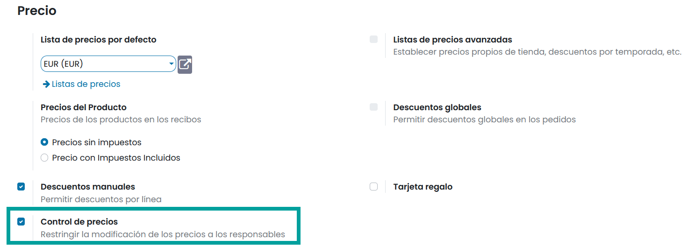

Al usar esta opción, el botón **Precio** aparecerá deshabilitado sobre los empleados que no sean administradores.

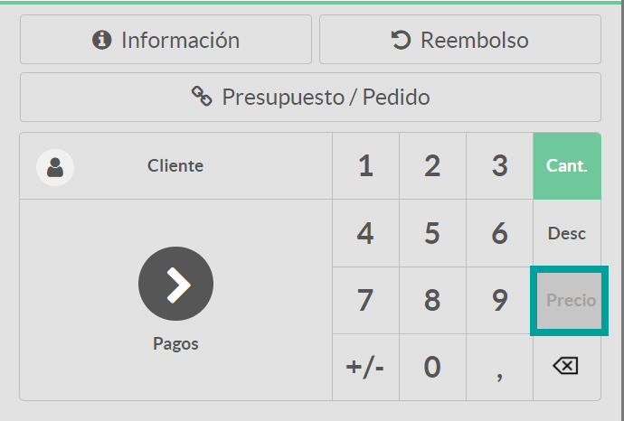

Permitir seleccionar entre distintos tipos de impuestos
--------------------------------------------------------

Daeris, permite dar la opción a los empleados de **seleccionar entre diferentes tipos de impuestos** en los TPV, para
que ciertos tipos de ventas puedan acogerse a ellos.

Para ello, navega a la pantalla :menuselection:`Punto de Venta --> Configuración --> Punto de Venta`,
accede al detalle de un TPV y marca la opción **Posición fiscal por pedido**, indicando todas las posiciones fiscales
disponibles para el cliente. También es posible escoger una posición fiscal especifica que será la que se use por defecto,
incorporándola sobre la opción **Posición fiscal**.

Al reanudar la sesión de TPV desde la pantalla :menuselection:`Punto de Venta --> Tablero`, puedes observar un nuevo
botón sobre el teclado numérico referente al **impuesto**.

.. image:: tarifas_promociones/boton_impuesto.png
   :align: center
   :alt: Impuesto en el TPV

Al hacer clic sobre el botón **Impuesto**, aparecerá un nuevo desplegable donde podrás seleccionar el impuesto que
quieras usar para el pedido.

.. image:: tarifas_promociones/seleccionar_impuesto.png
   :align: center
   :alt: Seleccionar impuesto

Una vez seleccionado el impuesto, sobre el botón de impuestos, aparecerá el impuesto seleccionado. Este impuesto
será aplicado sobre todas las líneas del pedido.

.. image:: tarifas_promociones/impuesto_aplicado.png
   :align: center
   :alt: Impuesto en el pedido del TPV

Mostrar los impuestos de los precios de los artículos
------------------------------------------------------

Una de las opciones que permite configurar Daeris, es cómo mostrar los impuestos de los precios de los artículos del
recibo.

Para gestionar cómo mostrar los precios de los productos, accede a la pantalla :menuselection:`Punto de Venta --> Configuración --> Punto de Venta`,
accede al detalle de un TPV y sobre el apartado de **precio** marca la opción **Precios sin impuestos**, para que los precios se muestren sin impuestos.

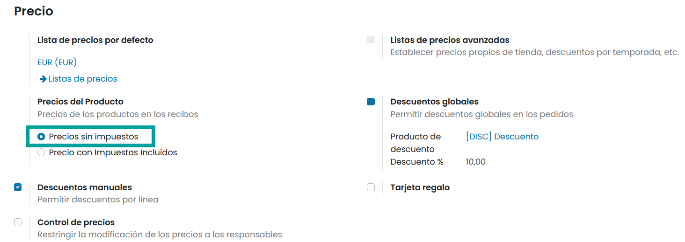

Marcando la opción de **precios sin impuestos**, la única referencia que se hace a los impuestos en la sesión de TPV
es sobre la sub línea Impuestos del importe total (los precios de cada artículo aparecen sin impuestos).

.. image:: tarifas_promociones/impuestos_pedido.png
   :align: center
   :alt: Impuestos del pedido

Además, con esta opción activa, la única referencia que se hace a los impuestos en el ticket de caja, es sobre la
sub línea **Impuesto** del subtotal.

.. image:: tarifas_promociones/impuestos_ticket.png
   :align: center
   :alt: Impuestos del ticket de caja

Para incluir los impuestos, accede a la pantalla :menuselection:`Punto de Venta --> Configuración --> Punto de Venta`,
accede al detalle de un TPV y sobre el apartado de **precio** marca la opción **Precios con impuestos incluidos**, para que los precios incorporen los impuestos.

.. image:: tarifas_promociones/precios_con_impuestos.png
   :align: center
   :alt: Precios con impuestos

Marcando la opción de **precios con impuestos incluidos**, la referencia que se hace a los impuestos en la sesión de TPV
es sobre la sub línea Impuestos del importe total (los precios de cada artículo aparecen con los impuestos incluidos).

Además, con esta opción activa, la referencia que se hace a los impuestos en el ticket de caja, es sobre las
líneas finales donde se detallan los distintos tipos de impuestos y su importe total.

Usar Tarifas
------------------------
Ya sea porque dispones de diferentes tiendas con precios distintos, porque dispones de una promoción especial de
temporada, o simplemente porque rebajas ciertos artículos descatalogados, puedes usar las tarifas sobre
el TPV.

Para usar las tarifas, navega a la pantalla :menuselection:`Punto de Venta --> Configuración --> Ajustes`,
y marca la opción **Tarifas**, así como la opción para calcularla.

.. image:: tarifas_promociones/opcion_tarifas.png
   :align: center
   :alt: Reglas de precio avanzadas

Para el siguiente ejemplo se utilizará la opción **reglas de precio avanzadas**, aunque también es posible utilizar múltiples precios por producto.

.. seealso::
   * :doc:`../../ventas/ventas/productos_precios/precios/precios`

Posteriormente, navega a la pantalla :menuselection:`Punto de Venta --> Producto --> Tarifas`, y crea una nueva
**tarifa**. En este ejemplo, se muestra una tarifa con un 10% de descuento para los artículos de la categoría “Todo / Ropa”.

.. note::
   Informar la opción Mostrar al cliente el precio al público y el descuento solo tendrá uso sobre las tarifas aplicadas en el sitio web.

Para indicar al TPV que debe usar la tarifa previamente creada, navega a la pantalla
:menuselection:`Punto de Venta --> Configuración --> Punto de Venta`, accede al detalle del TPV y marca la
opción **Tarifa**.

Posteriormente, añade a las **listas de precios disponibles** la tarifa recién creada y, en caso de ser necesario,
la puedes incorporar como **tarifa predeterminada**.

Al incorporar una tarifa predeterminada, esta aparecerá como tarifa inicial en el TPV sobre un nuevo botón disponible
en el teclado numérico.

Al añadir artículos al pedido, se utilizará la tarifa seleccionada, aplicando los precios correspondientes
sobre las líneas del pedido.

.. image:: tarifas_promociones/tarifa_precios.png
   :align: center
   :alt: Precios de los productos

Es posible cambiar de tarifa haciendo clic sobre el botón **tarifas**, lo que permitirá escoger la tarifa a aplicar
sobre los productos.

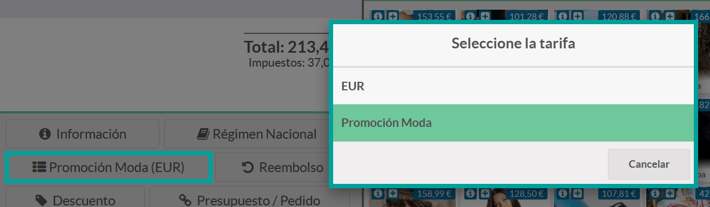

Usar tarifas para clientes VIP
-----------------------------------------
El TPV de Daeris permite la opción de aplicar tarifas específicas a clientes. Para usar las tarifas, navega a la
pantalla :menuselection:`Punto de Venta --> Configuración --> Ajustes`, y marca la opción **Tarifas**, así como la
opción para calcularla.

.. image:: tarifas_promociones/opcion_tarifas.png
   :align: center
   :alt: Reglas de precio avanzadas

Para el siguiente ejemplo se utilizará la opción **reglas de precio avanzadas**, aunque también es posible utilizar múltiples precios por producto.

.. seealso::
   * :doc:`../../ventas/ventas/productos_precios/precios/precios`

Posteriormente, navega a la pantalla :menuselection:`Punto de Venta --> Producto --> Tarifas`, y crea una nueva tarifa. En este ejemplo,
se muestra una tarifa con un 25% de descuento para todos los artículos.

Para indicar al TPV que puede usar la tarifa previamente creada, navega a la pantalla
:menuselection:`Punto de Venta --> Configuración --> Punto de Venta`, accede al detalle del TPV y marca la opción
**Tarifa**. Posteriormente, añade a las **listas de precios disponibles** la tarifa recién creada.

.. image:: tarifas_promociones/tarifas_disponibles.png
   :align: center
   :alt: Listas de precio disponibles

Una vez dispongas de la tarifa, añade la lista de precios a los clientes que quieras identificar como VIP.
Para ello, navega a la pantalla :menuselection:`Punto de Venta --> Pedidos --> Clientes`. Sobre cada cliente a identificar como VIP,
deberás posicionarte en la pestaña **Ventas y Compras** y seleccionar la **tarifa** correspondiente.

Una vez completados estos pasos, al reanudar la sesión de TPV, selecciona un cliente mediante el botón **Cliente**.

Al seleccionar a un cliente que disponga de tarifa asociada, esta se incorporará automáticamente al pedido.

Una vez hecho esto, se puede observar cómo aparece seleccionada la tarifa del cliente.

Cada vez que se seleccione un artículo, se aplicarán los precios basados en la lista de precios indicada.

.. image:: tarifas_promociones/tarifa_aplicada.png
   :align: center
   :alt: Tarifa aplicada al cliente

El empleado podrá, si lo desea, cambiar la lista de precios de forma manual, haciendo clic sobre el botón de lista
de precios.

.. image:: tarifas_promociones/cambio_tarifa.png
   :align: center
   :alt: Seleccionar la lista de precios

Cupones y promociones
======================

Daeris, permite el uso de programas de promoción y cupones para aumentar las ventas de tu negocio.
Los programas de promoción y los cupones están relacionados directamente con la aplicación de ventas.

Para activar los programas de promoción y cupones, navega a la
pantalla :menuselection:`Punto de Venta --> Configuración --> Ajustes`, marca la opción **Cupones y promociones**,
y haz clic sobre el botón **Guardar**.

Programas promocionales
---------------------------

Para crear un nuevo programa de promoción, navega a la pantalla
:menuselection:`Punto de Venta --> Productos --> Programas promocionales`, y haz clic sobre el botón **Crear**.

.. seealso::
   * :doc:`../../sitios_web/ecommerce/productos_precios/precios/precios`

Sobre el formulario es posible informar:

    - **Nombre**: Se recomienda un texto corto y descriptivo.
    - **Condiciones**: Reglas que permiten hacer uso del programa promocional. Se deben establecer por cliente o por producto para determinar, cuando se puede usar el programa promocional.
    - **Validez**: permite indicar el número máximo de pedidos sobre los que aplica, así como la fecha de inicio y fin de la promoción.
    - **Cantidad**: cantidad mínima de productos para obtener la recompensa.
    - **Compra mínima de**: Importe mínimo para obtener la recompensa.
    - **Uso de código promocional**: Permite aplicar la regla de forma automática o activarla a través de un código.
    - **Aplicabilidad**: Permite aplicar la recompensa sobre el pedido actual o emitir un código para ser usado en un siguiente pedido.
    - **Recompensa**: permite indicar si la recompensa equivale a un descuento o a un producto gratuito.
    - **Aplicar descuento**: permite aplicar un porcentaje de descuento sobre el pedido o una cantidad predeterminada.
    - **Aplicar descuento en**: permite indicar si el descuento se aplica sobre el importe total del pedido, en productos específicos o sobre el producto más barato.
    - **Importe descontado máximo**: Importe de descuento máximo a ofrecer.

.. note::
   En el caso de que uses un código determinado (texto y/o barras), deberá ser compartido en tus campañas promocionales para que tus clientes puedan presentarlo al realizar sus compras.

Una vez dispongas del programa de promoción, es necesario incorporarlo sobre el TPV. Para ello
navega a la pantalla :menuselection:`Punto de Venta --> Configuración --> Punto de Venta`, accede al detalle
del TPV y marca la opción **Cupones y Promociones** y selecciona los **Programas promocionales** que desees.

Para que un cliente pueda usar un programa promocional que disponga de un código determinado,
debe presentarlo en el momento que realice una compra, para que el empleado pueda escanear el código de barras
o teclear el código de texto. Esta acción no será necesaria si el programa promocional se activa automáticamente.

En el siguiente ejemplo se muestra cómo funciona la operativa usando una promoción que requiere presentar un código.

Bajo un pedido del TPV, el empleado incorpora los productos que adquiere el cliente. Posteriormente hace clic sobre
el botón **Introducir código**.

Al hacer clic sobre el botón **Introducir código** aparece una nueva pantalla que solicita introducir el código de texto
o el código de barras (mediante el lector de código de barras).

El empleado introduce el código de la promoción y **Acepta** la operación.

Al aceptar la operación se introduce la promoción como una línea del pedido. Al final del pedido aparece un
resumen con los programas activos.

Una vez completado el pedido, el empleado pasa a efectuar el pago del cliente, haciendo clic sobre el botón **Pagos**.
Esta acción muestra la pantalla de pago del cliente. El empleado debe seleccionar el método de pago y validarlo.

Una vez efectuado el pago, se presenta la pantalla de recibo desde donde es posible visualizar la operación efectuada.

Es posible consultar los datos de uso de la promoción, para ello, navega a la pantalla
:menuselection:`Punto de Venta --> Productos --> Programas promocionales`, y accede al detalle de la promoción que desees consultar.
Posteriormente, haz clic sobre el botón inteligente **Ventas de TPV**.

.. image:: tarifas_promociones/ejemplo_promo7.png
   :align: center
   :alt: Ejemplo de uso de código promocional.

Al hacer clic sobre el botón inteligente la aplicación navega al listado de pedidos que han usado la promoción.

Programas de cupones
---------------------------

Para crear un nuevo programa de cupones, navega a la pantalla
:menuselection:`Punto de Venta --> Productos --> Programas de cupones`, y haz clic sobre el botón **Crear**.

.. seealso::
   * :doc:`../../sitios_web/ecommerce/productos_precios/precios/precios`

Sobre el formulario es posible informar:

    - **Nombre**: Se recomienda un texto corto y descriptivo.
    - **Condiciones**: Reglas que permiten hacer uso del programa promocional. Se establecen por producto para determinar, cuando se puede usar el programa de cupones.
    - **Validez**: permite indicar el número de días de validez del cupón tras su creación.
    - **Cantidad**: cantidad mínima de productos para obtener la recompensa.
    - **Compra mínima de**: Importe mínimo para obtener la recompensa.
    - **Recompensa**: permite indicar si la recompensa equivale a un descuento o a un producto gratuito.
    - **Aplicar descuento**: permite aplicar un porcentaje de descuento sobre el pedido o una cantidad predeterminada.
    - **Aplicar descuento en**: permite indicar si el descuento se aplica sobre el importe total del pedido, en productos específicos o sobre el producto más barato.
    - **Importe descontado máximo**: Importe de descuento máximo a ofrecer.

Posteriormente, debes hacer clic sobre el botón **Guardar**. Una vez generado el programa de cupones, haz clic
sobre el botón *Generar cupón*.

Al hacer clic sobre el botón **Generar cupón** aparece una nueva pantalla desde donde es posible crear un número
de cupones determinado en el campo **Numero de cupones** si se selecciona la opción del campo **Tipo de generación**
igual a **Número de cupones**.

Mediante esta opción se generarán una serie de cupones que podrán ser impresos o enviados por correo electrónico, uno a uno a
los destinatarios de correo de los contactos que selecciones.

.. note::
   Esta opción no vincula el cupón con el contacto al que se envía el cupón, con lo que no es necesario identificar desde el TPV al cliente cuando vaya a hacer uso del cupón.

Para generar cupones, deberás hacer clic sobre el botón inteligente **Cupones** del formulario de cupones.

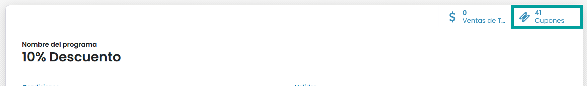

En el caso de que quieras imprimir los cupones, debes seleccionar los cupones sobre el listado y hacer clic sobre el
botón **Imprimir** seleccionando la opción **Código de cupon**.

Mediante esta acción se genera un nuevo fichero pdf que dispondrá de todos los cupones seleccionados para que puedas
enviarlos a la impresora.

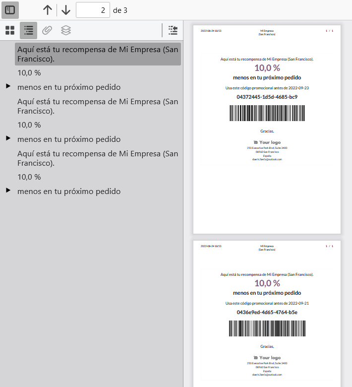

En el caso de que quieras enviar los cupones por correo electrónico, debes hacer clic sobre el botón **Enviar** de uno de los cupones que no haya sido usado ni enviado.

.. image:: tarifas_promociones/enviar_cupon.png
   :align: center
   :alt: Crear un programa de cupones

Esta acción muestra una nueva pantalla desde donde se debe seleccionar el contacto al que se desea enviar el
cupón de descuento, así como la plantilla de correo. En el caso de usar la plantilla especifica **[POS] Cupón: Enviar por correo electrónico**,
se anexará sobre el correo un documento adjunto con los detalles del cupón.

Al **enviar** el cupón, el cliente lo recibirá por correo electrónico y podrá hacer uso de él.

En el caso de que no desees enviar los cupones uno a uno, debes hacer clic sobre el botón **Generar cupón**
y seleccionar la opción del campo **Tipo de generación** igual a **Número de clientes seleccionados**.

.. note::
   Esta acción, relaciona directamente los cupones con los clientes a los que se envía el cupón. Para que un cupón relacionado con un cliente sea considerado como válido, se debe identificar al cliente sobre el TPV previo al uso del cupón.

.. image:: tarifas_promociones/genera_cupones.png
   :align: center
   :alt: Crear un programa de cupones

Posteriormente debes hacer clic sobre el botón **Añadir filtro**, para indicar las condiciones de búsqueda
de los clientes , así como la plantilla de correo a utilizar. En el caso de usar la plantilla especifica **[POS] Cupón: Enviar por correo electrónico**,
se anexará sobre el correo un documento adjunto con los detalles del cupón.

Por último, haz clic sobre el botón **Generar**.

Al generar los cupones, se enviarán por correo a los clientes indicados en el paso anterior.

Los clientes recibirán el cupón en el cuerpo del correo y en fichero anexo sobre el correo.

Una vez dispongas del programa de cupones, es necesario incorporarlo sobre el TPV. Para ello
navega a la pantalla :menuselection:`Punto de Venta --> Configuración --> Punto de Venta`, accede al detalle
del TPV y marca la opción **Cupones y Promociones** y selecciona los **Programas de cupones** que desees.

Para que un cliente pueda usar un programa de cupones que disponga de un código determinado,
debe presentarlo en el momento que realice una compra, para que el empleado pueda escanear el código de barras
o teclear el código de texto.

La forma de usar los cupones desde el TPV es exactamente la misma que la forma de usar los programas promocionales.

En el siguiente ejemplo se muestra la operativa de uso para un cupón que ha recibido un cliente a través de correo electrónico.

Bajo un pedido del TPV, el empleado incorpora los productos que adquiere el cliente, y hace clic sobre el botón **Cliente**,
para proceder a su identificación (el cupón del ejemplo se ha asociado a un cliente).

Posteriormente hace clic sobre el botón **Introducir código**.

Al hacer clic sobre el botón **Introducir código** aparece una nueva pantalla que solicita introducir el código de barras (mediante el lector de código de barras).

El empleado introduce el código del cupón y **Acepta** la operación.

Al aceptar la operación se introduce la promoción como una línea del pedido. Al final del pedido aparece un
resumen con los programas activos.

Una vez completado el pedido, el empleado pasa a efectuar el pago del cliente, haciendo clic sobre el botón **Pagos**.
Esta acción muestra la pantalla de pago del cliente. El empleado debe seleccionar el método de pago y validarlo.

Una vez efectuado el pago, se presenta la pantalla de recibo desde donde es posible visualizar la operación efectuada.

Es posible consultar los datos de uso del cupón, para ello, navega a la pantalla
:menuselection:`Punto de Venta --> Productos --> Programas de cupones`, y accede al detalle del programa de cupones que desees consultar.
Posteriormente, haz clic sobre el botón inteligente **Ventas de TPV**.

Al hacer clic sobre el botón inteligente la aplicación navega al listado de pedidos que han usado la promoción.

Tarjetas regalo
================

El uso de tarjetas regalo en un negocio, es una estrategia de marketing que ayuda a potenciar tus ventas.
Mediante las tarjetas regalo, tus clientes reducen un importe específico del precio final de la venta.

Daeris, permite generar tarjetas regalo con distintos precios y ser usadas por nuestros clientes cuando realizan
sus compras en el Sitio Web o en el TPV.

Activar el uso de tarjetas regalo en el TPV
--------------------------------------------

El TPV de Daeris permite el uso de tarjetas regalo. Para usar las tarjetas regalo, navega a la
pantalla :menuselection:`Punto de Venta --> Configuración --> Ajustes`, y marca la opción **Tarjeta regalo**.
Por último, recuerda hacer clic sobre el botón **Guardar** para que tus cambios queden registrados.

.. image:: tarifas_promociones/tarjetas_regalo.png
   :align: center
   :alt: Activar la opción de tarjetas regalo.

Daeris, permite crear tarjetas de regalo desde el backend y desde el propio TPV.

.. seealso::
   * :doc:`../../sitios_web/ecommerce/productos_precios/precios/precios`

El TPV de Daeris, permite usar las tarjetas regalo de tres formas distintas:

    - Generar un nuevo código de barras y establecer un precio: permite vender tarjetas de regalo, seleccionando el importe de la tarjeta desde el propio TPV. Posteriormente, el cliente puede usar la tarjeta regalo para descontar su valor de las futuras compras.
    - Escanear un código de barras existente y establecer un precio: permite vender tarjetas de regalo previamente creadas desde el backend, incorporando el importe/saldo de la tarjeta desde el propio TPV.
    - Escanear un código de barras existente con un precio existente: Permite vender tarjetas de regalo previamente creadas desde el backend, con un saldo determinado. Posteriormente, al realizar la venta de la tarjeta desde el TPV, el vendedor puede modificar el precio de la tarjeta.

Tan solo es posible usar una forma de uso por TPV. Para configurar la forma de uso de las tarjetas regalo de tu
TPV, navega a la pantalla :menuselection:`Punto de Venta --> Configuración --> Punto de Venta`, accede al detalle
del TPV y marca la opción **Tarjeta regalo** y selecciona una de las tres posibles opciones de uso.

.. note::
   En los siguientes apartados se detalla cada una de las formas de uso.

Generar un nuevo código de barras y establecer un precio
---------------------------------------------------------
Mediante la opción **Generar un nuevo código de barras y establecer un precio** de la funcionalidad de tarjetas
de regalo del TPV, permitimos vender tarjetas de regalo, seleccionando el importe de la tarjeta desde el propio TPV.
Posteriormente, el cliente puede usar la tarjeta regalo para descontar su valor de las futuras compras.
En este caso, la fecha de vencimiento de la tarjeta es de un año desde su creación.

Para usar esta opción, navega a la pantalla :menuselection:`Punto de Venta --> Configuración --> Punto de Venta`, accede al detalle
del TPV y marca la opción **Tarjeta regalo** y selecciona la opción **Generar un nuevo código de barras y establecer un precio**.

.. image:: tarifas_promociones/tarjeta_opcion1.png
   :align: center
   :alt: Generar un nuevo código de barras y establecer un precio

Al iniciar una sesión de TPV desde la pantalla :menuselection:`Punto de Venta --> Tablero`, puedes observar un nuevo
botón sobre el teclado numérico referente a la **Tarjeta regalo**.

.. image:: tarifas_promociones/boton_regalo.png
   :align: center
   :alt: Botón tarjeta de regalo del TPV.

Al hacer clic sobre el botón **Tarjeta regalo** aparece un desplegable con tres posibles opciones:

    - **Generar código de barras**: permite generar una nueva tarjeta regalo al cliente.
    - **Usar tarjeta regalo**: permite hacer uso de una tarjeta existente.
    - **Revisar una tarjeta existente** : permite consultar el saldo de una tarjeta existente.

Al hacer clic sobre el botón **Generar código de barras** aparece una nueva ventana desde donde introducir el
importe (saldo) que dispondrá la tarjeta.

Tras confirmar el saldo introducido, un nuevo producto **tarjeta regalo** será incorporado sobre el pedido.

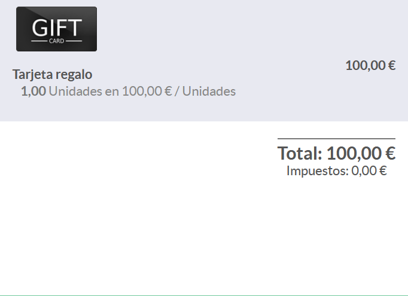

Una vez finalizado el pedido, se debe hacer clic sobre el botón **Pagos** para que el cliente realice el pago total
del pedido. Esta acción mostrará la ventana de pago desde donde deberemos seleccionar el método de pago del cliente.

Al hacer clic sobre el botón **Validar**, se mostrará una nueva ventana con la tarjeta regalo, que deberemos **imprimir**
y entregar al cliente.

.. note::
   También es posible la descarga del documento y el posterior envío por los distintos canales que acepte el dispositivo que estes usando.

Además, se mostrará la pantalla de impresión de recibo correspondiente a la venta.

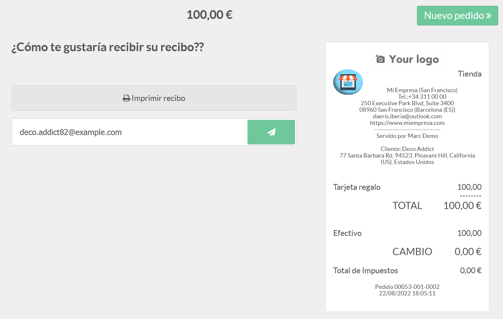

Para que un cliente pueda usar la tarjeta regalo, debe presentarla en el momento que realice una compra, para que
el empleado pueda escanear el código de barras.

En el siguiente ejemplo se muestra cómo funciona la operativa.

Bajo un pedido del TPV, el empleado incorpora los productos que adquiere el cliente. Posteriormente hace clic sobre
el botón **Tarjeta regalo**.

Al hacer clic sobre el botón **Tarjeta regalo** aparece una nueva pantalla con varias opciones. El empleado hace clic
sobre el botón **Usar una tarjeta regalo**.

El sistema solicita introducir el código de la tarjeta regalo.

El empleado introduce el código de la tarjeta y **Confirma** la operación, acción que introduce el saldo
de la tarjeta como una línea del pedido.

Una vez completado el pedido, el empleado pasa a efectuar el pago del cliente, haciendo clic sobre el botón **Pagos**.

Esta acción muestra la pantalla de pago del cliente. En el caso de que la tarjeta regalo no cubra el importe total
del pedido el cliente deberá abonar la parte restante (adeudo).

Una vez efectuado el pago, se presenta la pantalla de recibo desde donde es posible visualizar la operación efectuada.

.. note::
   En el caso de que el importe de la tarjeta regalo sobrepase el importe del pedido, esta continuará siendo válida hasta consumir el importe restante en próximas ventas.

Es posible consultar los datos de la tarjeta regalo, para ello, navega a la pantalla
:menuselection:`Punto de Venta --> Productos --> Tarjetas regalo`, y accede al detalle de la tarjeta que desees.

Escanear un código de barras existente y establecer un precio
--------------------------------------------------------------

Mediante la opción **Escanear un código de barras existente y establecer un precio** de la funcionalidad de tarjetas
de regalo del TPV, permitimos vender tarjetas de regalo previamente creadas desde el backend,
incorporando el importe de la tarjeta desde el propio TPV.

Posteriormente, el cliente puede usar la tarjeta regalo para descontar su valor de las futuras compras.
En este caso, la fecha de vencimiento de la tarjeta es de un año desde que se vende al cliente.

Para usar esta opción, navega a la pantalla :menuselection:`Punto de Venta --> Configuración --> Punto de Venta`, accede al detalle
del TPV y marca la opción **Tarjeta regalo** y selecciona la opción **Escanear un código de barras existente y establecer un precio**.

Para crear una nueva tarjeta regalo desde el backend, navega a la pantalla :menuselection:`Punto de Venta --> Productos --> Tarjetas regalo`
y haz clic sobre el botón **Crear**.

Sobre el formulario, no es necesario informar la fecha de vencimiento , ni el pago inicial (precio) de la tarjeta,
ya que estos serán informados desde el TPV en el momento de la venta.

Mediante el botón **Imprimir tarjeta** es posible realizar la impresión del código de la tarjeta y su correspondiente
código de barras.

.. image:: tarifas_promociones/imprimir_tarjeta.png
   :align: center
   :alt: Imprimir tarjetas regalo.

Esta impresión, debe ser entregada al cliente al realizar la venta de la tarjeta para su uso posterior.

Al iniciar una sesión de TPV desde la pantalla :menuselection:`Punto de Venta --> Tablero`, puedes observar un nuevo
botón sobre el teclado numérico referente a la **Tarjeta regalo**.

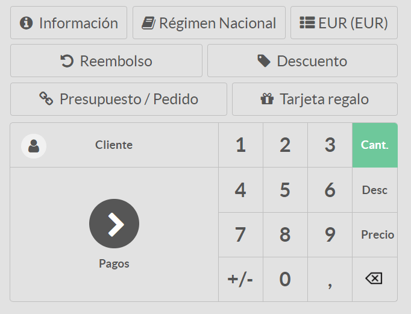

Al hacer clic sobre el botón **Tarjeta regalo** aparece un desplegable con tres posibles opciones:

    - **Escanea y establece el precio en la tarjeta regalo**: permite incorporar el saldo de una tarjeta regalo al cliente.
    - **Usar una tarjeta regalo**: permite hacer uso de una tarjeta existente.
    - **Revisa una tarjeta regalo** : permite consultar el saldo de una tarjeta existente.

Al hacer clic sobre el botón **Escanea y establece el precio en la tarjeta regalo** aparece una nueva ventana desde donde introducir el
código de la tarjeta regalo y el importe que deseas introducir en la tarjeta.

Una vez introducido el código de la tarjeta e incorporado el saldo, debes hacer clic sobre el botón **Confirmar**.

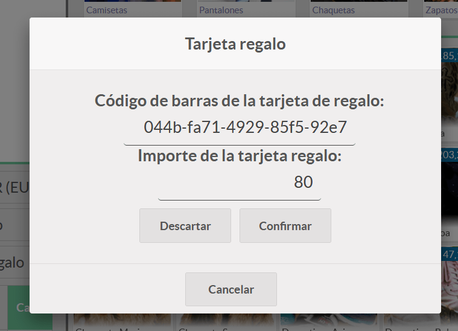

Tras confirmar el saldo introducido, un nuevo producto **tarjeta regalo** será incorporado sobre el pedido.

Una vez finalizado el pedido, se debe hacer clic sobre el botón **Pagos** para que el cliente realice el pago total
del pedido. Esta acción mostrará la ventana de pago desde donde deberemos seleccionar el método de pago del cliente.

Al hacer clic sobre el botón **Validar**, se mostrará una nueva ventana o un documento anexo con la tarjeta regalo,
que dispondrá del saldo introducido. No es necesario **imprimir** y entregar al cliente, ya que este ya dispone de la tarjeta.

Además, se mostrará la pantalla de impresión de recibo correspondiente a la venta.

Es posible consultar los datos de la tarjeta regalo, para ello, navega a la pantalla
:menuselection:`Punto de Venta --> Productos --> Tarjetas regalo`, y accede al detalle de la tarjeta que desees.

Para que un cliente pueda usar la tarjeta regalo, debe presentarla en el momento que realice una compra, para que
el empleado pueda escanear el código de barras.

En el siguiente ejemplo se muestra cómo funciona la operativa.

Bajo un pedido del TPV, el empleado incorpora los productos que adquiere el cliente. Posteriormente hace clic sobre
el botón **Tarjeta regalo**.

Al hacer clic sobre el botón **Tarjeta regalo** aparece una nueva pantalla con varias opciones. El empleado hace clic
sobre el botón **Usar una tarjeta regalo**.

El sistema solicita introducir el código de la tarjeta regalo.

El empleado introduce el código de la tarjeta y **Confirma** la operación, acción que introduce el saldo
de la tarjeta como una línea del pedido.

Una vez completado el pedido, el empleado pasa a efectuar el pago del cliente, haciendo clic sobre el botón **Pagos**.

Esta acción muestra la pantalla de pago del cliente. En el caso de que la tarjeta regalo no cubra el importe total
del pedido el cliente deberá abonar la parte restante (adeudo).

En el caso de que el importe de la tarjeta cubra el importe del pedido en su totalidad, el valor del pago será igual a 0.
En este caso tan solo se deberá validad el pago.

Una vez efectuado el pago, se presenta la pantalla de recibo desde donde es posible visualizar la operación efectuada.

.. note::
   En el caso de que el importe de la tarjeta regalo sobrepase el importe del pedido, esta continuará siendo válida hasta consumir el importe restante en próximas ventas o hasta que llegue la fecha de vencimiento de la tarjeta.

Es posible consultar los datos de la tarjeta regalo, para ello, navega a la pantalla
:menuselection:`Punto de Venta --> Productos --> Tarjetas regalo`, y accede al detalle de la tarjeta que desees.

Escanear un código de barras existente con un precio existente
---------------------------------------------------------------
Mediante la opción **Escanear un código de barras existente con un precio existente** de la funcionalidad de tarjetas
de regalo del TPV, permitimos vender tarjetas de regalo previamente creadas desde el backend, con un saldo determinado.
Posteriormente, al realizar la venta de la tarjeta desde el TPV, el vendedor puede modificar el precio de la tarjeta.

Esta opción puede usarse como estrategia de Marketing para ofrecer a tus clientes, tarjetas regalo con un saldo superior
al precio de la tarjeta.

En este caso, la fecha de vencimiento de la tarjeta es de un año desde que se vende al cliente.

Para usar esta opción, navega a la pantalla :menuselection:`Punto de Venta --> Configuración --> Punto de Venta`, accede al detalle
del TPV y marca la opción **Tarjeta regalo** y selecciona la opción **Escanear un código de barras existente con un precio existente**.

Para crear una nueva tarjeta regalo desde el backend, navega a la pantalla :menuselection:`Punto de Venta --> Productos --> Tarjetas regalo`
y haz clic sobre el botón **Crear**.

Sobre el formulario, informa el pago inicial de la tarjeta que se corresponde con el saldo,
Posteriormente, desde el TPV, el vendedor podrá modificar el precio de la tarjeta sin alterar el saldo aquí expuesto.

Mediante el botón **Imprimir tarjeta** es posible realizar la impresión del código de la tarjeta y su correspondiente
código de barras.

Esta impresión, debe ser entregada al cliente al realizar la venta de la tarjeta para su uso posterior.

Al iniciar una sesión de TPV desde la pantalla :menuselection:`Punto de Venta --> Tablero`, puedes observar un nuevo
botón sobre el teclado numérico referente a la **Tarjeta regalo**.

Al hacer clic sobre el botón **Tarjeta regalo** aparece un desplegable con tres posibles opciones:

    - **Escanear tarjeta regalo**: permite vender la tarjeta regalo al cliente.
    - **Usar una tarjeta regalo**: permite hacer uso de una tarjeta existente.
    - **Revisa una tarjeta regalo** : permite consultar el saldo de una tarjeta existente.

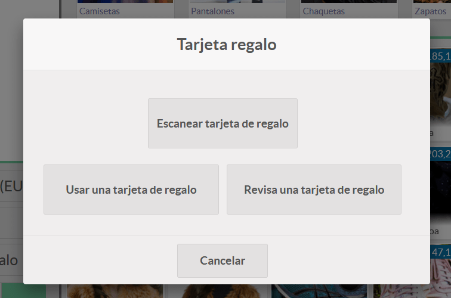

Al hacer clic sobre el botón **Escanear tarjeta regalo*** aparece una nueva ventana desde donde introducir el
código de la tarjeta regalo.

Una vez introducido el código de la tarjeta , debes hacer clic sobre el botón **Confirmar**.

Tras confirmar el código introducido, un nuevo producto **tarjeta regalo** será incorporado sobre el pedido.

Para modificar el precio de la tarjeta, el empleado debe hacer clic sobre el botón **Precio** e incorporar
el precio que se cobrará al cliente. Esta acción no alterará el saldo que dispone la tarjeta.

Una vez finalizado el pedido, se debe hacer clic sobre el botón **Pagos** para que el cliente realice el pago total
del pedido. Esta acción mostrará la ventana de pago desde donde deberemos seleccionar el método de pago del cliente.

Al hacer clic sobre el botón **Validar**, se mostrará una nueva ventana o un documento anexo con la tarjeta regalo,
que dispondrá del saldo introducido. No es necesario **imprimir** y entregar al cliente, ya que este ya dispone de la tarjeta.

Además, se mostrará la pantalla de impresión de recibo correspondiente a la venta.

Es posible consultar los datos de la tarjeta regalo, para ello, navega a la pantalla
:menuselection:`Punto de Venta --> Productos --> Tarjetas regalo`, y accede al detalle de la tarjeta que desees.

Haciendo clic sobre el enlace **Tarjeta regalo** es posible visualizar el importe cobrado al cliente en la venta de la tarjeta.

Para que un cliente pueda usar la tarjeta regalo, debe presentarla en el momento que realice una compra, para que
el empleado pueda escanear el código de barras.

En el siguiente ejemplo se muestra cómo funciona la operativa.

Bajo un pedido del TPV, el empleado incorpora los productos que adquiere el cliente. Posteriormente hace clic sobre
el botón **Tarjeta regalo**.

Al hacer clic sobre el botón **Tarjeta regalo** aparece una nueva pantalla con varias opciones. El empleado hace clic
sobre el botón **Usar una tarjeta regalo**.

El sistema solicita introducir el código de la tarjeta regalo.

El empleado introduce el código de la tarjeta y **Confirma** la operación, acción que introduce el saldo
de la tarjeta como una línea del pedido.

Una vez completado el pedido, el empleado pasa a efectuar el pago del cliente, haciendo clic sobre el botón **Pagos**.

Esta acción muestra la pantalla de pago del cliente. En el caso de que la tarjeta regalo no cubra el importe total
del pedido el cliente deberá abonar la parte restante (adeudo).

En el caso de que el importe de la tarjeta cubra el importe del pedido en su totalidad, el valor del pago será igual a 0.
En este caso tan solo se deberá validad el pago.

Una vez efectuado el pago, se presenta la pantalla de recibo desde donde es posible visualizar la operación efectuada.

.. note::
   En el caso de que el importe de la tarjeta regalo sobrepase el importe del pedido, esta continuará siendo válida hasta consumir el importe restante en próximas ventas o hasta que llegue la fecha de vencimiento de la tarjeta.

Es posible consultar los datos de la tarjeta regalo, para ello, navega a la pantalla
:menuselection:`Punto de Venta --> Productos --> Tarjetas regalo`, y accede al detalle de la tarjeta que desees.

Consultar el saldo de una tarjeta regalo
------------------------------------------

Para consultar el saldo de la tarjeta regalo, el empleado debe de hacer clic sobre el botón **Tarjeta regalo**
disponible en el TPV.

Al hacer clic sobre el botón **Tarjeta regalo**, aparece una nueva pantalla con varias opciones.
El empleado debe hacer clic sobre el botón **Revisar una tarjeta regalo**.

Sobre la siguiente pantalla, el empleado debe introducir el **Código de la tarjeta**.

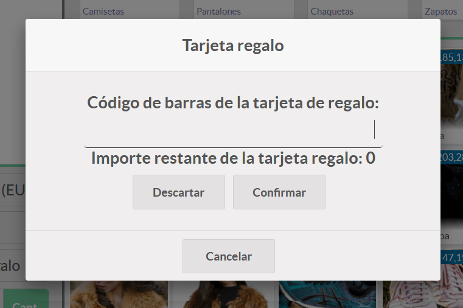

Una vez introducido el código de la tarjeta, se debe hacer clic sobre el botón **Confirmar**.

Al confirmar el código, aparece el saldo disponible.

.. note::
   Esta acción no revisa la fecha de vencimiento de la tarjeta, con lo que no asegura que el saldo que dispone pueda ser usado por el cliente.

Modificar la fecha de vencimiento de una tarjeta regalo
--------------------------------------------------------

Es posible modificar la fecha de vencimiento de una tarjeta regalo en el caso de que lo consideres oportuno.
Para ello, navega a la pantalla :menuselection:`Punto de Venta --> Productos --> Tarjetas regalo`, y accede al detalle de la tarjeta que desees,
desde donde podrás modificar su **fecha de vencimiento**.

Descuentos
=============

Aplicar un descuento al precio de un artículo de un pedido de forma manual
---------------------------------------------------------------------------

Al realizar un pedido en una sesión de TPV, los artículos que seleccionas arrastran el precio por defecto.
Sobre cada línea del pedido, puedes **establecer un porcentaje de descuento** de forma manual.

Para activar esta opción , navega a la pantalla
:menuselection:`Punto de Venta --> Configuración --> Punto de Venta`, accede al detalle de un TPV y marca la opción
**descuentos manuales**.

Una vez configurada la opción, accede al TPV y haz clic sobre la línea del artículo (aparecerá sombreada).

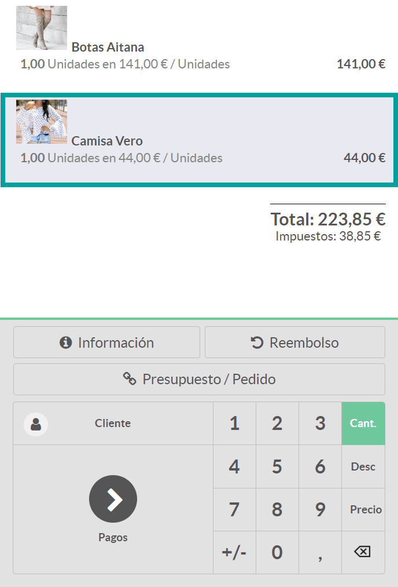

Posteriormente, y sobre el teclado numérico, deberás pulsar sobre la opción **Desc** (Descuento). A continuación,
introduce el descuento que quieres asignar al artículo. Esta acción generará una nueva línea que indicará el porcentaje
de descuento.

.. image:: tarifas_promociones/descuentos_aplicar.png
   :align: center
   :alt: Descuento del artículo en el TPV

.. note::
   Es importante aclarar que el descuento se efectuará sobre el precio del artículo sin contabilizar el IVA correspondiente.

Por último, cuando el empleado realice el cobro, aparecerá el descuento en la factura del cliente.

Aplicar descuentos al precio total de un pedido del TPV de forma manual
------------------------------------------------------------------------

Al realizar un pedido en una sesión de TPV, los artículos que seleccionas arrastran el precio por defecto.
Sobre el precio total, es posible establecer un porcentaje de descuento en forma de producto, de forma manual.
El descuento se aplica al precio de cada producto con impuestos incluidos.

Para configurar esta opción, navega a la pantalla :menuselection:`Punto de Venta --> Configuración --> Punto de Venta`,
accede al detalle de un TPV , marca la opción **descuentos globales** y haz clic sobre el botón **Guardar**.

.. image:: tarifas_promociones/descuentos_globales.png
   :align: center
   :alt: Opción para aplicar descuentos globales

.. note::
   En el caso de que la opción **descuentos globales** no sea editable, cierra las sesiones de TPV abiertas y actualiza la página de configuración.

Una vez marcada la opción y realizada la acción de **Guardar**, aparecerán disponibles como opciones, el **producto de
descuento** y el **porcentaje de descuento**.

Sobre el porcentaje de descuento, deberás incorporar el porcentaje que desees que se aplique de forma predeterminada.

Sobre el producto de descuento deberás seleccionar el producto que desees usar como referencia del descuento. Por defecto
ya se incorpora el producto **Descuento**. Es posible editar el producto haciendo clic sobre el enlace que dispone el
nombre del producto.

Desde la pantalla de detalle del producto es posible modificar sus atributos, en el caso de que lo consideres oportuno, aunque
las opciones **Puede ser vendido** y **Disponible en TPV** son opciones requeridas para su correcto funcionamiento.

Una vez informados los campos necesarios, pulsa el botón **Guardar**.

Al reanudar la sesión de TPV desde la pantalla Punto de Venta > Tablero, puedes observar un nuevo botón **Descuento** sobre el teclado numérico.

Para aplicar descuentos globales sobre un pedido, pulsa el botón **Descuento**, acción que abrirá un formulario donde será
necesario aceptar el descuento inicial ofrecido o teclear el descuento que quieras introducir.

.. image:: tarifas_promociones/boton_descuento2.png
   :align: center
   :alt: Porcentaje de descuento

Al aceptar el descuento mediante el botón **OK**, se introducirá una nueva línea de pedido con el producto de
descuento. El valor del descuento será igual al valor del porcentaje indicado de la suma de todas las líneas de
pedido incluyendo impuestos. El valor será negativo y se descuenta de la cantidad total.

El ticket de caja/factura incorporará una línea de descuento con el importe establecido.

Usar etiquetas de descuento con un escáner de código de barras
---------------------------------------------------------------
Ya sea porque un producto está próximo a caducar, dispones de un excedente de stock o simplemente quieres lanzar una
campaña promocional de un producto, Daeris te permite la opción de usar etiquetas de descuento de un producto
en concreto.

Al realizar la venta y tras haber escaneado el código de barras del producto ofertado, el cliente deberá mostrarte
la etiqueta de descuento para ser escaneada. Esta acción aplicará el descuento sobre el producto.

.. note::
   Para usar las etiquetas de descuento será necesario que dispongas de un lector de código de barras.

Para activar el uso de códigos de barras, navega a la pantalla :menuselection:`Punto de Venta --> Configuración --> Punto de Venta`,
accede al detalle de un TPV , marca la opción **Dispositivos directos** y haz clic sobre el botón **Guardar**.

.. image:: tarifas_promociones/dispositivos_directos.png
   :align: center
   :alt: Descuento en la factura del TPV

Sobre la **nomenclatura de código de barras** asegúrate que dispones de una configuración que dispone de la
opción **Códigos de barras de descuentos**.

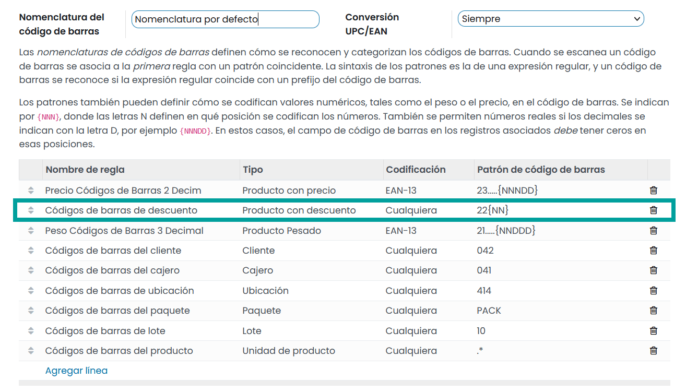

Para crear un código de barras de descuento de un producto, el producto debe disponer de un código de barras.

.. image:: tarifas_promociones/barras_producto.png
   :align: center
   :alt: Nomenclatura de código de barras

El código de barras de descuento será igual al número 22 , el número de porcentaje de descuento y el número del código
de barras del producto.

Si necesitas crear/imprimir etiquetas de código de barras de descuento, puedes modificar el código de barras del producto, añadiéndole el número 22 y el porcentaje de descuento. Posteriormente haz clic sobre el botón **Imprimir etiquetas del producto**. Por último, vuelve a dejar el código de barras sin el número 22 ni el porcentaje de descuento.

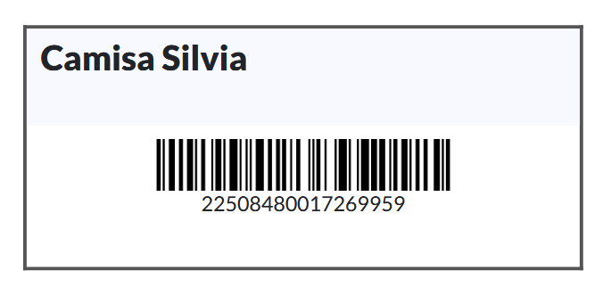

Para usar las etiquetas de descuento, accede a la sesión de TPV desde la pantalla :menuselection:`Punto de Venta --> Tablero` y
escanea el código de barras del producto deseado.

.. image:: tarifas_promociones/escanea_etiqueta.png
   :align: center
   :alt: Escanear código de barras de producto.

Posteriormente ,escanea la etiqueta de descuento, acción que aplicará el descuento.

.. image:: tarifas_promociones/escanea_etiqueta2.png
   :align: center
   :alt: Escanear etiqueta de descuento de producto.