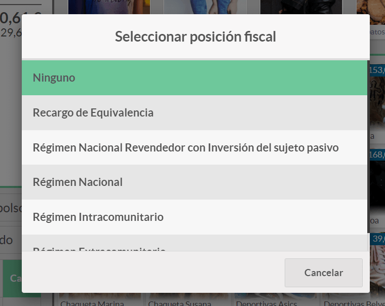
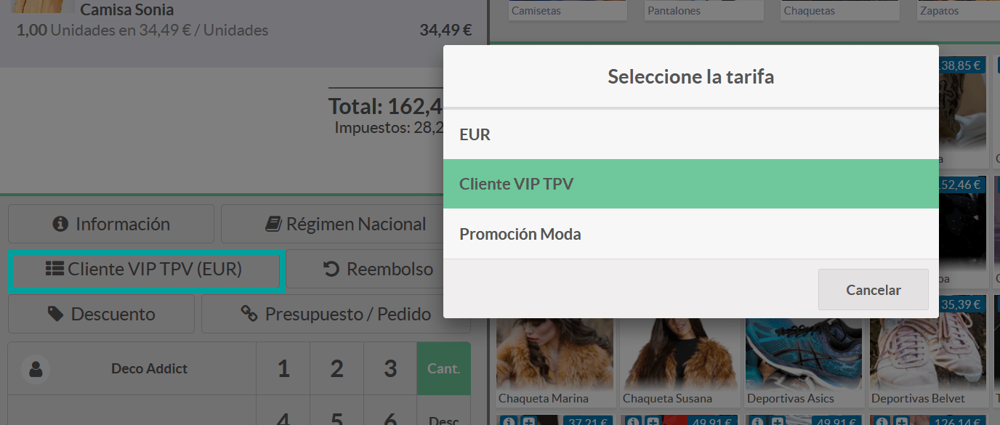
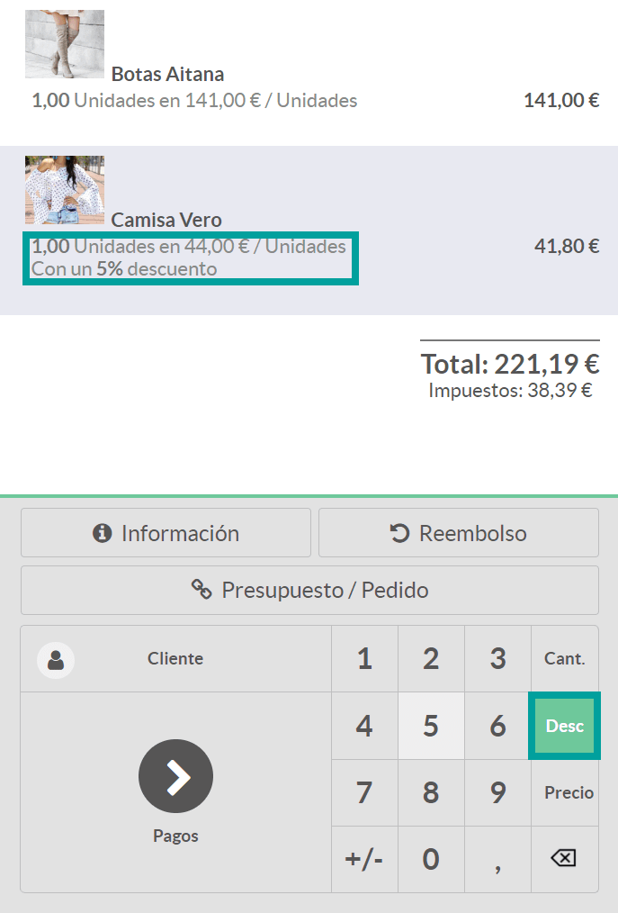

==========================================
Tarifas, Promociones y Descuentos
==========================================

Precios
=============

Incorporar el precio de un artículo de un pedido de forma manual 
------------------------------------------------------------------

Al realizar un pedido en una sesión de TPV, los artículos que seleccionas arrastran el precio por defecto. Aún así,
puede darse el caso de que quieras **modificar el precio del artículo de forma manual**. Para ello, haz clic sobre
la línea del artículo (aparecerá sombreada).

Posteriormente, y sobre el teclado numérico, deberás pulsar sobre la opción Precio. A continuación, introduce el
precio que quieres asignar al artículo.

.. image:: tarifas_promociones/precio.png
   :align: center
   :alt: Precio del artículo en el TPV

.. note::
   Es importante aclarar que el precio que se asignará es por artículo. Si dispones de una cantidad superior a 1, el precio final de la línea será igual al precio introducido, multiplicado por el número de artículos de la línea.

En el caso de que desees que únicamente los empleados con permisos de **administrador** del punto de venta puedan
modificar los precios de los productos al realizar ventas sobre el TPV, navega a la pantalla
:menuselection:`Punto de Venta --> Configuración --> Punto de Venta`, accede al detalle de un TPV y marca la opción
**control de precios**.

.. image:: tarifas_promociones/control_precio.png
   :align: center
   :alt: Impedir que los empleados no administradores puedan modificar los precios.

Al usuar esta opción, el botón **Precio** aparecerá deshabilitado sobre los empleados que no sean administradores.

.. image:: tarifas_promociones/precio_deshabilitado.png
   :align: center
   :alt: Impedir que los empleados no administradores puedan modificar los precios.

Permitir seleccionar entre distintos tipos de impuestos
--------------------------------------------------------

Daeris, permite dar la opción a los empleados de **seleccionar entre diferentes tipos de impuestos** en los TPV, para
que ciertos tipos de ventas puedan acogerse a ellos.

Para ello, navega a la pantalla :menuselection:`Punto de Venta --> Configuración --> Punto de Venta`,
accede al detalle de un TPV y marca la opción **Posición fiscal por pedido**, indicando todas las posiciones fiscales
disponibles para el cliente. También es posible escoger una posición fiscal especifica que será la que se use por defecto,
incorporándola sobre la opción **Posición fiscal**.

.. image:: tarifas_promociones/impuestos.png
   :align: center
   :alt: Posición fiscal por pedido

Al reanudar la sesión de TPV desde la pantalla :menuselection:`Punto de Venta --> Tablero`, puedes observar un nuevo
botón sobre el teclado numérico referente al **impuesto**.

Al hacer clic sobre el botón **Impuesto**, aparecerá un nuevo desplegable donde podrás seleccionar el impuesto que
quieras usar para el pedido.

Una vez seleccionado el impuesto, sobre el botón de impuestos, aparecerá el impuesto seleccionado. Este impuesto
será aplicado sobre todas las líneas del pedido.

Mostrar los impuestos de los precios de los artículos
------------------------------------------------------

Una de las opciones que permite configurar daeris, es cómo mostrar los impuestos de los precios de los artículos del
recibo.

Para gestionar cómo mostrar los precios de los productos, accede a la pantalla :menuselection:`Punto de Venta --> Configuración --> Punto de Venta`,
accede al detalle de un TPV y sobre el apartado de **precio** marca la opción **Precios sin impuestos**, para que los precios se muestren sin impuestos.

.. image:: tarifas_promociones/precios_sin_impuestos.png
   :align: center
   :alt: Precios sin impuestos

Marcando la opción de **precios sin impuestos**, la única referencia que se hace a los impuestos en la sesión de TPV
es sobre la sub línea Impuestos del importe total (los precios de cada artículo aparecen sin impuestos).

Además, con esta opción activa, la única referencia que se hace a los impuestos en el ticket de caja, es sobre la
sub línea **Impuesto** del subtotal.

Para incluir los impuestos, accede a la pantalla :menuselection:`Punto de Venta --> Configuración --> Punto de Venta`,
accede al detalle de un TPV y sobre el apartado de **precio** marca la opción **Precios con impuestos incluidos**, para que los precios incorporen los impuestos.

Marcando la opción de **precios con impuestos incluídos**, la referencia que se hace a los impuestos en la sesión de TPV
es sobre la sub línea Impuestos del importe total (los precios de cada artículo aparecen con los impuestos incluídos).

.. image:: tarifas_promociones/impuestos_pedido2.png
   :align: center
   :alt: Impuestos del pedido

Además, con esta opción activa, la referencia que se hace a los impuestos en el ticket de caja, es sobre las
líneas finales donde se detallan los distintos tipos de impuestos y su importe total.

.. image:: tarifas_promociones/impuestos_ticket2.png
   :align: center
   :alt: Impuestos del ticket de caja

Usar Tarifas
------------------------
Ya sea porque dispones de diferentes tiendas con precios distintos, porque dispones de una promoción especial de
temporada, o simplemente porque rebajas ciertos artículos descatalogados, puedes usar las tarifas sobre
el TPV.

Para usar las tarifas, navega a la pantalla :menuselection:`Punto de Venta --> Configuración --> Ajustes`,
y marca la opción **Tarifas**, así como la opción para calcularla.

Para el siguiente ejemplo se utilizará la opción **reglas de precio avanzadas**, aunque también es posible utilizar múltiples precios por producto.

.. seealso::
   * :doc:`../../ventas/ventas/productos_precios/precios/precios`

Posteriormente, navega a la pantalla :menuselection:`Punto de Venta --> Producto --> Tarifas`, y crea una nueva
**tarifa**. En este ejemplo, se muestra una tarifa con un 10% de descuento para los artículos de la categoría “Todo / Ropa”.

.. image:: tarifas_promociones/nueva_tarifa.png
   :align: center
   :alt: Detalle de la tarifa

.. note::
   Informar la opción Mostrar al cliente el precio al público y el descuento solo tendrá uso sobre las tarifas aplicadas en el sitio web.

Para indicar al TPV que debe usar la tarifa previamente creada, navega a la pantalla
:menuselection:`Punto de Venta --> Configuración --> Punto de Venta`, accede al detalle del TPV y marca la
opción **Tarifa**.

Posteriormente, añade a las **listas de precios disponibles** la tarifa recién creada y, en caso de ser necesario,
la puedes incorporar como **tarifa predeterminada**.

.. image:: tarifas_promociones/tarifa_tpv.png
   :align: center
   :alt: Listas de precio disponibles en el TPV

Al incorporar una tarifa predeterminada, esta aparecerá como tarifa inicial en el TPV sobre un nuevo botón disponible
en el teclado numérico.

.. image:: tarifas_promociones/tarifa_defecto.png
   :align: center
   :alt: Tarifa por defecto

Al añadir artículos al pedido, se utilizará la tarifa seleccionada, aplicando los precios correspondientes
sobre las líneas del pedido.

Es posible cambiar de tarifa haciendo clic sobre el botón **tarifas**, lo que permitirá escoger la tarifa a aplicar
sobre los productos.

.. image:: tarifas_promociones/tarifa_cambio.png
   :align: center
   :alt: Seleccionar la lista de precios

Usar tarifas para clientes VIP
-----------------------------------------
El TPV de daeris permite la opción de aplicar tarifas específicas a clientes. Para usar las tarifas, navega a la
pantalla :menuselection:`Punto de Venta --> Configuración --> Ajustes`, y marca la opción **Tarifas**, así como la
opción para calcularla.

Para el siguiente ejemplo se utilizará la opción **reglas de precio avanzadas**, aunque también es posible utilizar múltiples precios por producto.

.. seealso::
   * :doc:`../../ventas/ventas/productos_precios/precios/precios`

Posteriormente, navega a la pantalla :menuselection:`Punto de Venta --> Producto --> Tarifas`, y crea una nueva tarifa. En este ejemplo,
se muestra una tarifa con un 25% de descuento para todos los artículos.

.. image:: tarifas_promociones/opcion_tarifas2.png
   :align: center
   :alt: Detalle de la tarifa

Para indicar al TPV que puede usar la tarifa previamente creada, navega a la pantalla
:menuselection:`Punto de Venta --> Configuración --> Punto de Venta`, accede al detalle del TPV y marca la opción
**Tarifa**. Posteriormente, añade a las **listas de precios disponibles** la tarifa recién creada.

Una vez dispongas de la tarifa, añade la lista de precios a los clientes que quieras identificar como VIP.
Para ello, navega a la pantalla :menuselection:`Punto de Venta --> Pedidos --> Clientes`. Sobre cada cliente a identificar como VIP,
deberás posicionarte en la pestaña **Ventas y Compras** y seleccionar la **tarifa** correspondiente.

.. image:: tarifas_promociones/tarifas_clientes.png
   :align: center
   :alt: Tarifa del cliente

Una vez completados estos pasos, al reanudar la sesión de TPV, selecciona un cliente mediante el botón **Cliente**.

.. image:: tarifas_promociones/selec_cliente.png
   :align: center
   :alt: Cliente del pedido en el TPV

.. image:: tarifas_promociones/selec_cliente2.png
   :align: center
   :alt: Cliente del pedido en el TPV

Al seleccionar a un cliente que disponga de tarifa asociada, esta se incorporará automáticamente al pedido.

Una vez hecho esto, se puede observar como aparece seleccionada la tarifa del cliente.

Cada vez que se seleccione un artículo, se aplicarán los precios basados en la lista de precios indicada.

.. image:: tarifas_promociones/tarifa_aplicada.png
   :align: center
   :alt: Tarifa aplicada al cliente

El empleado podrá, si lo desea, cambiar la lista de precios de forma manual, haciendo clic sobre el botón de lista
de precios.

Cupones y promociones
======================

Programas promocionales
---------------------------

Programas de cupones
---------------------------

Tarjetas regalo
================

El uso de tarjetas regalo en un negocio, es una estrategia de marketing que ayuda a potenciar tus ventas.
Mediante las tarjetas regalo, tus clientes reducen un importe específico del precio final de la venta

Daeris, permite generar tarjetas regalo con distintos precios y ser usadas por nuestros clientes cuando realizan
sus compras en el Sitio Web o en el TPV.

Activar el uso de tarjetas regalo en el TPV
--------------------------------------------

El TPV de daeris permite el uso de tarjetas regalo. Para usar las tarjetas regalo, navega a la
pantalla :menuselection:`Punto de Venta --> Configuración --> Ajustes`, y marca la opción **Tarjeta regalo**.
Por último, recuerda hacer clic sobre el botón **Guardar** para que tus cambios queden registrados.

Descuentos
=============

Aplicar un descuento al precio de un artículo de un pedido de forma manual
---------------------------------------------------------------------------

Al realizar un pedido en una sesión de TPV, los artículos que seleccionas arrastran el precio por defecto.
Sobre cada línea del pedido, puedes **establecer un porcentaje de descuento** de forma manual.

Para activar esta opción , navega a la pantalla
:menuselection:`Punto de Venta --> Configuración --> Punto de Venta`, accede al detalle de un TPV y marca la opción
**descuentos manuales**.

.. image:: tarifas_promociones/descuentos_manuales.png
   :align: center
   :alt: Opción para permitir descuentos manuales

Una vez configurada la opción, accede al TPV y haz clic sobre la línea del artículo (aparecerá sombreada).

.. image:: tarifas_promociones/descuentos_articulo.png
   :align: center
   :alt: Artículo seleccionado en el TPV

Posteriormente, y sobre el teclado numérico, deberás pulsar sobre la opción Desc (Descuento). A continuación,
introduce el descuento que quieres asignar al artículo. Esta acción generará una nueva línea que indicará el porcentaje
de descuento.

.. note::
   Es importante aclarar que el descuento se efectuará sobre el precio del artículo sin contabilizar el IVA correspondiente.

Por último, cuando el empleado realice el cobro, aparecerá el descuento en la factura del cliente:

.. image:: tarifas_promociones/descuentos_factura.png
   :align: center
   :alt: Descuento en la factura del TPV

Aplicar descuentos al precio total de un pedido del TPV de forma manual
------------------------------------------------------------------------

Al realizar un pedido en una sesión de TPV, los artículos que seleccionas arrastran el precio por defecto.
Sobre el precio total, es posible establecer un porcentaje de descuento en forma de producto, de forma manual.
El descuento se aplica al precio de cada producto con impuestos incluidos.

Para configurar esta opción, navega a la pantalla :menuselection:`Punto de Venta --> Configuración --> Punto de Venta`,
accede al detalle de un TPV , marca la opción **descuentos globales** y haz clic sobre el botón **Guardar**.

.. note::
   En el caso de que la opción **descuentos globales** no sea editable, cierra las sesiones de TPV abiertas y actualiza la página de configuración.

Una vez marcada la opción y realizada la acción de **Guardar**, aparecerán disponibles como opciones, el **producto de
descuento** y el **porcentaje de descuento**.

.. image:: tarifas_promociones/descuentos_globales2.png
   :align: center
   :alt: Opción para aplicar descuentos globales

Sobre el porcentaje de descuento, deberás incorporar el porcentaje que desees que se aplique de forma predeterminada.

Sobre el producto de descuento deberás seleccionar el producto que desees usar como referencia del descuento. Por defecto
ya se incorpora el producto **Descuento**. Es posible editar el producto haciendo clic sobre el enlace que dispone el
nombre del producto.

Desde la pantalla de detalle del producto es posible modificar sus atributos, en el caso de que lo consideres oportuno, aunque
las opciones **Puede ser vendido** y **Disponible en TPV** son opciones requeridas para su correcto funcionamiento.

.. image:: tarifas_promociones/producto.png
   :align: center
   :alt: Producto para aplicar descuentos globales

Una vez informados los campos necesarios, pulsa el botón **Guardar**.

Al reanudar la sesión de TPV desde la pantalla Punto de Venta > Tablero, puedes observar un nuevo botón **Descuento** sobre el teclado numérico.

.. image:: tarifas_promociones/boton_descuento.png
   :align: center
   :alt: Descuento del TPV

Para aplicar descuentos globales sobre un pedido, pulsa el botón Descuento, acción que abrirá un formulario donde será
necesario aceptar el descuento inicial ofrecido o teclear el descuento que quieras introducir.

Al aceptar el descuento mediante el botón **OK**, se introducirá una nueva línea de pedido con el producto de
descuento. El valor del descuento será igual al valor del porcentaje indicado de la suma de todas las líneas de
pedido incluyendo impuestos. El valor será negativo y se descuenta de la cantidad total.

.. image:: tarifas_promociones/descuento_aplica.png
   :align: center
   :alt: Descuento en el pedido del TPV

El ticket de caja/factura incorporará una línea de descuento con el importe establecido.

.. image:: tarifas_promociones/ticket_descuento.png
   :align: center
   :alt: Descuento en la factura del TPV

Usar etiquetas de descuento con un escáner de código de barras
---------------------------------------------------------------
Ya sea porque un producto esta próximo a caducar, dispones de un excedente de stock o simplemente quieres lanzar una
campaña promocional de un producto, Daeris te permite la opción de usar etiquetas de descuento de un producto
en concreto.

Al realizar la venta y tras haber escaneado el código de barras del producto ofertado, el cliente deberá mostrarte
la etiqueta de descuento para ser escaneada. Esta acción aplicará el descuento sobre el producto.

.. note::
   Para usar las etiquetas de descuento será necesario que dispongas de un lector de código de barras.

Para activar el uso de códigos de barras, navega a la pantalla :menuselection:`Punto de Venta --> Configuración --> Punto de Venta`,
accede al detalle de un TPV , marca la opción **Dispositivos directos** y haz clic sobre el botón **Guardar**.

Sobre la **nomenclatura de código de barras** asegúrate que dispones de una configuración que dispone de la
opción **Códigos de barras de descuentos**.

.. image:: tarifas_promociones/barras_descuentos.png
   :align: center
   :alt: Nomenclatura de codigo de barras

Para crear un código de barras de descuento de un producto, el producto debe disponer de un codigo de barras.

.. image:: tarifas_promociones/barras_producto.png
   :align: center
   :alt: Nomenclatura de codigo de barras

El codigo de barras de descuento será igual al número 22 , el número de porcentaje de descuento y el número del código
de barras del producto.

.. image:: tarifas_promociones/ejemplo.png
   :align: center
   :alt: Ejemplo de codigo de barras de descuento

Si necesitas crear/imprimir etiquetas de código de barras de descuento, puedes modificar el código de barras del producto, añadiéndole el número 22 y el porcentaje de descuento. Posteriormente haz clic sobre el botón **Imprimir etiquetas del producto**. Por último, vuelve a dejar el codigo de barras sin el número 22 ni el porcentaje de descuento.

.. image:: tarifas_promociones/imprimir.png
   :align: center
   :alt: Imprimir etiquetas del producto

.. image:: tarifas_promociones/imprimir2.png
   :align: center
   :alt: Imprimir etiquetas del producto

Para usar las etiquetas de descuento, accede a la sesión de TPV desde la pantalla :menuselection:`Punto de Venta --> Tablero` y
escanea el código de barras del producto deseado.

Posteriormente ,escanea la etiqueta de descuento, acción que aplicará el descuento.

