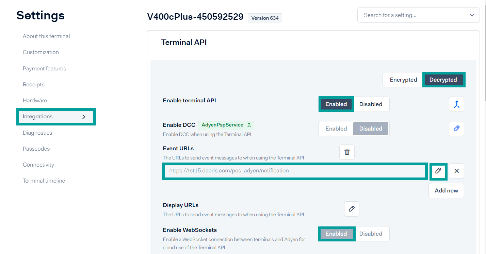

==============
Usabilidad
==============

Navegación
=============

Mejorar la navegación sobre pantallas táctiles imprecisas
----------------------------------------------------------

Aunque la tecnología avanza y la precisión de las pantallas táctiles cada vez es mejor, sigue existiendo maquinaria
muy útil que dispone de pantallas táctiles de poca sensibilidad. La baja sensibilidad de las pantallas afecta sobre
todo a las barras de desplazamiento de las aplicaciones, siendo una tarea difícil de realizar para los empleados.

En Daeris se mejora la usabilidad del TPV adaptando la navegación a este tipo de pantallas. Para ello, navega a la pantalla
:menuselection:`Punto de Venta --> Configuración --> Punto de Venta`, accede al detalle de un TPV y marca la opción
**Barras de desplazamiento grandes**.

Al reanudar la sesión del TPV desde la pantalla :menuselection:`Punto de Venta --> Tablero` , todas las barras de
desplazamiento pasarán a disponer de un formato mayor, siendo de gran utilidad en pantallas táctiles de baja
sensibilidad.

.. note::
   Esta opción, puede no se compatible con navegadores distintos a Google Chrome.

Dispositivos externos
======================

Lector de códigos de barras
----------------------------

En comercios y negocios relacionados con la distribución de productos es común el uso de un lector de código de
barras para el TPV.

Daeris permite integrar su funcionalidad con la mayoría de los lectores de códigos de barras, herramientas
indispensables para agilizar las ventas a través de un simple escaneo de una etiqueta para su registro.

.. seealso::
   * :doc:`../../inventario_y_fabricacion/inventario/codigos_de_barras`

Pantalla del cliente
---------------------

Daeris, permite incorporar una segunda pantalla la cual muestra los artículos y el precio cuando se está efectuando la venta.

Esta opción es muy recomendable para que el cliente pueda revisar el total de productos adquiridos, así como el precio
total de su factura.

Mediante esta opción se ofrece confianza al cliente y se evitan confusiones a la hora de indicarle el precio final de la venta.

Para configurar una segunda pantalla, navega a la pantalla
:menuselection:`Punto de Venta --> Configuración --> Punto de Venta`, accede al detalle de un TPV y marca la opción
**Pantalla del cliente**.

A partir de este momento, al iniciar una sesión del TPV, aparecerá un botón con el icono de una pantalla sobre la parte superior
izquierda del TPV.

.. image:: usabilidad/pantalla2.png
   :align: center
   :alt: Pantalla del cliente

Al hacer clic sobre el botón, aparecerá una nueva ventana con los detalles del pedido del cliente.

.. image:: usabilidad/pantalla3.png
   :align: center
   :alt: Pantalla del cliente

Esta pantalla se ha de arrastrar hasta la segunda pantalla que debe estar conectada a tu dispositivo como una extensión de pantalla.
De este modo, sobre una pantalla, el empleado manejará el TPV y sobre la otra, el cliente podrá visualizar los detalles del pedido.

Terminales de venta (Adyen)
----------------------------

Realizar una integración con un terminal de pago de Adyen permite realizar una operativa fluida a tus clientes a la hora de realizar el pago
con tarjeta, facilitando la gestión a los empleados.

Configurar una cuenta de Adyen
~~~~~~~~~~~~~~~~~~~~~~~~~~~~~~~~

Para pagar con Adyen necesitas dar de alta una `cuenta de pruebas <https://www.adyen.com/signup>`__.

Una vez dada de alta, accede a tu panel de control de Adyen, y desde el menú de **Settings**, navega
al apartado **Merchant Accounts**. Mediante el botón **Request new merchant Account** crea una nueva solicitud de cuenta de comerciante, siguiendo
los pasos del asistente, con el objetivo de generar una cuenta para el TPV.

Sobre el apartado **Add payment methods**, incorpora todos los métodos de pago aceptados por tu terminal.

Una vez dada de alta tu cuenta, debes solicitar un terminal de la lista de terminales que ofrece Adyen. Para ello accede al menu **Point of sale**
y hac clic sobre la opción **order and returns**.

Haz clic sobre el botón **New Sales Order** y gestiona tu pedido mediante el asistente.

.. image:: usabilidad/ady03.png
   :align: center
   :alt: Configurar una cuenta de Adyen

.. attention::
   Ten muy presente tus necesidades, como la necesidad de que el terminal requiera de impresión del pago por tarjeta o si necesitas un terminal que pueda conectarse mediante red WIFI o GSM.

Configurar el terminal de venta
~~~~~~~~~~~~~~~~~~~~~~~~~~~~~~~~~~

Una vez hayas recibido el terminal, debes de configurarlo.

Para ello, lee atentamente las instrucciones facilitadas por Adyen para tu terminal. Puedes encontrarlas
`aquí <https://docs.adyen.com/point-of-sale/user-manuals>`_ , seleccionando el modelo de tu terminal.

Básicamente y en función del terminal recibido, deberás:

   - Incorporar el rollo de papel
   - Conectar el cable RJ-45 al router o realizar la conexión inalámbrica en pasos posteriores.
   - Conectar el cable de alimentación a la red eléctrica

Una vez iniciado el terminal, podrás ver la pantalla de inicio que muestra los valores de configuración.

Posteriormente, el dispositivo procede con la inicialización.

La primera vez que se inicia el terminal, solicita el emparejamiento. Para ello pulsa el botón **Board terminal**.

El TPV procede a actualizarse.

Una vez actualizado el terminal, se solicita **seleccionar el comercio** (de todos los comercios que dispongas) al que vas a asociarlo.

Debes pulsar sobre el comercio que desees.

Al pulsar sobre el comercio, el sistema solicita confirmación. Pulsa sobre el botón **Confirm**.

A partir de aquí, el sistema se actualiza y se reinicia varias veces hasta que queda configurado.

.. image:: usabilidad/term09.png
   :align: center
   :alt: Configurar el terminal del TPV

.. image:: usabilidad/term12.png
   :align: center
   :alt: Configurar el terminal del TPV

.. image:: usabilidad/term14.png
   :align: center
   :alt: Configurar el terminal del TPV

Posteriormente, accede a tu cuenta de Adyen y navega a :menuselection:`Point of sale --> Terminals` y haz clic sobre el registro de tu terminal.

Haz clic sobre el menú :menuselection:`Integrations` y haz clic sobre el botón **Decrypted** y sobre el botón **Enable terminal API**.

Haz clic sobre el icono del lápiz del apartado **Event URLs** y, sobre el desplegable, informa como URL el valor **https://tudominio.com/pos_adyen/notification**
sustituyendo tudominio.com por tu dominio, añade la opción **Public** y haz clic sobre el botón **edit URL**.

A continuación, haz clic sobre el botón **Save**.

También es necesario activar los Web Socckets del apartado **Enable Web Sockets**, pero dicha opción, aparece inhabilitada. Debes contactar
con el **equipo de soporte de Adyen** para que realice esta acción por tí.

Para ello, completa el siguiente `formulario <https://www.adyen.help/hc/en-us/requests/new?ticket_form_id=360000705420>`_ , y envia la siguiente solicitud:

   - **Please choose your issue below**: I have an Adyen account
   - **Your email address**: *La dirección de correo con la que te has registrado en Adyen.*
   - **What do you need help with?(optional)**: Point of Sale
   - **Specify a topic**: Configure terminals
   - **Subject**: Enable Websockets on my terminal + *identificador de tu terminal*
   - **Description**: Hi, we need Enable Websockets on my terminal as soon as possible because we need integrate with another system. ¿can you help us? please.
   - **Merchant account name**: *Nombre del comerciante relacionado con el terminal que estas configurando.*
   - **StoreID number** : *Nombre de la tienda relacionada con el terminal que estas configurando.*

   .. image:: usabilidad/term22.png
      :align: center
      :alt: Configurar el terminal del TPV

   - **Terminal serial number**: *Número de serie del terminal que deseas configurar*

Una vez completado el formulario, haz clic sobre el botón **Submit**.

Cuando el equipo de Adyen te confirme la actualización (Suele tardar pocas horas), deberás actualizar tu terminal. Para ello
, accede a tu cuenta de Adyen, navega a :menuselection:`Point of sale --> Terminals` y haz clic sobre el registro de tu terminal.

Haz clic sobre el menú :menuselection:`Passcodes` y sobre el botón **Decrypted**. Sobre el apartado **Admin & Settings** anota el
**código de administrador de tu terminal**. Este código se solicita para entrar al menú de administrador del terminal.

Sobre tu terminal, presiona la tecla 9 y el botón verde (confirmar). Sobre la pantalla aparece el **menú admin** y se solicita introducir el
código de administrador, recuperado en el paso anterior.

Al introducir el código, aparece la pantalla del administrador. Haz clic sobre el Botón **Config**.

Haz clic sobre el botón **1. Update** y espera a que se actualice y reinicie el terminal.

En el caso de que necesites reiniciar el terminal, haz clic sobre el botón **Reboot**.

Haz clic sobre el botón **Yes**, y espera a que se reinicie el terminal.

Configurar la integración entre Daeris y Adyen
~~~~~~~~~~~~~~~~~~~~~~~~~~~~~~~~~~~~~~~~~~~~~~~

Pata configurar la integración entre Daeris y Adyen se requiere **crear una clave API de Adyen** , **seleccionar el identificador de terminal Adyen** y
**configurar Adyen como método de pago**.

Crear una clave API de Adyen
""""""""""""""""""""""""""""""

Adyen, permite autentificar sus solicitudes mediante una clave API.

Para crear una nueva clave API, accede a tu cuenta de Adyen y desde el menú de **Developers**, navega al apartado de **API credentials**.
En este apartado, selecciona una clave de tipo *Web Service* o crea una nueva.

En el detalle de la API, navega a :menuselection:`Server settings --> Authentication` y genera y copia tu clave de API.

Por último, haz clic sobre el botón **Save Changes**.

Seleccionar el identificador de terminal Adyen
""""""""""""""""""""""""""""""""""""""""""""""""""

El identificador del terminal de Adyen se obtiene a partir del modelo del terminal más su número de serie y se utiliza para identificarlo.

Para identificar el terminal , navega a :menuselection:`Point of sale --> Terminals` y haz clic sobre el registro de tu terminal.

Sobre el formulario de detalle del terminal, haz clic sobre el titulo, acción que copiará el identificador en el portapapeles.

Configurar Adyen como método de pago
"""""""""""""""""""""""""""""""""""""""""""

Para incorporar Adyen en Daeris como método de pago, navega a :menuselection:`Punto de venta --> Configuración --> Ajustes` y sobre el
apartado *Terminales de Pago*, selecciona la opción **Adyen**. Recuerda hacer clic sobre el botón **Guardar**.

Posteriormente, navega a :menuselection:`Punto de venta --> Configuración --> Métodos de pago` y crea un nuevo método de pago haciendo clic
sobre el botón **Crear**.

Sobre el formulario, informa los siguientes campos:

   -**Nombre**: Nombre del método que aparecerá al realizar el pago.
   -**Identificar al cliente**: No informado.
   -**Cuenta pendiente**: Vacío.
   -**Cuenta intermedia**: Vacío.
   -**Usa una terminal de pago**: Informado.
   -**Clave de API de Adyen**: Clave API de Adyen, obtenida en puntos anteriores.
   -**Identificador de terminal de Adyen**: identificador del terminal, obtenido en el punto anterior.
   -**Entorno de prueba de Adyen**: Informado para realizar pruebas contra un entorno de pruebas de Adyen.

Para que tus cambios queden registrados, haz clic sobre el botón **Guardar**.

Asociar Adyen como método de pago a un TPV
~~~~~~~~~~~~~~~~~~~~~~~~~~~~~~~~~~~~~~~~~~~~~~

Para incorporar el nuevo método de pago sobre tu TPV, navega a la pantalla :menuselection:`Punto de Venta --> Configuración --> Punto de Venta`, accede al detalle
del TPV y sobre el apartado **Pagos**, informa el método de pago creado para Adyen y haz clic sobre el botón **Guardar**.

Realizar un pago en el TPV mediante el terminal de Adyen
~~~~~~~~~~~~~~~~~~~~~~~~~~~~~~~~~~~~~~~~~~~~~~~~~~~~~~~~~~~~~

Para realizar el pago de tu pedido con tarjeta mediante el terminal de Adyen, haz clic sobre el botón **Pagos** en el momento que el
cliente vaya a efectuar el pago.

A continuación, haz clic sobre el **método de pago** sobre el que hayas configurado la integración con Adyen.

Haz clic sobre el botón **Enviar** para enviar el importe solicitado al terminal.

El sistema se mantiene a la espera de que el cliente presente la tarjeta.

El terminal solicita que se presente la tarjeta para abonar el importe del pedido.

El cliente presenta la tarjeta. En el caso de que la transacción requiera de autentificación, se le solicitará el PIN.
Si no requiere de PIN se continuará con la validación.

.. image:: usabilidad/adypago06.png
   :align: center
   :alt: Realizar un pago en el TPV mediante el terminal de Adyen

Una vez presentada la tarjeta, el terminal intentará autorizar el pago.

Una vez procesado el pago, se muestra el mensaje **Aprobada** en el terminal y se imprime el recibo si el terminal dispone de impresora de recibos.
Al hacer clic sobre el botón **Continuar** se realiza la impresión del recibo para el cliente.

Finalmente, el sistema muestra una pantalla de confirmación del pago.

.. image:: usabilidad/adypago07c.png
   :align: center
   :alt: Realizar un pago en el TPV mediante el terminal de Adyen

Una vez el cliente ha presentado la tarjeta y efectuadas las operaciones de verificación, se muestra un mensaje por pantalla indicando
el **éxito del pago** y es posible hacer clic sobre l botón **Validar**.

Al validar el pedido se presenta la pantalla de recibo desde donde es posible enviarlo por email o imprimirlo. El recibo dispone de los detalles de
la transacción realizada con la tarjeta de crédito.

.. important::
   Actualmente no es posible realizar un reembolso desde el TPV mediante un método de pago relacionado con Adyen.

Impresoras
-----------

En función del tipo de acción que se realice desde el TPV, puede ser necesario realizar impresiones mediante
un tipo de impresora u otro.

    - **Impresoras convencionales**: Destinadas a la impresión de facturas completas.
    - **Impresoras térmicas (ePos)**: Destinadas a la impresión de recibos o facturas simplificadas para entregar al cliente. También es posible la impresión de detalles de pedidos para cocinas, barras de bar, etc.

Impresoras de recibos
~~~~~~~~~~~~~~~~~~~~~~~

Las impresoras de recibos ePos tienen como finalidad, realizar impresiones desde el punto de venta, enviando el recibo directamente a la impresora.

La tecnología ePos, desarrollada por **EPSON** permite imprimir desde varios tipos de dispositivos como ordenadores personales y portátiles, tabletas o teléfonos móviles.

Para ello, el dispositivo que realiza la impresión debe de poder configurarse sobre la **misma red** donde residen los dispositivos que emitirán la impresión.

Epson, dispone de varios modelos de impresoras térmicas que permite realizar la impresión a través de la tecnología ePos, como son los siguientes:

   - TM-H6000IV-DT (Solo impresora de recibos)
   - TM-T70II-DT
   - TM-T88V-DT
   - TM-L90-i
   - TM-T20II-i
   - TM-T70-i
   - TM-T82II-i
   - TM-T83II-i
   - TM-T88V-i
   - TM-U220-i
   - TM-m10
   - TM-m30
   - TM-P20 (Wi-Fi® model)
   - TM-T20II-i
   - TM-T20III(Ethernet)
   - TM-P60II (Receipt: Wi-Fi® model)
   - TM-P60II (Peeler: Wi-Fi® model)
   - TM-P80 (Wi-Fi® model)

.. note::
   Consulta la `lista de impresoras EPSON ePos <https://c4b.epson-biz.com/modules/community/index.php?content_id=91&ml_lang=es>`_ .

.. image:: usabilidad/epson.png
   :align: center
   :alt: Impresoras de recibos

Configuración de la impresora EPSON ePos
""""""""""""""""""""""""""""""""""""""""""""""""

Para configurar la impresora de recibos EPSON debes conectar el cable de red hasta tu router antes de ponerla en funcionamiento.

.. attention::
   Es importante que tu router disponga de direcciones IP fijas, ya que de otro modo, deberás configurar estos pasos cada vez que se reinicie el router.

La primera vez que enciendes la impresora, se realiza una impresión de forma automática indicando la dirección IP asignada por el router.

Una vez dispones de la dirección IP, debes acceder a la página https://XXX.XXX.XXX.XXXX sustituyendo las X por la dirección de la impresora.

El navegador te solicitará que incorpores un usuario y contraseña. Inicialmente el usuario es **epson** y en función del modelo de impresora
utilizado, la contraseña es **epson** o el **número de serie** (Código de 10 caracteres respetando mayúsculas y minúsculas).

Una vez incorporado el usuario y contraseña, se accede al panel de control de la impresora. Haz clic sobre la opción del menu izquierdo
:menuselection:`Authentication --> Certificate List`.

Sobre el apartado **Self Signed Certificate**  haz clic sobre el botón **Create**

Informa a continuación, los siguientes campos:

   - **Common Name** (Nombre común): la dirección IP de la impresora , por ejemplo, 192.168.1.64
   - **Validity period** (Periodo de validez): 10

Haz clic sobre el botón **Create**.

A continuación, haz clic sobre el botón **Reset**.

Al reiniciar, introduce las credenciales de la impresora de nuevo y acepta el riesgo potencial de acceder a una página con un certificado no válido.

Verifica que la opción **Self Signed Certificate** dispone de estado **Used**

.. image:: usabilidad/conf06.png
   :align: center
   :alt: Configurar Impresora de recibos

Haz clic sobre la opción del menú izquierdo :menuselection:`ePos Print` e informa el campo **ePos Print** con el valor **Enable**.
Por último, haz clic sobre el botón **Send**.

Expotar el certificado autofirmado
""""""""""""""""""""""""""""""""""""""""""""

Con el objetivo de no tener que aceptar el certificado autofirmado en reiteradas ocasiones, es posible exportarlo para posteriormente
importarlo en los navegadores o dispositivos móviles que usen la impresión.

Para exportarlo, accede desde tu navegador (por ejemplo, Google Chrome) a la página de Ajustes de tu impresora.

Recuerda que la dirección de la página de ajustes se obtiene accediendo a https://XXX.XXX.XXX.XXXX , sustituyendo las X por la dirección de la impresora.

Inicialmente, no disponemos de certificado instalado, con lo que procederemos a expórtalo a fichero.

Ya sobre la página de Ajustes, haz clic sobre el texto **No es seguro** y haz clic sobre el botón **El certificado no es válido**.

Sobre el visor de certificados, haz clic sobre la pestaña **Detalles** y haz clic sobre el botón **Exportar certificado seleccionado**.

Selecciona un nombre para tu certificado, así como la ruta donde vas a guardarlo y el tipo **ASCII codificado en base 64, certificado único**.
Por último, haz clic sobre el botón **Guardar**.

Importar el certificado autofirmado en dispositivos Microsoft Windows
"""""""""""""""""""""""""""""""""""""""""""""""""""""""""""""""""""""""

Para importar el certificado de tu impresora ePos sobre un dispositivo con Microsoft Windows, accede a tu navegador (por ejemplo, Google Chrome)
, haz clic sobre el icono de **tres puntos** de la parte superior derecha, y haz clic sobre el menú **Configuración**.

Sobre la pestaña izquierda haz clic en **Privacidad y seguridad** y vuelve a hacer clic sobre **Seguridad**.

Sobre el apartado **Configuración Avanzada** de la parte inferior de la pantalla, haz clic sobre el botón **Gestionar certificados**:

A continuación, posiciónate sobre la pestaña **Entidades de certificación raíz de confianza** y haz clic sobre el botón **Importar**.

En el **Asistente de configuración**, Haz clic sobre el botón **Siguiente**.

Selecciona la ubicación del certificado exportado en el punto anterior y haz clic sobre el botón **Siguiente**.

Coloca el certificado sobre el almacén de **Entidades de certificación raíz de confianza** y haz clic sobre el botón **Siguiente**.

A continuación, haz clic sobre el botón **Finalizar**.

Por último, **Acepta** las notificaciones de seguridad y reinicia el navegador.

Importar el certificado autofirmado en dispositivos Android
""""""""""""""""""""""""""""""""""""""""""""""""""""""""""""""""""

Para importar el certificado autofirmado sobre dispositivos Android, accede al buscador de opciones e informa el valor **Certificado**,
seleccionando la opción **Certificado de CA**.

Sobre el asistente **Instalar certificados desde SD**, selecciona la opción **Certificado de CA**.

Sobre el **Aviso de privacidad** haz clic sobre **Instalar de todos modos**.

Selecciona la ubicación del certificado exportado en el punto anterior y haz clic sobre el botón **Hecho**.

Si la operación se realiza con éxito se mostrará el mensaje **Se ha instalado el certificado de CA**.

A partir de este momento, cualquier acceso a la impresora se estará realizando de forma segura.

.. image:: usabilidad/and07.png
   :align: center
   :alt: Importar el certificado autofirmado en dispositivos Android

Cajón de monedas y billetes
----------------------------

Para integrar el cajón de monedas y billetes con el punto de venta, el cajón debe disponer de una conexión RJ11.
Además, también debes disponer de una impresora de recibos ePos Epson, con una entrada hacia una conexión RJ11.

Daeris, permite que se abra automaticamente el cajón de monedas al realizar la impresión del recibo. Para ello, navega a la pantalla
:menuselection:`Punto de Venta --> Configuración --> Punto de Venta`, accede al detalle de un TPV y marca la opción
**Cajón de monedas** sobre el apartado de dispositivos directos.

También es posible abrir el cajón portamonedas haciendo clic sobre el botón **Abrir caja** desde la pantalla de pagos del pedido.

