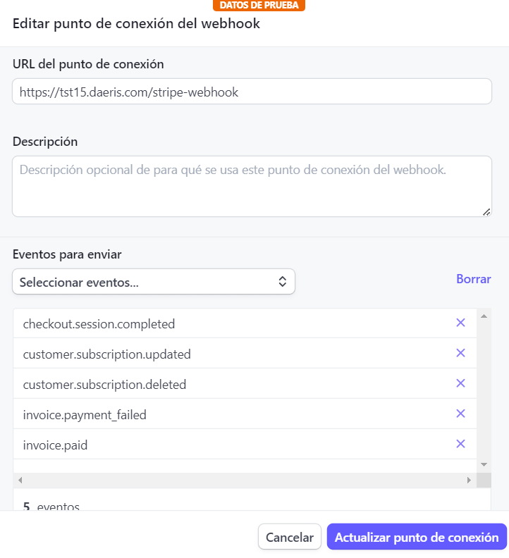
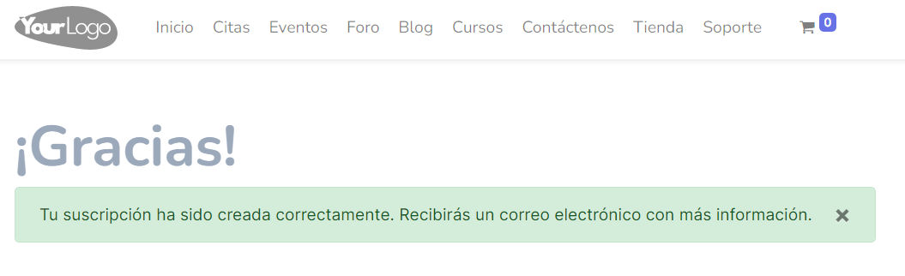
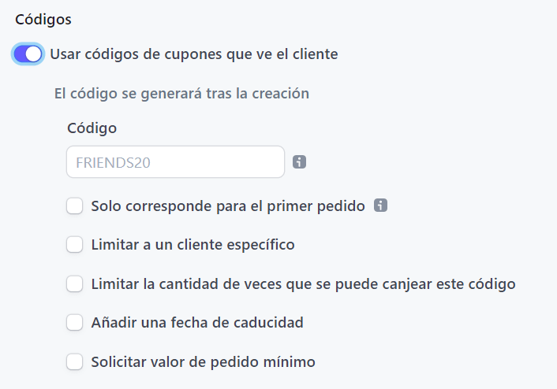
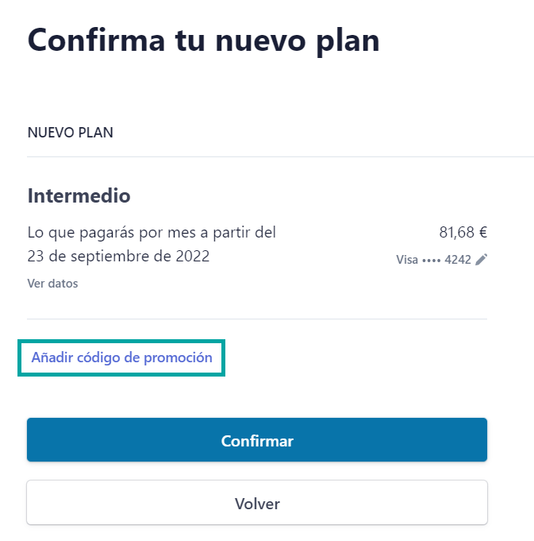

==================================
Gestionar suscripciones con Stripe
==================================

Configuración
=============

Activar las suscripciones de clientes con Stripe
------------------------------------------------

Mediante la activación de la funcionalidad de suscripciones con Stripe, Daeris genera un formulario de suscripción en
el sitio web para que los usuarios puedan suscribirse a un servicio o producto mediante el pago recurrente con tarjeta de
crédito o débito.

Los pagos recurrentes son gestionados por la plataforma de pagos `Stripe <https://stripe.com/es>`__, así que para utilizar
esta funcionalidad será necesario disponer de una cuenta en dicha plataforma.

Una vez creada la cuenta será necesario obtener las claves de API necesarias para integrar Stripe con Daeris. Para ello,
desde tu cuenta de Stripe, navega al menú :menuselection:`Desarrolladores --> Claves de API`. Desde esta pantalla puedes
consultar la clave publicable y la clave secreta:

.. note::
   Si utilizas las claves API de prueba, podrás hacer pruebas con las suscripciones sin afectar a datos reales. Esto puede
   ser útil para validar la integración con Stripe antes de publicar el formulario de suscripción para tus usuarios.

Por otro lado, navega al menú :menuselection:`Desarrolladores --> Webhooks` y añade un nuevo punto de conexión mediante
el botón **Añadir punto de conexión**. El sistema desplegará un formulario donde informar los siguientes campos:

-  **URL del punto de conexión**: Deberás introducir la URL de tu entorno exclusivo de Daeris, seguido de la página
   `/stripe-webhook`.

-  **Descripción**: Descripción opcional de para qué se usa este punto de conexión.

-  **Eventos para enviar**: Deberás seleccionar los siguientes eventos:

   -  checkout.session.completed

   -  customer.subscription.updated

   -  customer.subscription.deleted

   -  invoice.payment_failed

   -  invoice.paid

Una vez creado el Webhook, desde el detalle del mismo, anota el secreto de firma del Webhook, ya que se deberá introducir
en la configuración de Daeris:

A continuación, desde Daeris, navega a la pantalla :menuselection:`Sitio web --> Configuración --> Ajustes`, y en el
apartado de **Suscripciones**, activa la opción correspondiente:

Tras marcar esta opción, pulsa el botón *Guardar* de la pantalla de ajustes. El sistema instalará el módulo de suscripciones,
y una vez finalizada la instalación, deberás informar los siguientes campos:

-  **Clave secreta**: Clave secreta de la API de Stripe.

-  **Clave publicable**: Clave publicable de la API de Stripe.

-  **Clave del webhook**: Secreto de firma obtenido desde el detalle del webhook creado en Stripe.

-  **URL de agradecimiento**: URL a la que se redirigirá a los usuarios cuando completen una sesión de checkout en Stripe.
   Por defecto, se informará la URL `https://miempresa.daeris.com/agradecimiento-suscripcion`, en donde deberás cambiar
   `miempresa.daeris.com` por el nombre de tu entorno exclusivo de Daeris. También es posible utilizar cualquier otra
   página personalizada.

-  **URL de cancelación**: URL a la que se redirigirá a los usuarios cuando cancelen una sesión de checkout en Stripe. Por
   defecto, se informará la URL `https://miempresa.daeris.com/cancelacion-suscripcion`, en donde deberás cambiar
   `miempresa.daeris.com` por el nombre de tu entorno exclusivo de Daeris. También es posible utilizar cualquier otra
   página personalizada.

-  **Códigos de promoción**: Si se marca este campo, se permitirá al usuario introducir códigos de promoción en la
   pantalla de checkout.

-  **Usuario responsable**: Usuario al que se asignarán las tareas asociadas con las suscripciones.

-  **Compañía**: Compañía que se asociará a las facturas generadas en las suscripciones.

   .. important::
      En caso de trabajar con múltiples compañías, se deberá seleccionar la compañía con la que se ha configurado el plan
      contable y los impuestos utilizados en las suscripciones. En caso de existir incongruencias, la creación de la factura
      fallará, ya que no es posible crear una factura cuya cuenta contable o impuestos sean distintos a la compañía utilizada.

-  **Cuenta contable**: Cuenta contable que se asociará a las facturas generadas en las suscripciones.

-  **Clave Recaptcha**: Debes introducir la `clave del sitio Recaptcha <http://www.google.com/recaptcha/admin>`__. La
   clave creada debe ser de tipo ReCaptcha v2 y el dominio debe coincidir con el dominio de tu instancia Daeris.

Una vez completados los campos, pulsa de nuevo el botón *Guardar* de la pantalla de ajustes.

Crear los productos y precios de la suscripción
-----------------------------------------------

Antes de publicar el formulario de suscripción, es necesario crear los productos y precios a los que se podrán suscribir
los clientes, tanto en Stripe como en Daeris. Para ello, navega a tu área de cliente de Stripe, y desde el menú **Productos**,
pulsa el botón **Añadir producto**. A continuación, informa los siguientes campos:

-  **Nombre**: Nombre descriptivo del producto.

-  **Modelo de tarifas**: Selecciona la opción de tarifas estándar.

-  **Precio**: Introduce un precio de la tarifa.

-  **Periodo de facturación**: Selecciona cada cuanto quieres facturar el producto o servicio (diario, semanal, mensual,
   anual, etc).

.. note::
   Es posible disponer de dos precios para un mismo producto. Por ejemplo, si quieres permitir la suscripción mensual y
   anual, puedes crear dos precios distintos, uno para cada periodo de facturación.

Una vez creados los productos, anota el identificador de dichos productos y de sus precios. Esta información está disponible
desde el formulario de detalle del producto:

A continuación, desde la aplicación Daeris, navega a la pantalla :menuselection:`Miembros --> Configuración --> Productos de Suscripción`,
y crea un nuevo producto mediante el botón *Crear*. El sistema navegará al formulario de detalle donde puedes informar un
nombre, una categoría e informar el resto de campos asociados al producto:

Desde el apartado **Stripe**, podrás informar los siguientes campos:

-  **Id de producto de la suscripción**: Informar el identificador de producto de Stripe.

-  **Id de precio de la suscripción**: Informar el identificador de precio de Stripe.

.. note::
   En caso de haber creado varios precios para un mismo producto en Stripe, se deberán crear varios productos en Daeris,
   y en cada uno de ellos informar el mismo identificador de producto y su identificador de precio específico.

Por último, guarda el producto mediante el botón *Guardar*.

A partir de ese momento, puedes validar que el producto está disponible accediendo al formulario de suscripción disponible
desde la URL `https://miempresa.daeris.com/suscribirse`, y validando el campo **Tarifa**:

Configurar el grupo de países que estará disponible desde el formulario de suscripción
--------------------------------------------------------------------------------------

Para configurar el grupo de países que estará disponible desde el formulario de suscripción de Daeris, navega a la pantalla
:menuselection:`Contactos --> Configuración --> Grupo de países`. Tras activar la funcionalidad de suscripciones, dispones
de un grupo de países llamado **Suscripciones Stripe**:

Accede al detalle del grupo de países y pulsa el botón *Editar* para añadir o quitar países del grupo:

Una vez editados los países, pulsa el botón *Guardar*.

A partir de ese momento, puedes validar que los países configurados están disponibles accediendo al formulario de suscripción
disponible desde la URL `https://miempresa.daeris.com/suscribirse`, y validando el campo **País**:

.. image:: stripe/configurar-grupo-paises-3.png
   :align: center
   :alt: Configurar el grupo de países que estará disponible desde el formulario de suscripción (3)

Crear tipos de impuestos para el pago de las suscripciones
----------------------------------------------------------

Daeris permite definir un tipo de impuesto distinto por cada uno de los países y provincias configurados en el formulario
de suscripción. Para ello, accede a tu área de cliente de Stripe y navega a la pantalla
:menuselection:`Productos --> Tipos de impuesto`. Crea un nuevo tipo de impuesto mediante el botón *Nuevo* e informa
los siguientes campos:

-  **Tipo**: El nombre del tipo impositivo.

-  **Región**: Informar el país al que aplicará dicho impuesto.

-  **Tasa**: Especificar el porcentaje de impuesto a aplicar.

Una vez creado el impuesto, anotar el identificador del tipo impositivo:

A continuación, desde la aplicación Daeris, navega a la pantalla :menuselection:`Contactos --> Configuración --> Países`,
y selecciona el país para el que quieres configurar el impuesto. Desde el formulario de detalle, informa los siguientes campos:

-  **Impuesto Stripe de las suscripciones**: Identificador del tipo de impuesto de Stripe.

-  **Impuesto facturas de las suscripciones**: Impuesto que se añadirá a las facturas de las suscripciones creadas en Daeris.

.. important::
   El porcentaje de impuesto debe coincidir en ambos impuestos, ya que, si no, se producirán incoherencias entre el monto
   cobrado por Stripe y la factura creada en Daeris.

.. tip::
   Si quieres incluir un impuesto del 0%, deberás informar solamente el campo **Impuesto facturas de las suscripciones**,
   ya que Stripe no permite crear tipos impositivos del 0%. De esta manera, cuando la factura se cree en Daeris, se añadirá
   el impuesto a la factura.

Por último, guarda la información del país mediante el botón *Guardar*.

Si dentro de un mismo país, debes cobrar un impuesto diferente a los clientes de un estado o provincia, lo puedes hacer
navegando a la pantalla :menuselection:`Contactos --> Configuración --> Provincias` y seleccionando la provincia para la
que quieres configurar el impuesto. El sistema siempre tendrá en cuenta antes la provincia del cliente para calcular el
impuesto. Si no está informado el impuesto a nivel de la provincia, se tomará el impuesto del país.

A partir de ese momento, el impuesto quedará configurado para todas las suscripciones vendidas a clientes del país o provincia
seleccionado, a los que se les añadirá el porcentaje de impuesto sobre el precio del producto de la suscripción.

Configurar el checkout y el portal de clientes de Stripe
--------------------------------------------------------

Antes de poder empezar a utilizar el formulario de suscripciones de Stripe, es necesario configurar el checkout y el portal
de clientes de Stripe. Para ello, navega a tu área de clientes de Stripe, y desde el menú **Configuración**, accede a la
pantalla de **Checkout y Payment Links**. Desde esta pantalla puedes configurar lo siguiente:

-  **Proceso de compra más rápido**: Los clientes podrán guardar su información de pago para pagar con 1 clic.

-  **Rellenado automático de direcciones**: Habilita el rellenado automático de direcciones con Google Maps.

-  **Información pública**: Permite actualizar el nombre de tu empresa y la descripción que aparecerá en el extracto bancario.

-  **Aspecto**: Permite configurar la imagen de marca para cargar tu icono o logotipo y definir los colores.

-  **Dominio**: Permite cambiar el dominio de tu página de Checkout.

Desde el apartado de **Políticas de la tienda**, puedes configurar lo siguiente:

-  **Política de rembolsos y devoluciones**: Muestra tu política de rembolsos y devoluciones.

-  **Políticas legales**: Muestras enlaces a tus condiciones de servicio y políticas de privacidad.

-  **Información de contacto**: Muestra información de contacto para soporte.

Una vez hecho esto, navega de nuevo a la pantalla de **Configuración**, y accede a la pantalla de **Portal de clientes**.
Desde esta pantalla puedes configurar lo siguiente:

-  **Apariencia**: Permite configurar la imagen de marca para cargar tu icono o logotipo y definir los colores.

-  **Nombre de la empresa**: Permite actualizar el nombre de tu empresa.

-  **Historial de facturas**: Muestra a los clientes una lista interactiva de sus facturas abiertas y pagadas. Como las
   facturas serán cargadas en Daeris, dejaremos esta opción deshabilitada.

-  **Datos de facturación**: Permite que los clientes actualicen sus datos de facturación. Como las facturas serán cargadas
   en Daeris, dejaremos esta opción deshabilitada.

-  **Métodos de pago**: Permite que los clientes actualicen sus métodos de pago. Dejaremos esta opción habilitada, ya que
   así los clientes podrán cambiar sus tarjetas de crédito o débito.

-  **Códigos de promoción**: Permite a los clientes aplicar códigos de promoción en su portal de clientes una vez dada
   de alta la suscripción.

-  **Cancelar suscripciones**: Permite que el cliente cancele sus suscripciones. En caso de habilitar esta opción, se
   deberá marcar la opción para cancelar de inmediato, ya que será Daeris el que gestione dicha petición de cancelación
   en el momento de recibirla.

-  **Suspender suscripciones**: Permite que los clientes suspendan y reanuden las suscripciones. Mientras el cobro está
   suspendido, las suscripciones generarán facturas anuladas. Esta opción no es compatible con Daeris, por lo que se deberá
   dejar deshabilitada.

-  **Actualizar suscripciones**: Permite que los clientes se cambien a un plan de precios diferente o que actualicen las
   cantidades de las suscripciones. Si se habilita esta opción, no se deberá marcar la opción de prorrateo, ya que puede
   generar incoherencias en las facturas generadas en Daeris.

-  **Encabezado**: Personaliza los mensajes que se muestran a los clientes en todo el portal de clientes.

-  **Vínculos**:

   -  **Condiciones de servicio**: Lo que ven los clientes cuando confirman cambios en la suscripción o añaden métodos de pago.

   -  **Política de privacidad**: Lo que ven los clientes cuando confirman cambios en la suscripción o añaden métodos de pago.

   -  **Vínculo de redireccionamiento predeterminado**: Elige dónde redirigir a los clientes después de que hayan gestionado
      sus cuentas. Deberás informar la URL `https://miempresa.daeris.com/my/home`, donde `miempresa.daeris.com` se corresponde
      con el nombre de tu instancia en Daeris.

Una vez informados los campos, pulsa el botón *Guardar*.

A partir de ese momento, tanto el portal del cliente de Stripe como el checkout, quedarán listos para su uso.

Gestionar las suscripciones
===========================

Suscribirse a un producto o servicio mediante el formulario de suscripción
--------------------------------------------------------------------------

Los clientes que quieran suscribirse a un producto o servicio mediante el formulario de suscripción, deberán acceder a la
URL `https://miempresa.daeris.com/suscribirse`, donde `miempresa.daeris.com` se corresponde con el nombre de tu instancia
de Daeris.

.. tip::
   Puedes crear un acceso a esta página desde el menú, o desde un botón ubicado en una página de tu sitio web, con tal
   de facilitar el acceso de los usuarios a dicha página.

El formulario de suscripción dispone de los siguientes campos:

-  **Nombre y apellidos**: Campo de tipo texto con el nombre y apellidos del usuario.

-  **Correo electrónico**: Campo de tipo E-mail, que se utilizará como método de contacto e identificador de
   acceso del usuario al sistema.

-  **Número de teléfono**: Campo donde el usuario puede introducir su teléfono.

-  **Nombre de la compañía**: Campo donde el usuario puede introducir su compañía, en caso de tratarse de una empresa.

-  **NIF (Número de Identificación Fiscal)**: Campo donde el usuario puede introducir su número de identificación
   fiscal, en caso que quiera que así aparezca en sus facturas.

-  **Dirección**: Campo donde el usuario puede introducir su calle y número de casa.

-  **Código postal**: Campo donde el usuario puede introducir su código postal.

-  **Ciudad**: Campo donde el usuario puede introducir su ciudad.

-  **País**: Campo donde el usuario debe introducir su país de residencia, y para que sea posible hacer el
   cálculo del tipo impositivo en función del país.

-  **Tarifa**: Campo con el listado de productos de tipo suscripción publicados.

Una vez completados todos los campos, aceptadas las condiciones de uso y política de privacidad, y marcada la validación
de Google ReCapctha, se habilitará el campo **Confirmar & Pagar**:

A continuación, si todo es correcto, el sistema redirigirá al cliente a la pantalla de pago de Stripe, donde deberá
introducir los datos de su tarjeta:

Finalmente, si el pago es aceptado, el sistema redirigirá al cliente a la URL de agradecimiento configurada en el sistema:

Por su parte, el usuario recibirá un correo con un enlace que le permitirá establecer una contraseña para acceder a su
área privada. También recibirá un correo con la factura generada en formato PDF. Dichos correos se corresponden con las
siguientes plantillas de correo:

-  Registro de autenticación: Conexión Daeris

-  Suscripciones Stripe: Factura Pagada

.. note::
   En caso de querer modificar alguna de estas plantillas, es posible hacerlo desde la pantalla de
   :menuselection:`Ajustes --> Correo electrónico --> Plantillas`.

.. seealso::
   * :doc:`../../varios/correo_electronico/plantillas_correo`

Por último, el usuario responsable de las suscripciones de Daeris, recibirá una notificación con una nueva tarea creada.
Para consultar dicha tarea debe acceder a la pantalla :menuselection:`Proyecto --> Proyectos`, y acceder al detalle del
proyecto **Suscripciones Stripe**:

Dentro de este proyecto aparecerán las tareas asociadas a las suscripciones. Todas aquellas que hacen referencia a nuevas
suscripciones creadas se identifican con el nombre *Checkout sesión completed*, y disponen de la fecha en la que se realizó
el pago de la suscripción:

De esta manera, el responsable de las suscripciones, puede tomar las acciones necesarias para otorgar el producto o servicio
al cliente registrado. Para ello, puede navegar al detalle de una tarea, y consultar el cliente asociado:

Al navegar al detalle del cliente, desde la pestaña **Suscripción**, puede consultar el detalle de la suscripción de dicho
cliente:

Este mismo cliente también se puede consultar desde el área de cliente de Stripe, en el menú
:menuselection:`Clientes --> Resumen`, donde también se puede consultar el estado de su suscripción, así como el
producto al que se ha suscrito, accediendo al detalle del mismo:

Cancelar una suscripción
------------------------

Los clientes que quieran cancelar su suscripción, pueden hacerlo desde su área privada, siempre y cuando se permita la
opción de cancelación en el portal de clientes. Para ello, el usuario deberá acceder con su cuenta a su área privada de Daeris:

Desde su área privada, el usuario podrá consultar sus facturas, así como los datos de su suscripción. Para cancelar su
suscripción, deberá pulsar el botón **Editar suscripción**, que le llevará a su portal de cliente de Stripe:

Desde el portal de cliente, el usuario podrá cancelar su suscripción mediante el botón **Cancelar plan**:

A continuación, el sistema pedirá confirmación para cancelar el plan:

Una vez cancelado, el portal del cliente mostrará que ya no hay planes actuales:

Al volver al área privada de Daeris, se indicará que la suscripción está pendiente o ha sido cancelada, y permitirá
al usuario crear de nuevo otra suscripción si así lo desea:

En paralelo, el usuario recibirá un correo electrónico indicando que su suscripción ha sido cancelada. Dicho correo se
corresponde con la siguiente plantilla de correo:

-  Suscripciones Stripe: Eliminada

.. note::
   En caso de querer modificar esta plantilla, es posible hacerlo desde la pantalla de
   :menuselection:`Ajustes --> Correo electrónico --> Plantillas`.

.. seealso::
   * :doc:`../../varios/correo_electronico/plantillas_correo`

Por último, el usuario responsable de las suscripciones de Daeris, recibirá una notificación con una nueva tarea creada.
Para consultar dicha tarea debe acceder a la pantalla :menuselection:`Proyecto --> Proyectos`, y acceder al detalle del
proyecto **Suscripciones Stripe**:

Dentro de este proyecto aparecerán las tareas asociadas a las suscripciones. Todas aquellas que hacen referencia a
suscripciones canceladas se identifican con el nombre *Customer subscription deleted*, y disponen de la fecha en la que
vence su suscripción:

De esta manera, el responsable de las suscripciones, puede tomar las acciones necesarias para desvincular el producto o
servicio del cliente registrado. Para ello, puede navegar al detalle de una tarea, y consultar el cliente asociado:

Al navegar al detalle del cliente, desde la pestaña **Suscripción**, puede consultar el detalle de la suscripción de dicho
cliente:

Este mismo cliente también se puede consultar desde el área de cliente de Stripe, en el menú :menuselection:`Clientes --> Resumen`,
donde también se puede consultar el estado de su suscripción, así como el producto que ha cancelado, accediendo al detalle
del cliente:

Actualizar una suscripción
--------------------------

Los clientes que quieran cambiar a un plan de precios diferente, pueden hacerlo desde su área privada, siempre y cuando
se permita la opción de actualización en el portal de clientes. Para ello, el usuario deberá acceder con su cuenta a su
área privada de Daeris:

Desde su área privada, el usuario podrá consultar sus facturas, así como los datos de su suscripción. Para actualizar su
suscripción, deberá pulsar el botón **Editar suscripción**, que le llevará a su portal de cliente de Stripe:

Desde el portal de cliente, el usuario podrá actualizar su suscripción mediante el botón **Cambiar plan**:

A continuación, el sistema mostrará los planes disponibles para que el cliente seleccione el que más le convenga:

Por último, el sistema solicitará confirmación para cambiar el plan:

Una vez actualizado, el portal del cliente mostrará el plan actual:

Al volver al área privada de Daeris, también se mostrará el nombre del nuevo plan, así como su estado:

En paralelo, el usuario recibirá un correo electrónico indicando que su suscripción ha sido modificada. Dicho correo se
corresponde con la siguiente plantilla de correo:

-  Suscripciones Stripe: Modificada

.. note::
   En caso de querer modificar esta plantilla, es posible hacerlo desde la pantalla de
   :menuselection:`Ajustes --> Correo electrónico --> Plantillas`.

.. seealso::
   * :doc:`../../varios/correo_electronico/plantillas_correo`

Por último, el usuario responsable de las suscripciones de Daeris, recibirá una notificación con una nueva tarea creada.
Para consultar dicha tarea debe acceder a la pantalla :menuselection:`Proyecto --> Proyectos`, y acceder al detalle del
proyecto **Suscripciones Stripe**:

Dentro de este proyecto aparecerán las tareas asociadas a las suscripciones. Todas aquellas que hacen referencia a
suscripciones modificadas se identifican con el nombre *Customer subscription updated*, y disponen de la fecha en que
se emitirá la próxima factura:

De esta manera, el responsable de las suscripciones, puede tomar las acciones necesarias para actualizar la suscripción
del cliente. Para ello, puede navegar al detalle de una tarea, y consultar el cliente asociado:

Al navegar al detalle del cliente, desde la pestaña **Suscripción**, puede consultar el detalle de la suscripción de dicho
cliente:

Este mismo cliente también se puede consultar desde el área de cliente de Stripe, en el menú :menuselection:`Clientes --> Resumen`,
donde también se puede consultar el estado de su suscripción, así como el producto actualizado, accediendo al detalle del
cliente:

Pagar una factura atrasada de una suscripción
---------------------------------------------

Las facturas de las suscripciones pueden quedar pendientes de pago por varios motivos, como, por ejemplo, tarjetas de
crédito caducadas, canceladas o sin fondos. Cuando una factura correspondiente a una suscripción no puede ser pagada,
Daeris envía un correo al cliente alertando de esta situación, y proporcionando un enlace para que pague la factura
pendiente. Dicho correo se corresponde con la siguiente plantilla de correo:

-  Suscripciones Stripe: Pago de Factura Fallido

.. note::
   En caso de querer modificar esta plantilla, es posible hacerlo desde la pantalla de
   :menuselection:`Ajustes --> Correo electrónico --> Plantillas`.

.. seealso::
   * :doc:`../../varios/correo_electronico/plantillas_correo`

Por su parte, el usuario responsable de las suscripciones de Daeris, recibirá una notificación con una nueva tarea creada.
Para consultar dicha tarea debe acceder a la pantalla :menuselection:`Proyecto --> Proyectos`, y acceder al detalle del
proyecto **Suscripciones Stripe**:

Dentro de este proyecto aparecerán las tareas asociadas a las suscripciones. Todas aquellas que hacen referencia a
suscripciones pendientes de pago se identifican con el nombre *Invoice payment failed*. En la fecha límite aparece la
fecha en que falló el pagó más 7 días, con tal de dejar un margen de pago a los clientes:

De esta manera, el responsable de las suscripciones, puede tomar las acciones necesarias para que el cliente proceda con
el pago de la factura atrasada. Para ello, puede navegar al detalle de la tarea, y consultar el cliente asociado:

El cliente puede realizar el pago de la factura pendiente desde el propio correo electrónico recibido o accediendo a su
área de clientes y pulsando en el enlace **Pagar factura**:

El sistema abrirá una nueva ventana de navegador donde poder realizar el pago de la factura en la pasarela de Stripe:

Una vez realizado el pago, el sistema mostrará un mensaje de confirmación:

A continuación, el cliente recibirá un correo con la factura generada en formato PDF. Dicho correo se corresponde con
la siguiente plantilla de correo:

-  Suscripciones Stripe: Factura Pagada

.. note::
   En caso de querer modificar esta plantilla, es posible hacerlo desde la pantalla de
   :menuselection:`Ajustes --> Correo electrónico --> Plantillas`.

.. seealso::
   * :doc:`../../varios/correo_electronico/plantillas_correo`

Por último, si el cliente refresca la pantalla de su área privada, podrá confirmar que su suscripción vuelve a
encontrarse activa:

Para que en futuros pagos no vuelva a tener el mismo problema, el cliente debería cambiar su método de pago pulsando el
botón **Editar Suscripción**. Desde el portal de cliente de Stripe, el cliente puede añadir nuevos métodos de pago y
eliminar métodos de pago obsoletos:

Utilizar códigos de promoción en las suscripciones
==================================================

Configuración
-------------

Para utilizar códigos de promoción en las suscripciones, navega a tu cuenta de Stripe, y desde la pantalla
:menuselection:`Productos --> Cupones`, crea un nuevo cupón mediante el botón *Nuevo*:

A continuación, informa un nombre para el cupón y el tipo de descuento, donde puedes seleccionar un porcentaje de descuento
o un importe fijo. También puedes indicar si quieres que la promoción aplique solamente a productos específicos. Por último,
informa la duración y el límite de canjes, en caso de querer limitarlos.

Para que el cliente pueda introducir manualmente el código del cupón de descuento, marca la opción *Usar códigos de cupones que ve el cliente*.
Informa un código para el cupón, y configura los límites y duración del mismo:

Una vez informados todos los campos, pulsa el botón **Crear cupón**.

Ahora, desde la aplicación Daeris, navega a la pantalla :menuselection:`Sitio web --> Configuración --> Ajustes` y
asegúrate de que está marcada la opción de **Códigos de promoción** en el apartado de *Suscripciones*:

Una vez hecho esto, pulsa el botón *Guardar* de la pantalla de ajustes.

Por último, si quieres que los clientes puedan introducir códigos de promoción desde el portal de clientes, activa
la opción de **Códigos de promoción** disponible desde tu cuenta de Stripe, en la pantalla :menuselection:`Configuración --> Portal de clientes`:

.. image:: stripe/promociones-4b.png
   :align: center
   :alt: Utilizar códigos de promoción en las suscripciones (4b)

Tras activar esa opción, pulsa el botón *Guardar*.

Aplicar un código de promoción en el checkout
---------------------------------------------

Cuando un cliente se suscribe a un producto o servicio desde el formulario de suscripción de Daeris, el sistema
cargará la pantalla de checkout, desde donde el cliente podrá introducir su código de promoción pulsando el botón
*Añadir código de promoción*:

Una vez introducido el código, es necesario pulsar el botón *Aplicar* para que se aplique el descuento:

Si el código es válido, se aplicará el descuento sobre el precio de la suscripción:

Una vez realizado el pago, el cliente recibirá la factura, cuyo importe será el precio total menos el descuento aplicado
en el checkout:

El usuario responsable de las suscripciones de Daeris, recibirá una notificación con una nueva tarea creada.
Para consultar dicha tarea debe acceder a la pantalla :menuselection:`Proyecto --> Proyectos`, y acceder al detalle del
proyecto **Suscripciones Stripe**:

Dentro de este proyecto aparecerán las tareas asociadas a las suscripciones. Todas aquellas que hacen referencia a nuevas
suscripciones creadas se identifican con el nombre *Checkout sesión completed*, y disponen de la fecha en la que se realizó
el pago de la suscripción:

De esta manera, el responsable de las suscripciones, puede tomar las acciones necesarias para dar de alta la suscripción
del cliente. Para ello, puede navegar al detalle de una tarea, y consultar el cliente asociado:

Al navegar al detalle del cliente, desde la pestaña **Suscripción**, puede consultar el detalle de la suscripción de dicho
cliente. Mediante la *URL de factura de la suscripción* se puede consultar la última factura generada para el cliente:

Al consultar dicha factura, se puede ver el detalle del descuento aplicado:

Aplicar un código de promoción en el portal de clientes
-------------------------------------------------------

Cuando un cliente acceda a su área de clientes del sitio web desde el menú **Mi cuenta**, siempre que tenga una suscripción activa,
podrá acceder a su portal de clientes de Stripe pulsando el botón **Editar Suscripción**:

Desde el portal de clientes de Stripe, el cliente puede cambiar su plan desde el botón **Cambiar plan**, siempre y cuando
se haya habilitado esa opción en la configuración del portal de clientes de Stripe:

.. image:: stripe/promociones-15.png
   :align: center
   :alt: Utilizar códigos de promoción en las suscripciones (15)

Al seleccionar un nuevo plan, será posible introducir un código promocional mediante el enlace **Añadir código de promoción**,
siempre y cuando se haya activado esa opción desde la configuración del portal de clientes de Stripe:

De esta manera, al cambiar de plan, se aplicarán los descuentos del cupón en la factura.