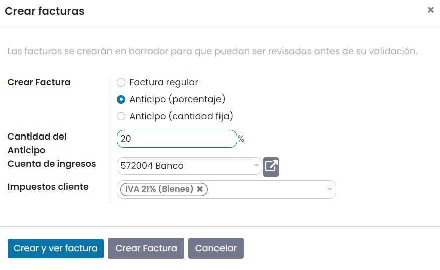
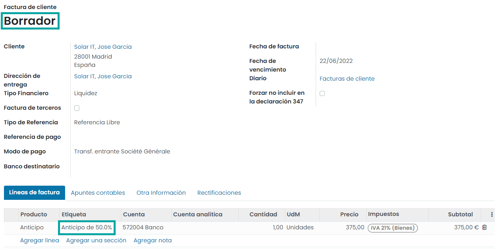
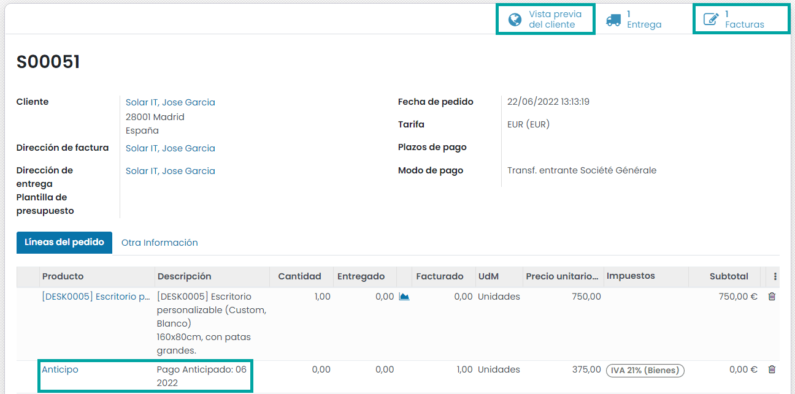
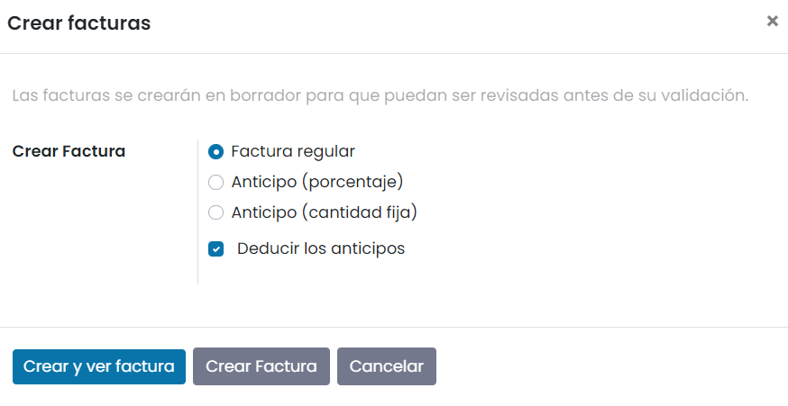
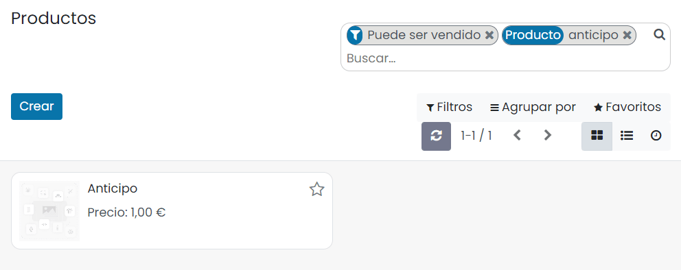
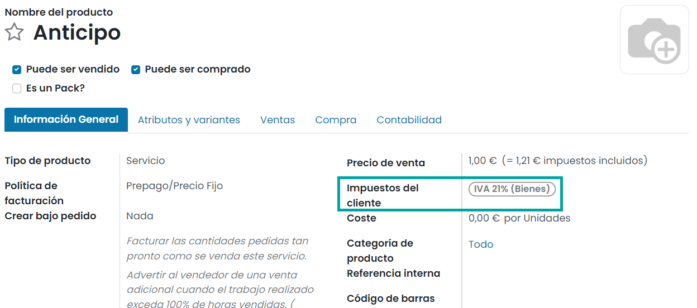
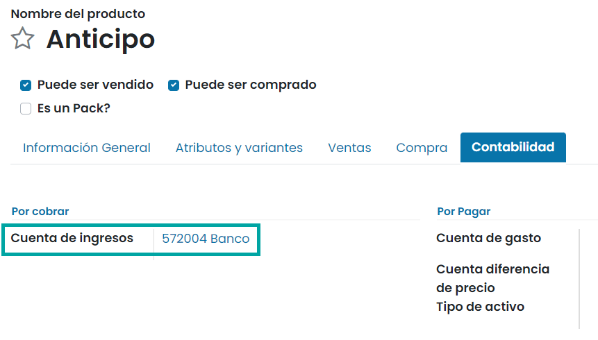
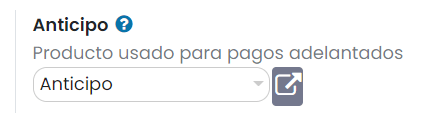

=====================
Solicitar un anticipo
=====================

Un **anticipo** es un pago parcial que hace un comprador al concluir un contrato de venta. Esto implica el compromiso
total de ambas partes (el vendedor y el comprador) de cumplir el contrato. Con un anticipo, los compradores muestran su
voluntad de adquirir el producto y se comprometen a pagar el resto después, mientras que los vendedores al aceptarlo
tienen la obligación de proporcionar los productos.

Algunas veces se necesita un anticipo para pedidos o proyectos caros. De esta forma, te puedes proteger y asegurarte de
que tu cliente sea confiable.

Primera vez que solicitas un anticipo
=====================================

Cuando se confirma un pedido de venta, tienes la posibilidad de crear una factura. Las facturas se crean de forma
automática como borradores para que las puedas revisar antes de validarlas. Para crear una factura, la aplicación de
Ventas de Daeris te ofrece 3 opciones:

-  Factura regular
-  Anticipo (porcentaje)
-  Anticipo (cantidad fija)

En cuanto al anticipo, puede ser un importe fijo o un porcentaje del importe total. La primera vez que solicites un
anticipo, puedes establecer un porcentaje o un importe fijo de tu elección, y seleccionar la cuenta de ingresos y los
impuestos adecuados. Estos ajustes se reutilizarán para futuros anticipos.

.. important::
   Cuando solicitas un anticipo por primera vez, se crea un nuevo producto que se llama **Anticipo**. Este producto se
   registrará como un producto de tipo **servicio** con una política de facturación de **cantidades ordenadas**. Te
   recordamos que puedes editar este producto y modificarlo en cualquier momento. Ten en cuenta que si eliges
   **cantidades entregadas** como política de facturación, no podrás crear una factura.

Flujo de ventas básico al usar anticipos
========================================

Para este primer ejemplo utilizaremos un importe de 50% como anticipo con un producto que utiliza **cantidades ordenadas**
como política de facturación. Asegúrate de consultar nuestra documentación sobre políticas de facturación aquí:
:doc:`politica_facturacion` , antes de solicitar tu primer anticipo. A la hora de crear y ver la factura, solo tendrás
acceso a un borrador de factura en el que se menciona el anticipo (como puedes ver a continuación).

Ahí puedes confirmar la factura y registrar el pago de tu cliente. Sin embargo, todos sabemos que en la vida real este
flujo no sucede de inmediato. Así que, por ahora, puedes volver al pedido de venta. Ahí tendrás la posibilidad de ver
el pedido como lo visualiza el cliente mediante el botón de **Vista previa del cliente** o ir al borrador de factura
anterior con facilidad con el botón de **Factura**. En cualquier caso, el anticipo se mencionará en ambos (el pedido de
venta y el borrador de factura).

Para completar el flujo, cuando el cliente quiere pagar el resto de su pedido de venta, deberás crear otra factura. Una
vez más, tendrás la opción de realizar otro anticipo o deducir todos los anticipos, y así pagar el resto de la factura
como una factura regular.

Este flujo también es posible con un anticipo con un importe fijo.

.. important::
   Ten cuidado, ya que si haces un anticipo con un producto que usa **cantidades entregadas** como política de facturación,
   no podrás deducir todos los anticipos al querer facturar a tu cliente. Tienes que entregar un producto antes de crear
   la factura final. Si no se ha entregado nada, debes crear una factura rectificativa que cancele el borrador de factura
   que se creó después del anticipo.

Modificar la cuenta de ingresos y los impuestos de clientes
===========================================================

En la lista de productos, busca el producto de **Anticipo**.

Puedes editarlo, en la pestaña de **Información General** podrás cambiar los impuestos del cliente:

Para cambiar la cuenta de ingresos, navega a la pestaña de **Contabilidad** en el formulario del producto:

Cambiar el producto usado para pagos adelantados
================================================

Cuando solicitas un anticipo por primera vez, se crea un nuevo producto que se llama **Anticipo** y se establece como
producto usado para pagos adelantados.

Si necesitas cambiar el producto usado para los anticipos, navega a la pantalla :menuselection:`Ventas --> Configuración --> Ajustes`
y en el apartado de **Anticipo** selecciona un nuevo producto:

Una vez realizados los cambios, pulsa el botón *Guardar* de la pantalla de ajustes.

.. seealso::
  - :doc:`politica_facturacion`