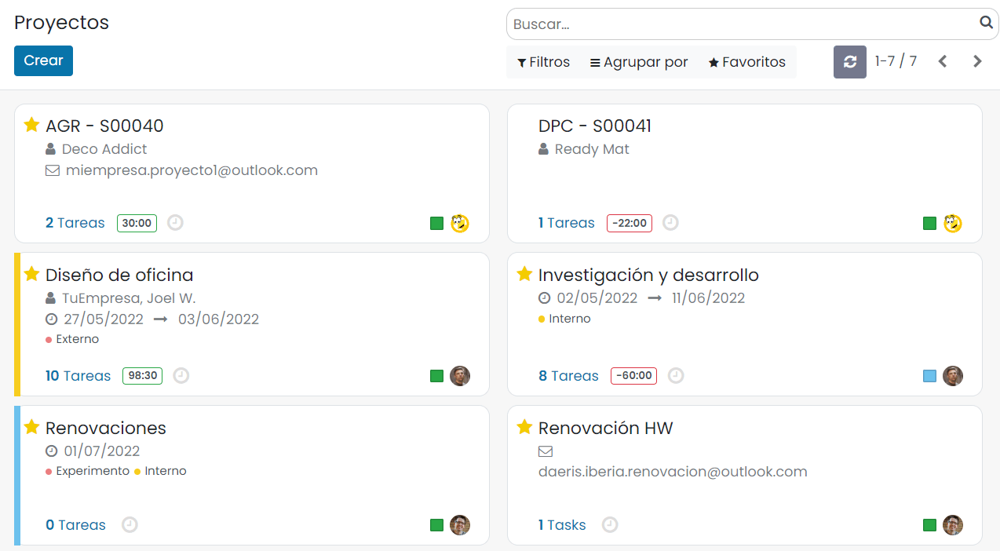
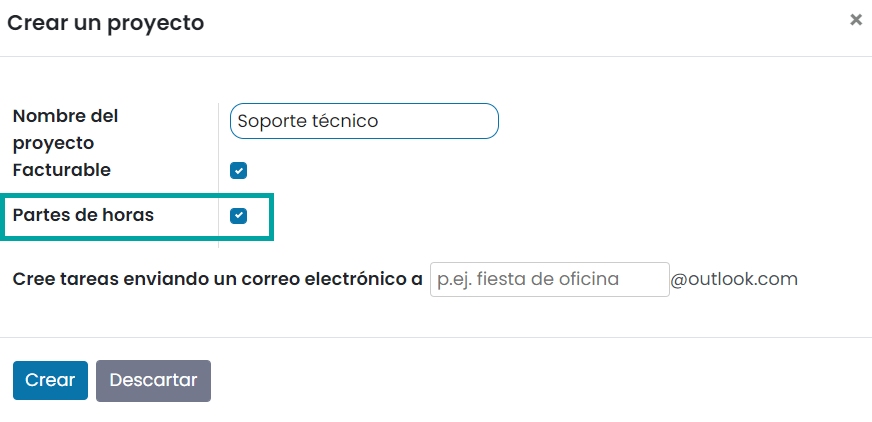
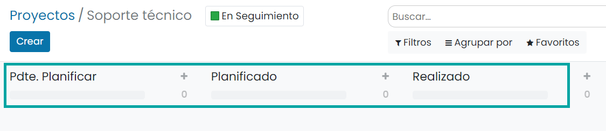
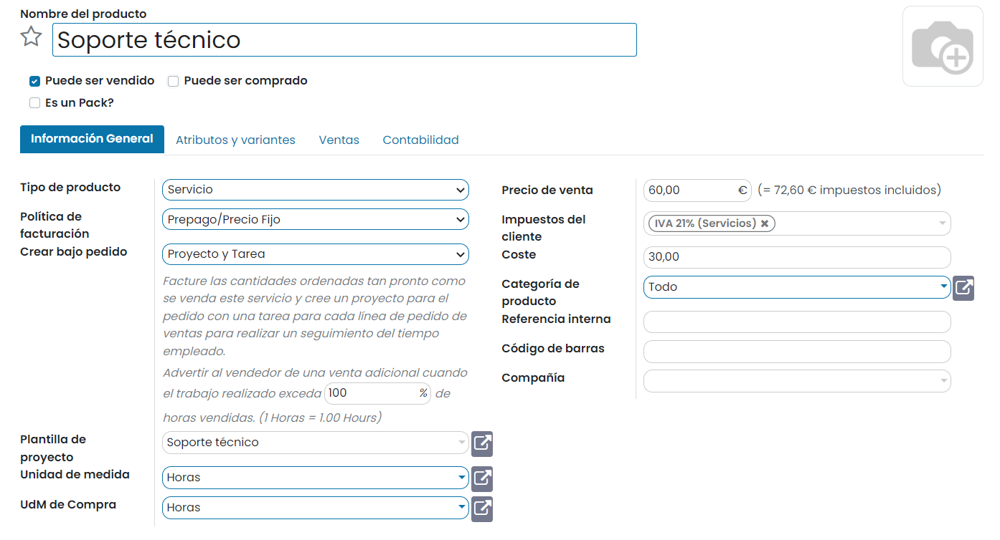
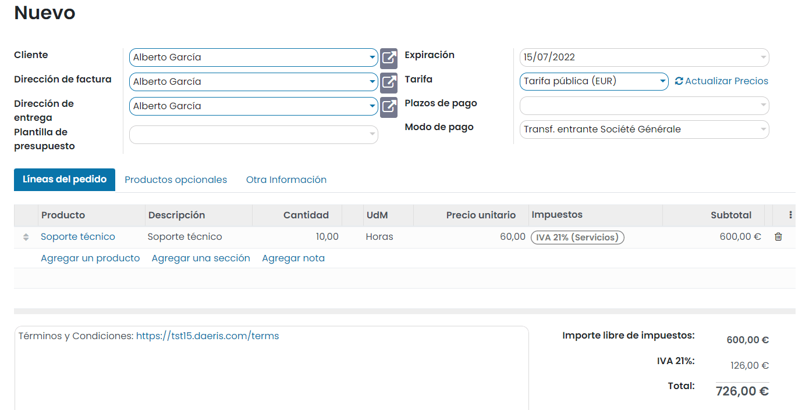
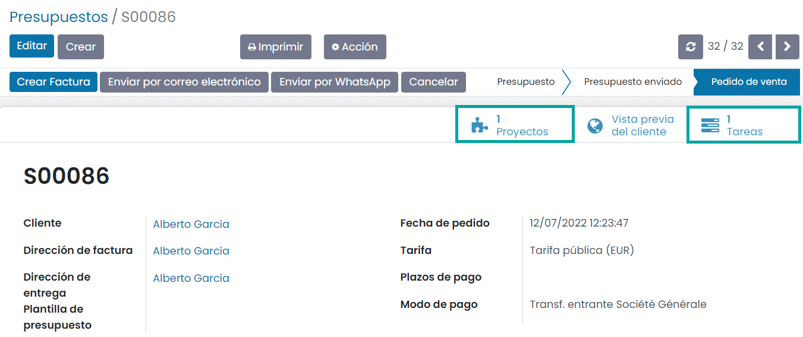
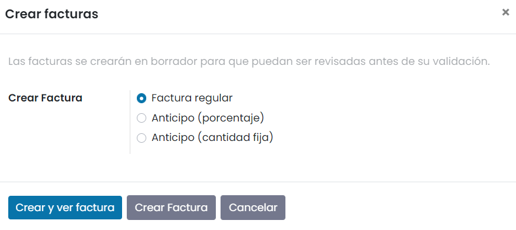
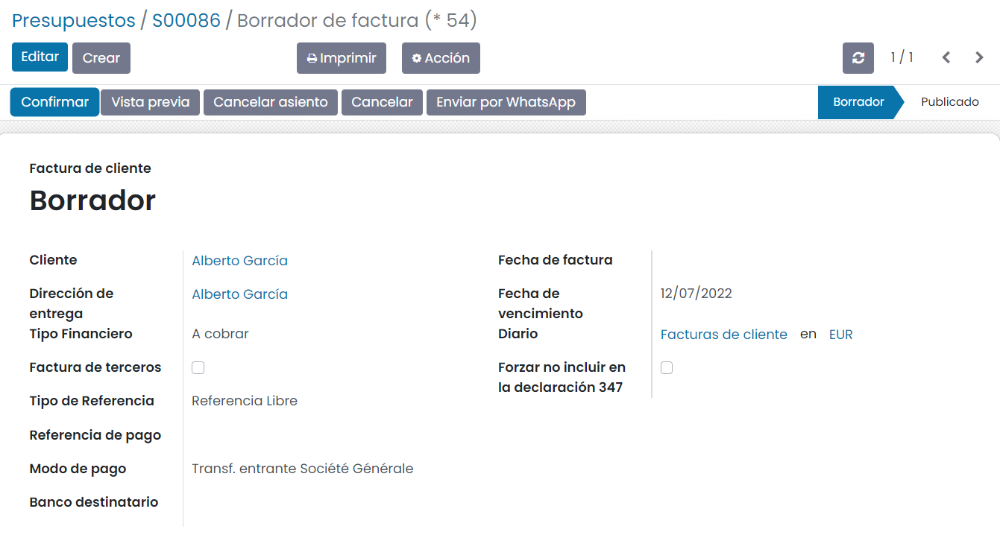

=============================
Factura en formato de prepago
=============================

Daeris permite la venta de productos de tipo servicio estableciendo un precio fijo de contrato, independientemente de los
recursos que puedan llegar a invertirse (venta de proyectos). Estos contratos se pueden configurar para que el pago
deba realizarse antes de prestar el servicio, en formato prepago.

Crear un proyecto para controlar el servicio
============================================

Para disponer de un proyecto base al que asociar el producto, crea un nuevo proyecto desde la pantalla
:menuselection:`Proyecto --> Proyectos`:

En el formulario de creación de proyecto, informa el nombre de proyecto y marca la opción para **Permitir partes de horas**:

Bajo el nuevo proyecto, incorpora las etapas que consideres oportunas:

.. seealso::
   * :ref:`servicios/gestion_de_proyecto/crear_un_proyecto`

Crear el producto de tipo servicio
==================================

Daeris permite configurar un producto de tipo servicio, para que pueda ser vendido antes de que haya sido realizado
(servicio de prepago). El precio y unidad de medida se define a nivel de producto y se factura antes de que el servicio
haya sido realizado. Bajo este formato es posible vender, por ejemplo, horas de soporte de un especialista.

Para crear un producto de tipo servicio en formato de prepago, navega a la pantalla :menuselection:`Ventas --> Productos --> Productos`
y pulsa el botón *Crear*. El nuevo producto debe tener informados los siguientes campos:

-  **Nombre del producto**: Nombre del producto en formato prepago.

-  **Puede ser vendido**: Marcado.

-  **Tipo de producto**: Servicio.

-  **Política de facturación**: Prepago/Precio fijo.

-  **Crear bajo pedido**: Proyecto y Tarea.

-  **Plantilla de proyecto**: Seleccionar el proyecto que servirá como plantilla para generar nuevos proyectos.

-  **Precio de venta**: Precio de venta del servicio.

-  **Impuestos del cliente**: Impuestos asociados a la venta del servicio.

-  **Coste**: Precio de coste del servicio.

-  **Unidad de medida**: Horas.

-  **UdM de Compra**: Horas.

Una vez informados los campos necesarios pulsa el botón *Guardar*.

Vender un servicio
==================

Para vender un servicio en formato de prepago, crea un nuevo presupuesto de venta desde la pantalla
:menuselection:`Ventas --> Pedidos --> Presupuestos`. Incorpora en la línea de pedido, un producto de tipo servicio en
formato prepago y la cantidad de horas a vender:

Una vez confirmado el pedido, el presupuesto se habrá transformado en un pedido de venta y dispondrás de un proyecto y
una tarea asociadas:

Facturar un servicio
====================

Para facturar un servicio en formato de prepago, navega al detalle del pedido de venta desde la pantalla
:menuselection:`Ventas --> Pedidos --> Pedidos` y pulsa el botón **Crear Factura**. El sistema permitirá seleccionar los
elementos a facturar:

Una vez en el detalle de la factura, será necesario confirmarla mediante el botón correspondiente:

Con la factura ya validada, se deberá registrar el pago mediante el botón **Registrar pago**. El sistema permitirá
registrar el pago, seleccionando el diario, tipo de método y fecha correspondiente. Una vez registrado el pago, la factura
queda en estado *Pagado* o *En proceso de pago*.