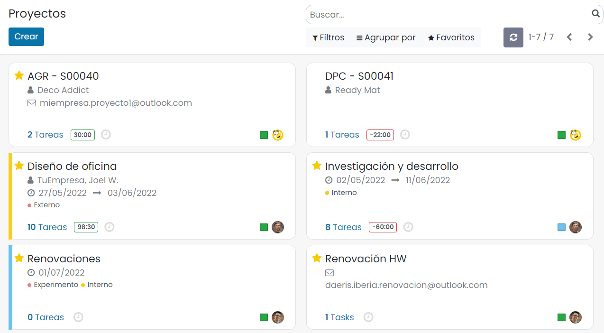
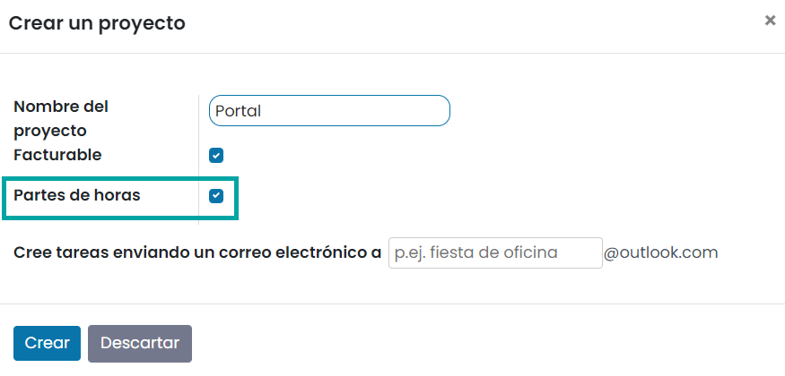
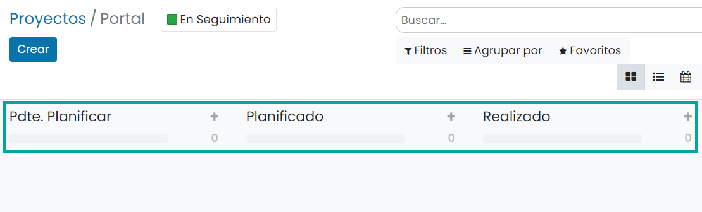
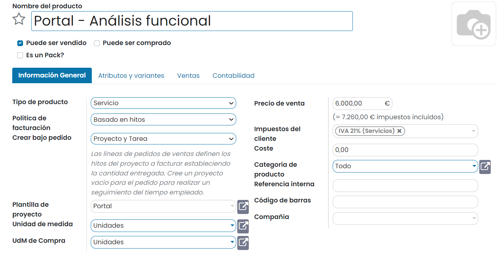
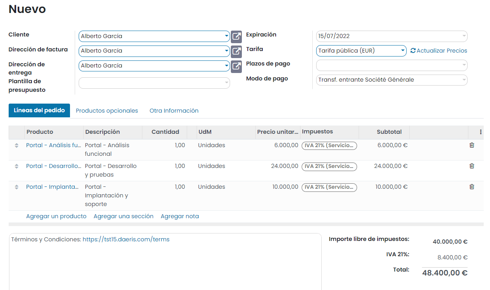
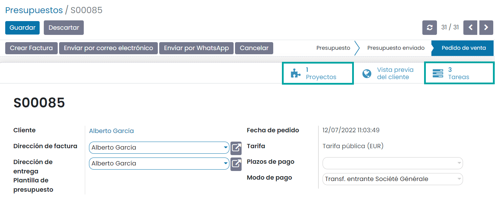
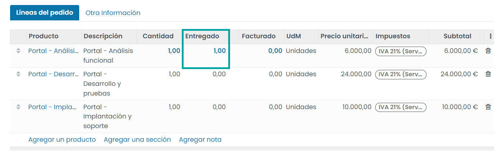
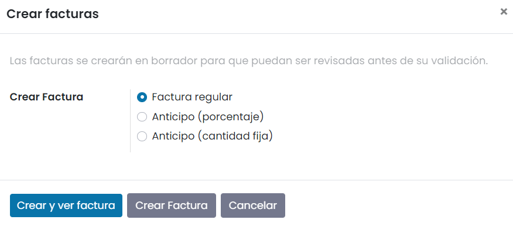
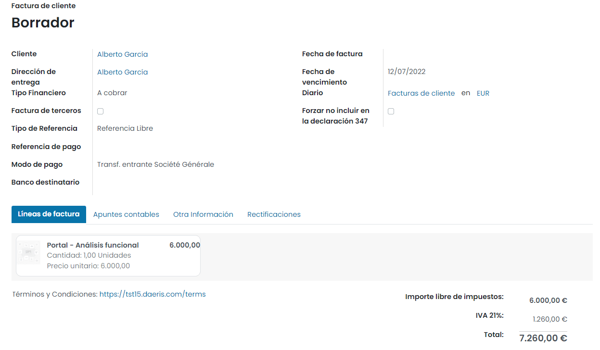

==============================
Facturar objetivos de proyecto
==============================

Daeris permite la venta de productos de tipo servicio estableciendo un precio fijo de contrato, independientemente de los
recursos que puedan llegar a invertirse (venta de proyectos). Para realizar la venta de proyectos se deben establecer
unas fases (objetivos) que identificarán el progreso del proyecto y el precio de completarlas. Al alcanzar cada una de
las fases se puede facturar al precio establecido. De igual modo es posible usar el tipo de facturación por porcentajes,
identificando como objetivos a alcanzar, porcentajes de avance concretos con su correspondiente abono. Por ejemplo, 12.000€
al llegar al 25%, 12.000€ al 50% y 26.000€ al llegar al 100%.

Crear servicios como fases de un proyecto
=========================================

Para disponer de un proyecto base al que asociar el producto, crea un nuevo proyecto desde la pantalla
:menuselection:`Proyecto --> Proyectos`:

En el formulario de creación de proyecto, informa el nombre de proyecto y marca la opción para **Permitir partes de horas**:

Bajo el nuevo proyecto, incorpora las etapas que consideres oportunas:

.. seealso::
   * :ref:`servicios/gestion_de_proyecto/crear_un_proyecto`

Crear el producto de tipo servicio por objetivos
================================================

Para crear un producto de tipo servicio como fases de un proyecto, navega a la pantalla :menuselection:`Ventas --> Productos --> Productos`
y pulsa el botón *Crear*. El nuevo producto debe tener informados los siguientes campos:

-  **Nombre del producto**: Nombre del producto o fase del proyecto.

-  **Puede ser vendido**: Marcado.

-  **Tipo de producto**: Servicio.

-  **Política de facturación**: Basado en hitos.

-  **Crear bajo pedido**: Proyecto y Tarea.

-  **Plantilla de proyecto**: Seleccionar el proyecto que servirá como plantilla para generar nuevos proyectos.

-  **Precio de venta**: Precio de venta de la fase del proyecto.

-  **Impuestos del cliente**: Impuestos asociados a la venta del servicio.

-  **Unidad de medida**: Unidades.

Una vez informados los campos necesarios pulsa el botón *Guardar*.

Vender un proyecto fragmentado por fases
========================================

Para vender proyecto fragmentado por fases, crea un nuevo presupuesto de venta desde la pantalla
:menuselection:`Ventas --> Pedidos --> Presupuestos`. Incorpora en la línea de pedido, los productos correspondientes a
cada una de las fases:

Una vez confirmado el pedido, el presupuesto se habrá transformado en un pedido de venta y dispondrás de un proyecto y
varias tareas asociadas (el número de tareas depende de las fases del proyecto o líneas de pedido asociadas):

Facturar la fase de un proyecto
===============================

Para facturar una fase completada de un proyecto, navega al pedido de venta desde la pantalla :menuselection:`Ventas --> Pedidos --> Pedidos`
y pulsa el botón *Editar*. A continuación, informa la cantidad entregada (1 unidad) para indicar que se ha entregado la
parte del proyecto que quieres facturar:

Una vez guardada la línea del pedido, pulsa el botón **Crear Factura**. El sistema permitirá seleccionar los elementos a
facturar:

Esta acción creará una nueva factura que incorporará únicamente la línea del pedido que ya se ha entregado al cliente:

Cada vez que completes una fase y quieras facturarla, será necesario volver al detalle del pedido de venta, actualizar
la cantidad entregada de la línea que haga referencia a la fase del proyecto y generar la correspondiente factura.