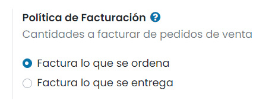
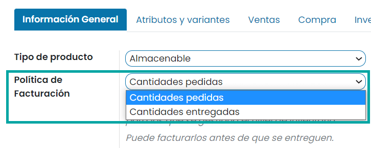

===================================================
Factura basada en cantidades entregadas u ordenadas
===================================================

Diferentes políticas empresariales pueden requerir diferentes opciones de facturación:

- Se utiliza la regla **Facturar lo que se ordena** como modo predeterminado en la aplicación de Ventas de Daeris, lo
  cual significa que se facturará a los clientes cuando se confirme la orden de venta.

- La regla **Facturar lo que se entrega** facturará a los clientes cuando se realice la entrega. Esta regla afecta a las
  empresas que venden materiales, líquidos o alimentos en grandes cantidades. En estos casos, la cantidad puede diferir
  un poco y, por lo tanto, es preferible facturar la cantidad que se entrega en realidad.

Tener distintas opciones de facturación te permite tener más flexibilidad. Debes saber exactamente cómo facturar a tus
clientes en distintas situaciones.

Activar estas funciones
=======================

Navega a la pantalla :menuselection:`Ventas --> Configuración --> Ajustes` y en el apartado **Política de Facturación**
selecciona la regla que deseas aplicar.

.. important::
   Si seleccionas la regla **Facturar lo que se entrega**, no podrás activar la función de **Facturación automática**,
   la cual genera facturas de forma automática cuando se confirma el pago en línea.

Elegir una política de facturación en un formulario de producto
===============================================================

En cualquier página de detalle de un producto, en la pestaña de *Información General*, encontrarás la política de facturación,
la cual se puede cambiar de forma manual.

Impacto en el flujo de ventas
=============================

En la aplicación de **Ventas** de Daeris, el flujo de ventas básico es crear un presupuesto, enviarlo a tu cliente,
esperar la confirmación, confirmar el pedido de venta y crear una factura.

- **Facturar lo que se ordena**: No tiene impacto en este flujo de ventas básico. Puedes facturar en cuanto se confirma
  la venta.

- **Facturar lo que se entrega**: Tiene un impacto pequeño en el flujo de ventas porque debes confirmar la cantidad
  entregada antes de crear una factura con la aplicación de **Ventas**. Si tratas de crear una factura sin validar la
  cantidad entregada, recibirás un mensaje de error como se muestra a continuación.

  .. image:: politica_facturacion/error-politica-facturacion.png
     :class: img-thumbnail
     :alt: ¿Cómo la elección de tu política de facturación afecta tu flujo de ventas en el módulo de Ventas de Daeris?

.. note::
   Una vez que se confirma el presupuesto y que el estado cambia de **Presupuesto enviado** a **Pedido de venta**, podrás
   ver tus cantidades entregadas y facturadas directamente en tu pedido de venta (esto aplica para ambas reglas).

   .. image:: politica_facturacion/cantidades-entregadas-facturadas.png
      :align: center
      :class: img-thumbnail
      :alt: ¿Cómo ver las cantidades entregadas y facturadas en el módulo de Ventas de Daeris?

   Daeris agregará de forma automática las cantidades a la factura (incluso si es una entrega parcial).

Por último, para crear una factura, tienes diferentes opciones: factura regular o anticipo (porcentaje o importe fijo).

.. important::
   Asegúrate de consultar nuestra documentación sobre anticipos aquí: :doc:`anticipos`, para dominar esta increíble función.