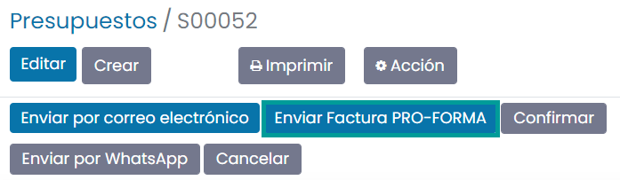
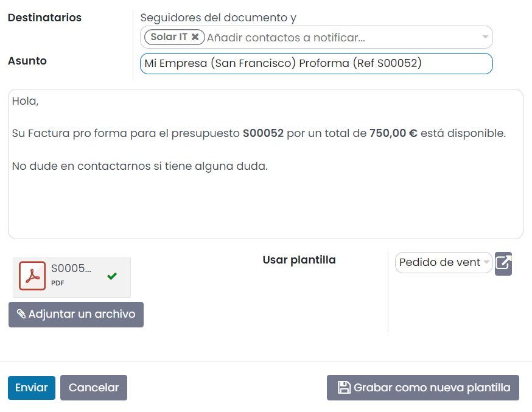

===========================
Enviar una factura proforma
===========================

Una factura proforma es una factura abreviada o estimada antes de una entrega de bienes. En ella se indica el tipo y la
cantidad de bienes, su valor y otros datos importantes, como el peso y los gastos de transporte. Las facturas proforma
se utilizan habitualmente como facturas preliminares con un presupuesto, o a efectos aduaneros en la importación. Se
diferencian de una factura normal en que no exigen o solicitan un pago.

Activar esta característica
===========================

Navega a la pantalla :menuselection:`Ventas --> Configuración --> Ajustes` y activa la función de **Factura Pro-Forma**.

Una vez activada la opción, pulsa el botón *Guardar* de la pantalla de ajustes.

Enviar una factura proforma
===========================

Ahora tendrás la opción de enviar una factura proforma desde cualquier presupuesto o pedido de venta:

Daeris enviará un correo electrónico con la factura proforma como archivo adjunto cuando hagas clic en enviar:

.. seealso::
   * :doc:`../../../varios/correo_electronico/enviar_correos`