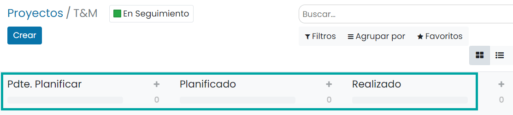
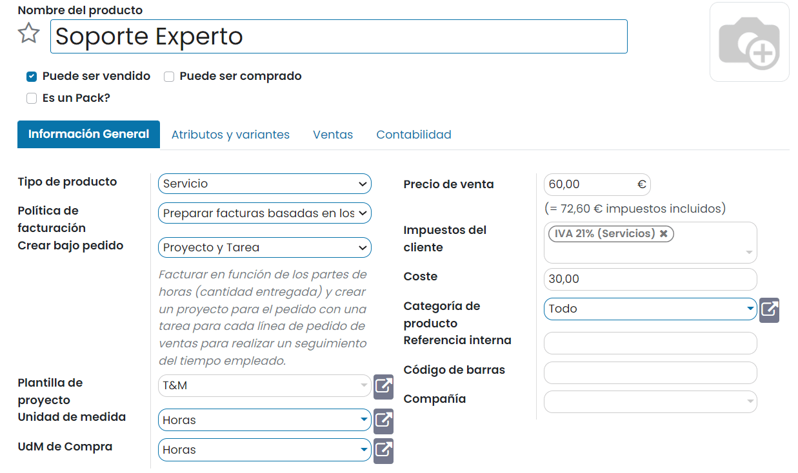

=====================================
Factura basada en tiempo y materiales
=====================================

El tiempo y los materiales se utilizan generalmente en proyectos en los que no es posible estimar con precisión el
tamaño del proyecto, o cuando se espera que los requisitos del proyecto cambien. Esto es lo opuesto a un contrato de
precio fijo, en el cual el propietario acuerda pagarle al contratista una suma fija por el cumplimiento del contrato,
sin importar lo que los contratistas paguen a sus empleados, subcontratistas y proveedores.

Para esta documentación se utilizará el ejemplo de un consultor, que deberá facturar su tiempo y sus diversos gastos
(transporte, alojamiento, etc.).

Facturar el tiempo invertido
============================

Crear un proyecto para controlar el servicio
--------------------------------------------

Para disponer de un proyecto base al que asociar el producto, crea un nuevo proyecto desde la pantalla
:menuselection:`Proyecto --> Proyectos`:

En el formulario de creación de proyecto, informa el nombre de proyecto y marca la opción para **Permitir partes de horas**:

Bajo el nuevo proyecto, incorpora las etapas que consideres oportunas:

.. seealso::
   * :ref:`servicios/gestion_de_proyecto/crear_un_proyecto`

Crear el producto de tipo servicio
----------------------------------

Para crear un producto de tipo servicio basado en los partes de horas, navega a la pantalla :menuselection:`Ventas --> Productos --> Productos`
y pulsa el botón *Crear*. El nuevo producto debe tener informados los siguientes campos:

-  **Nombre del producto**: Nombre del producto basado en los partes de horas.

-  **Puede ser vendido**: Marcado.

-  **Tipo de producto**: Servicio.

-  **Política de facturación**: Preparar facturas basadas en los partes de horas.

-  **Crear bajo pedido**: Proyecto y Tarea.

-  **Plantilla de proyecto**: Seleccionar el proyecto que servirá como plantilla para generar nuevos proyectos.

-  **Precio de venta**: Precio de venta del servicio.

-  **Impuestos del cliente**: Impuestos asociados a la venta del servicio.

-  **Coste**: Precio de coste del servicio.

-  **Unidad de medida**: Horas.

-  **UdM de Compra**: Horas.

Una vez informados los campos necesarios pulsa el botón *Guardar*.

Vender un servicio
------------------

Para vender un servicio basado en partes de horas, crea un nuevo presupuesto de venta desde la pantalla
:menuselection:`Ventas --> Pedidos --> Presupuestos`. Incorpora en la línea de pedido, un producto de tipo servicio
basado en partes de horas:

Una vez confirmado el pedido, el presupuesto se habrá transformado en un pedido de venta y dispondrás de un proyecto y
una tarea asociadas:

Al hacer clic en la tarea asociada, el sistema navegará al detalle de la tarea, donde se podrán informar las horas
iniciales planificadas, así como registrar todas las horas incurridas por los empleados en la pestaña **Partes de horas**:

A continuación, desde el pedido de venta, se podrán visualizar las horas registradas, y se deberá ajustar la cantidad
del pedido para que se corresponda con las horas entregadas:

Facturar un servicio
--------------------

Para facturar un servicio basado en partes de horas, navega al detalle del pedido de venta desde la pantalla
:menuselection:`Ventas --> Pedidos --> Pedidos` y pulsa el botón **Crear Factura**. El sistema permitirá seleccionar los
elementos a facturar. También será posible informar el periodo de partes de horas incluidos en la factura:

Una vez en el detalle de la factura, será necesario confirmarla mediante el botón correspondiente:

Con la factura ya validada, se deberá registrar el pago mediante el botón **Registrar pago**. El sistema permitirá
registrar el pago, seleccionando el diario, tipo de método y fecha correspondiente. Una vez registrado el pago, la factura
queda en estado *Pagado* o *En proceso de pago*.

Facturar gastos
===============

.. seealso::
   * :ref:`finanzas/gastos/facturar_gastos`