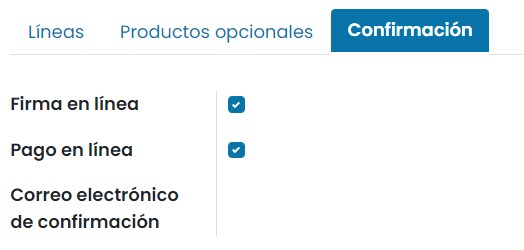
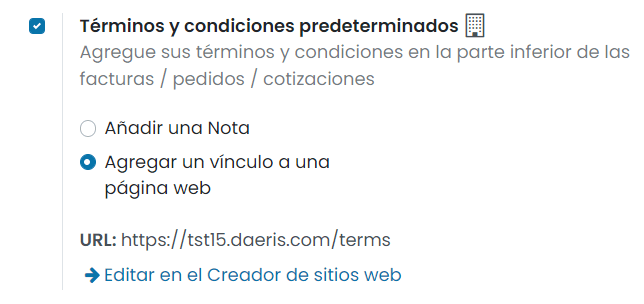
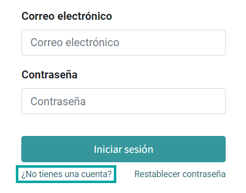

=============
Configuración
=============

Completar la información del asistente de ventas
================================================

El asistente de ventas permite completar la información básica desde un solo lugar para la correcta generación de
presupuestos. Para acceder al asistente de ventas, navega a la pantalla :menuselection:`Ventas --> Pedidos --> Presupuestos`.
El asistente aparece en la cabecera de la página:

Para completar el asistente, pulsa los botones ubicados en cada uno de los pasos. En primer lugar, completa la información
de la compañía pulsando el botón **¡Empecemos!**:

El sistema desplegará una ventana en donde poder revisar y completar los datos de la compañía:

Una vez revisados los datos pulsa el botón **Aplicar**.

A continuación, pulsa el botón **Personalizar**, para personalizar el diseño de los presupuestos:

El sistema desplegará una ventana en donde poder seleccionar entre los diferentes estilos de plantillas de presupuestos,
así como informar un logotipo, lema de la compañía, pie de página y formato del papel:

Una vez completados los datos pulsa el botón **Guardar**.

.. seealso::
   * :ref:`varios/usuarios_companias/configurar_formato_documentos`

El siguiente paso será pulsar el botón **Establecer pagos**, que permitirá seleccionar cómo confirmar los presupuestos
y recibir los pagos:

La aplicación desplegará una ventana con una serie de opciones que permiten seleccionar cómo pueden confirmar los pedidos
los clientes:

.. image:: configuracion/confirmacion-presupuestos.png
   :align: center
   :alt: Selecciona como pueden confirmar un pedido tus clientes

Una vez completados los datos pulsa el botón **Aplicar**.

Por último, pulsa el botón **Enviar prueba**, para enviar una prueba de presupuesto:

La aplicación navegará a la pantalla de detalle de un presupuesto, que permitirá enviar por correo electrónico un
ejemplo de presupuesto, con el objetivo de confirmar que el diseño se adapta a tus necesidades:

.. seealso::
   * :doc:`../../../varios/correo_electronico/enviar_correos`

.. _ventas/presupuestos_pedidos/plantillas_presupuestos:

Configurar las plantillas de presupuesto de venta
=================================================

Si creas plantillas de presupuesto personalizadas, ahorrarás mucho tiempo. Con el uso de plantillas podrás enviar
presupuestos completos a un ritmo rápido.

Configuración
-------------

Para habilitar esta función navega a la pantalla :menuselection:`Ventas --> Configuración --> Ajustes` y activa la opción
**Plantillas de presupuesto**:

También se recomienda añadir la función de **Constructor de presupuestos**, la cuál ayuda a diseñar tus plantillas de
presupuesto de manera sencilla:

Una vez marcadas las opciones, pulsa el botón *Guardar* de la pantalla de ajustes.

Crea tu primera plantilla
-------------------------

Puedes encontrar las plantillas de presupuesto en la pantalla :menuselection:`Ventas --> Configuración --> Plantillas de presupuesto`:

Puedes crear una plantilla nueva o editar una que ya existe. Añade un nombre, selecciona productos y cantidades, e
informa los días de vigencia de la plantilla:

En la pestaña de *Productos opcionales*, añade los productos opcionales en caso de haberlos:

Desde la pestaña de *Confirmación* aparecen disponibles las siguientes opciones, que se heredarán sobre el presupuesto
cuando el gestor seleccione la plantilla:

-  **Firmar en línea**: Pedir al cliente la firma del presupuesto online.

-  **Pago en línea**: Permitir al cliente pagar el presupuesto online.

-  **Correo electrónico de confirmación**: Plantilla de correo electrónico que se utilizará para enviar un correo al
   cliente cuando confirme el presupuesto.

Una vez completados los campos necesarios, pulsa el botón *Guardar*.

Diseña tu plantilla
-------------------

A continuación, pulsa el botón *Diseñar plantilla*, ubicado en la parte superior del formulario:

Tendrás la posibilidad de diseñar la plantilla y editar la interfaz de clientes para manejar lo que verán los clientes
antes de aceptar y pagar el presupuesto. Por ejemplo, podrás describir tu empresa, servicios y productos. Para hacerlo,
puedes hacer clic en *Editar*:

Puedes editar el contenido de tu plantilla al arrastrar y soltar bloques de creación para organizar tu presupuesto. Por
ejemplo, puedes agregar un bloque de contenido para describir tus productos:

Una vez finalizadas las modificaciones, guarda los cambios, y la plantilla ya estará lista para su uso.

Utiliza una plantilla de presupuesto
------------------------------------

A partir de ese momento, al crear un presupuesto de venta desde la pantalla :menuselection:`Ventas --> Pedidos --> Presupuestos`,
podrás seleccionar la plantilla de presupuesto desde el campo ubicado en el formulario de detalle:

.. tip::
   Puedes seleccionar cualquier plantilla de tu elección y sugerirla como plantilla predeterminada en el campo
   **Plantilla predeterminada** de la pantalla :menuselection:`Ventas --> Configuración --> Ajustes`.

En función de la configuración de la plantilla de presupuesto, el presupuesto de venta heredará la configuración de la
plantilla, incorporando las diferentes líneas y opciones informadas en la plantilla de presupuesto.

Mediante el botón *Vista previa del cliente*, puedes validar la información contenida en el presupuesto online y editarla
en caso de ser necesario:

.. image:: configuracion/vista-previa-cliente.png
   :align: center
   :alt: Vista previa del cliente

El sistema navegará al editor web, donde se incluyen los datos del presupuesto online tal y como se mostrarán al cliente
si se conecta al portal web:

Obtener una firma para confirmar un pedido
==========================================

Las firmas en línea son como "huellas dactilares" electrónicas. Si decides usarlas en Daeris, obtendrás confirmaciones
automáticas en tus pedidos. Tú y tus clientes ahorraréis mucho tiempo al usar esta función, en comparación con el proceso
tradicional.

Activar la firma online
-----------------------

Para activar la firma online navega a la pantalla :menuselection:`Ventas --> Configuración --> Ajustes` y activa la
opción de **Firma en línea**:

Una vez marcada la opción, pulsa el botón *Guardar* de la pantalla de ajustes.

Confirmar un presupuesto con una firma
--------------------------------------

Cuando envíes presupuestos, tus clientes podrán aceptarlos y firmarlos en línea de manera inmediata. Cuando hagan clic
en *Firmar y pagar*, tendrán las opciones de dibujar su firma, completar con una firma automatizada o subir un archivo
desde su ordenador. El siguiente es un ejemplo de una firma automatizada:

.. image:: configuracion/ejemplo-firma-en-linea.png
   :align: center
   :alt: Ejemplo de firma en línea en los pedidos de venta

Una vez firmado, tendrás la posibilidad de escoger tu método de pago. Después, cuando pagues y confirmes el presupuesto,
Daeris creará automáticamente una orden de entrega.

Recibe el pago para confirmar un pedido
=======================================

En general, se considera que los pagos en línea son una alternativa más rápida, barata y segura comparada con los métodos
tradicionales de pago. Con la aplicación de Ventas de Daeris, puedes usar los pagos en línea para automatizar la
confirmación de los pedidos. Los pagos en línea se realizan de manera instantánea, lo cual es muy conveniente y ahorra
mucho tiempo en el proceso básico de venta.

.. _ventas/presupuestos_pedidos/configuracion/pago_en_linea:

Activar el pago en línea
------------------------

Para activar el pago online navega a la pantalla :menuselection:`Ventas --> Configuración --> Ajustes` y activa la
opción de **Pago en línea**:

Una vez marcada la opción, pulsa el botón *Guardar* de la pantalla de ajustes.

Mediante el enlace de **Medios de pago**, tendrás acceso directo a la página de métodos de pago, donde podrás seleccionar
y configurar los métodos de tu elección.

Registrar un pago
-----------------

Después de abrir los presupuestos que llegaron a sus correos electrónicos, tus clientes tendrán varias opciones sobre
cómo realizar sus pagos. Por ejemplo:

Entrega y facturación a diferentes direcciones
==============================================

Con la aplicación de Ventas de Daeris, puedes configurar diferentes direcciones para la entrega y la facturación. Para
algunos clientes, esta función será muy práctica para definir direcciones específicas, ya que no todos tienen la misma
ubicación de entrega que la de facturación.

Configuración
-------------

Para activar esta función navega a la pantalla :menuselection:`Ventas --> Configuración --> Ajustes` y activa la
opción de **Direcciones de clientes**:

Una vez marcada la opción, pulsa el botón *Guardar* de la pantalla de ajustes.

Añadir direcciones desde un presupuesto
---------------------------------------

A partir de ese momento, al crear un presupuesto de ventas, podrás agregar, eliminar y modificar las direcciones de
facturación y entrega de los clientes:

.. note::
   Si seleccionas un cliente con direcciones de facturación y entrega definidas, Daeris usará esta información para
   completar los campos. Ahora, si deseas cambiarlos en el momento, puedes hacerlo directamente desde el presupuesto o
   el pedido de venta.

Agregar términos y condiciones
==============================

Especificar los términos y condiciones es esencial para exponer los puntos contractuales importantes como términos de
pago, limitación de responsabilidad y condiciones de entrega entre los clientes y vendedores. Cada vendedor debe declarar
toda la información oficial de la política de sus productos y su empresa. Por otro lado, cada cliente debe tener en
cuenta todas estas condiciones antes de comprometerse a cualquier cosa. Gracias a la aplicación de Ventas, es muy fácil
incluir tus términos y condiciones predeterminados en cada presupuesto, pedido de venta y factura que gestiones.

.. _ventas/presupuestos_pedidos/terminos:

Términos y condiciones predeterminados
--------------------------------------

Configuración
~~~~~~~~~~~~~

Para activar esta función navega a la pantalla :menuselection:`Facturación / Contabilidad --> Configuración --> Ajustes`
y activa la opción de **Términos y condiciones predeterminados**:

Una vez marcada la opción, pulsa el botón *Guardar* de la pantalla de ajustes.

Términos y condiciones en tus presupuestos, pedidos de venta y facturas
~~~~~~~~~~~~~~~~~~~~~~~~~~~~~~~~~~~~~~~~~~~~~~~~~~~~~~~~~~~~~~~~~~~~~~~

Tienes la posibilidad de añadir tus términos y condiciones predeterminados marcando la opción **Añadir una Nota** e
informando el campo de términos y condiciones:

.. image:: configuracion/terminos-condiciones-predeterminados.png
   :align: center
   :alt: Términos y condiciones predeterminados

Una vez informados los términos y condiciones, pulsa el botón *Guardar* de la pantalla de ajustes.

A partir de ese momento, los términos y condiciones aparecerán en cada presupuesto, pedido de venta y factura.

Términos y condiciones en tus plantillas de presupuesto
~~~~~~~~~~~~~~~~~~~~~~~~~~~~~~~~~~~~~~~~~~~~~~~~~~~~~~~

Puedes especificar los términos y condiciones en tus plantillas de presupuesto de acuerdo con las necesidades de tu empresa.
Esto es interesante si tienes diferentes términos y condiciones dentro de tu empresa. Para ello, navega a la pantalla
:menuselection:`Ventas --> Configuración --> Plantillas de presupuesto`, y accede al detalle de una plantilla:

Términos y condiciones generales
--------------------------------

Términos y condiciones generales en tu sitio web
~~~~~~~~~~~~~~~~~~~~~~~~~~~~~~~~~~~~~~~~~~~~~~~~

Tienes la posibilidad de añadir tus términos y condiciones generales marcando la opción **Agregar un vínculo a una página web**:

Una vez informada esta opción, pulsa el botón *Guardar* de la pantalla de ajustes.

Mediante el enlace *Editar en el Creador de sitios web* puedes editar la página de términos y condiciones generales:

Términos y condiciones generales como archivo adjunto en tus correos electrónicos
~~~~~~~~~~~~~~~~~~~~~~~~~~~~~~~~~~~~~~~~~~~~~~~~~~~~~~~~~~~~~~~~~~~~~~~~~~~~~~~~~

Adjunta un documento externo con tus condiciones generales cuando vayas a enviar un presupuesto por correo electrónico a
tus clientes:

Términos y condiciones generales como archivo adjunto en tus plantillas de presupuesto
~~~~~~~~~~~~~~~~~~~~~~~~~~~~~~~~~~~~~~~~~~~~~~~~~~~~~~~~~~~~~~~~~~~~~~~~~~~~~~~~~~~~~~

Crea y edita plantillas de correo electrónico para establecer un archivo adjunto predeterminado para todos los correos
electrónicos de presupuesto que enviarás en el futuro. Para ello, debe navegar a la pantalla a
:menuselection:`Ventas --> Configuración --> Plantillas de presupuesto` y crear una nueva plantilla de presupuesto o
modificar una existente. En la pestaña de *Confirmación*, puedes establecer un correo de confirmación, en el que tienes
la posibilidad de configurar el archivo adjunto predeterminado. Ahí puedes poner tus condiciones generales:

Cómo dar a mis clientes permisos de acceso al portal
====================================================

¿Qué es el acceso al portal y quién es usuario del portal?
----------------------------------------------------------

Un acceso al portal se otorga a un usuario que necesita acceso a la instancia de Daeris para ver ciertos documentos o
información en el sistema. Por ejemplo, un cliente de larga duración que necesita ver presupuestos en línea.

Un usuario de portal solo tiene acceso de lectura. No podrá editar ningún documento en el sistema.

¿Como otorgar a los clientes acceso al portal?
----------------------------------------------

Por invitación
~~~~~~~~~~~~~~

Para seleccionar el modo de acceso al portal, navega a la pantalla :menuselection:`Ventas --> Configuración --> Ajustes`
y modifica el apartado de cuenta de cliente:

Si seleccionas la opción **Por invitación**, será necesario dar acceso al portal a los usuarios que consideres necesarios.
Para ello, navega a la pantalla de :menuselection:`Contactos --> Contactos`, y selecciona el contacto al que quieras dar
de alta en el portal. Desde la ficha de detalle del contacto, selecciona la acción *Otorgar acceso al portal*:

A continuación, el sistema muestra una ventana en donde se permite informar un mensaje que se incluirá en el correo electrónico
enviado a los nuevos usuarios de portal. Una vez informado el mensaje, debes marcar la opción *Permitir acceso*:

.. image:: configuracion/permitir-acceso-portal.png
   :align: center
   :alt: Permitir acceso al portal

Esta acción llevará a cabo el envío de un correo electrónico al contacto seleccionado para que se pueda registrar en el portal.

.. image:: configuracion/correo-acceso-portal.png
   :align: center
   :alt: Correo de acceso al portal

Al pulsar el enlace correspondiente, el usuario podrá informar su contraseña de acceso al portal, que le servirá para
poder iniciar sesión en el portal y ver sus documentos.

Registro gratuito
~~~~~~~~~~~~~~~~~

Para seleccionar el modo de acceso al portal, navega a la pantalla :menuselection:`Ventas --> Configuración --> Ajustes`
y modifica el apartado de cuenta de cliente:

Al seleccionar la opción de **Registro gratuito**, todos los visitantes del sitio web tienen la posibilidad de crear su
propio usuario de portal desde la página de inicio de sesión:

Al pulsar el enlace de **¿No tienes una cuenta?**, el sistema redirige a la siguiente pantalla, desde donde poder crear
una nueva cuenta de acceso al portal:

.. _ventas/presupuestos_pedidos/validez:

Establecer una validez predeterminada en tus presupuestos
=========================================================

Cuando envíes presupuestos, es importante fijar una fecha límite para motivar a tus clientes. De hecho, esto los
estimulará porque temerán perderse una buena oferta y también te permitirá protegerte en caso de que tengas que cumplir
un presupuesto a un precio que ya no te resulte rentable.

Establece una fecha límite
--------------------------

Para establecer una fecha límite predeterminada en los presupuestos, navega a la pantalla
:menuselection:`Ventas --> Configuración --> Ajustes` y activa la opción **Validez de presupuesto por defecto**,
informando también el límite por defecto en días:

Una vez hecho esto, pulsa el botón *Guardar* de la pantalla de ajustes.

A partir de ese momento, al crear un presupuesto, se informará de forma automática la validez predeterminada en el campo
**Expiración**:

También es posible añadir una fecha límite a cada plantilla de presupuesto creada. Siempre que se utilice una plantilla
de presupuesto específica en un presupuesto, su fecha límite asociada se aplicará automáticamente:

Recibir advertencias en pedidos de productos o clientes
=======================================================

Activar las advertencias de venta
---------------------------------

Es posible recibir mensajes de advertencia en pedidos de ciertos productos o clientes de la aplicación. Para ello,
navega a la pantalla :menuselection:`Ventas --> Configuración --> Ajustes` y activa la opción
**Advertencias de venta**:

Una vez hecho esto, pulsa el botón *Guardar* de la pantalla de ajustes.

Recibir una advertencia al vender un producto
---------------------------------------------

Para recibir una advertencia al vender un producto, navega al detalle de un producto desde la pantalla
:menuselection:`Ventas --> Productos --> Productos` y desde la pestaña de *Ventas* informa el campo **Aviso cuando vende este producto**:

-  **Sin mensaje**: No se muestra ninguna advertencia para este producto.

-  **Alerta**: Se muestra una alerta al vender este producto.

-  **Mensaje de bloqueo**: Se muestra una excepción con el mensaje y se bloquea el flujo.

Una vez configurada la advertencia, pulsa el botón *Guardar* del formulario del producto.

A partir de ese momento, al crear un presupuesto de venta y seleccionar ese producto, se mostrará la alerta configurada:

Recibir una advertencia al vender a un cliente
----------------------------------------------

Para recibir una advertencia al vender a un cliente, navega al detalle de un contacto desde la pantalla
:menuselection:`Contactos --> Contactos` y desde la pestaña de *Notas internas* informa el campo **Advertencia en el pedido de venta**:

-  **Sin mensaje**: No se muestra ninguna advertencia para este contacto.

-  **Alerta**: Se muestra una alerta al vender a este contacto.

-  **Mensaje de bloqueo**: Se muestra una excepción con el mensaje y se bloquea el flujo.

Una vez configurada la advertencia, pulsa el botón *Guardar* del formulario del contacto.

A partir de ese momento, al crear un presupuesto de venta y seleccionar ese cliente, se mostrará la alerta configurada:

Bloquear pedidos confirmados
============================

Es posible bloquear los pedidos de venta para que no puedan ser modificados una vez confirmados. Para ello,
navega a la pantalla :menuselection:`Ventas --> Configuración --> Ajustes` y activa la opción
**Bloquear pedidos confirmados**:

Una vez hecho esto, pulsa el botón *Guardar* de la pantalla de ajustes.

A partir de ese momento, tras confirmar un presupuesto de venta, el pedido quedará bloqueado:

Al estar en estado bloqueado, el pedido no podrá ser modificado.

.. note::
   También es posible bloquear y desbloquear los pedidos de forma manual, mediante los botones ubicados en el formulario
   del pedido de venta.