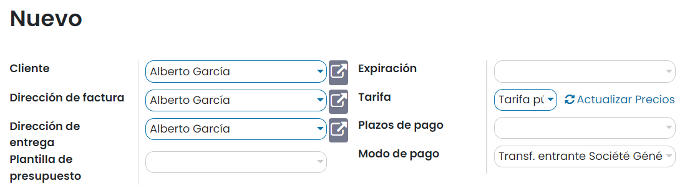
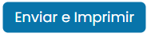
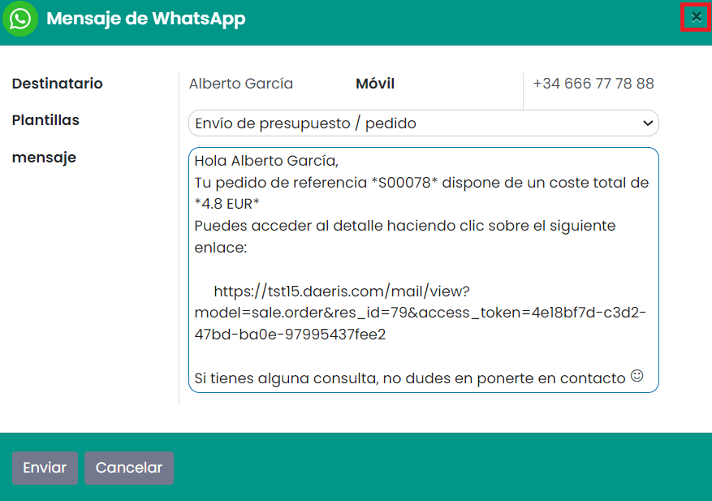
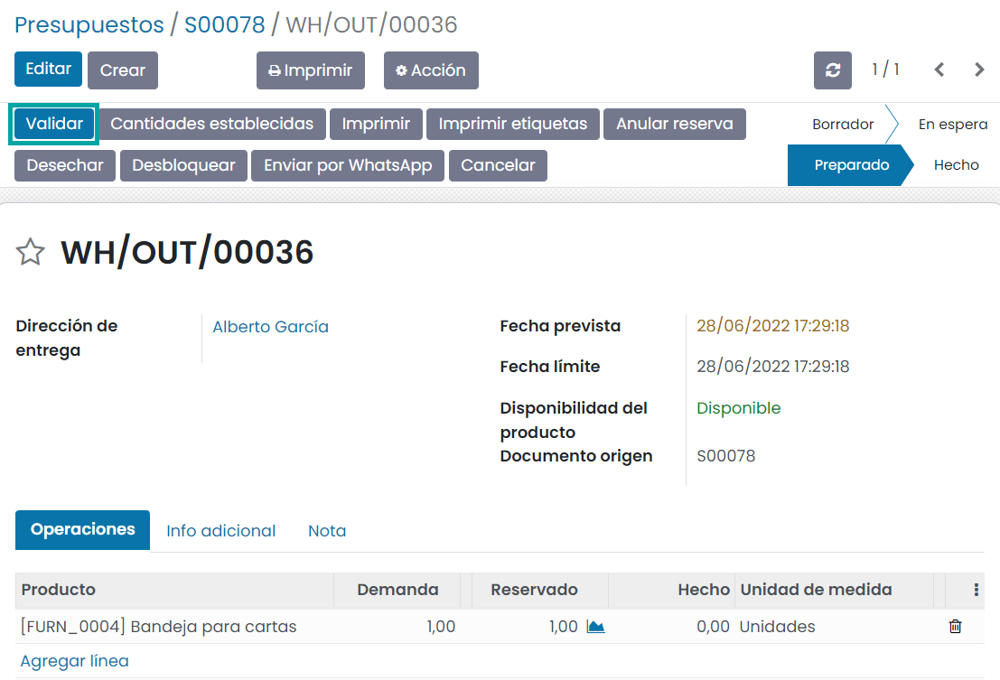

===============
Flujo de ventas
===============

Un **presupuesto de venta** es una oferta formal que se presenta a un cliente para establecer una negociación sobre la
venta de un producto o servicio. Un **pedido de venta** es un presupuesto aceptado por el cliente. Por lo tanto, la
principal diferencia entre un presupuesto y un pedido de venta es el estado en el que se encuentra la negociación (en
trámite o aceptada por el cliente).

.. youtube:: IlvwZ4DrFbE
    :align: right
    :width: 786
    :height: 442

Crear un presupuesto de venta
=============================

Para crear un presupuesto de venta navega a la pantalla :menuselection:`Ventas --> Pedidos --> Presupuestos`, y pulsa el
botón *Crear*:

Al crear un nuevo presupuesto es posible informar los siguientes campos:

-  **Cliente**: Cliente que realiza el pedido.

-  **Dirección de factura**: La información se hereda del cliente.

-  **Dirección de entrega**: La información se hereda del cliente.

-  **Plantilla de presupuesto**: Permite seleccionar la plantilla de presupuesto de entre el listado de plantillas disponibles.

-  **Expiración**: Fecha hasta la que será válido el presupuesto.

-  **Tarifa**: Tarifa con la que se calculará el precio de los productos asociados al presupuesto.

-  **Plazos de pago**: Permite seleccionar de entre los distintos plazos de pago disponibles.

-  **Modo de pago**: Permite seleccionar de entre los distintos modos de pago disponibles.

.. seealso::
   * :ref:`ventas/presupuestos_pedidos/plantillas_presupuestos`
   * :ref:`ventas/presupuestos_pedidos/validez`
   * :doc:`../productos_precios/precios/precios`

En la pestaña de *Líneas del pedido*, sobre cada línea, puedes informar los diferentes productos asociados al presupuesto,
así como la cantidad, el precio, etc. También es posible informar los términos y condiciones del presupuesto, que serán
incluidos en el presupuesto de venta enviado al cliente.

.. seealso::
   * :ref:`ventas/presupuestos_pedidos/terminos`

En la pestaña de *Productos opcionales*, se pueden incorporar líneas opcionales de pedido:

En la pestaña de *Otra información*, es posible incorporar información relacionada con el envío, con la facturación y
con la propia venta:

Una vez completados los campos necesarios, pulsa el botón *Guardar*. Al guardar el presupuesto, se genera un código de
presupuesto que servirá para su posterior seguimiento:

Enviar un presupuesto de venta por correo electrónico
=====================================================

.. seealso::
   * :doc:`../../../varios/correo_electronico/enviar_correos`

Para enviar un presupuesto de venta por correo electrónico, navega a la pantalla :menuselection:`Ventas --> Pedidos --> Presupuestos`,
accede al detalle de un presupuesto y pulsa el botón **Enviar por correo electrónico**:

El sistema abrirá un asistente e informará la plantilla de correo electrónico de presupuestos, anexando el presupuesto
en formato PDF:

Una vez completados los campos necesarios pulsa el botón *Enviar*. Tras hacer esto, el estado del presupuesto cambiará
a *Presupuesto enviado*:

Pasados unos minutos, el cliente recibirá un correo con el presupuesto adjunto en formato PDF.

Confirmar un pedido de venta
============================

Para confirmar un pedido de venta, navega a la pantalla :menuselection:`Ventas --> Pedidos --> Presupuestos` y accede al
detalle de un presupuesto.

Independientemente de la forma de contacto del cliente con el gestor del equipo de ventas, cuando establecen comunicación
y llegan a un acuerdo, el gestor introduce los términos en el presupuesto, informando el precio unitario de cada uno de
los productos a adquirir.

Una vez ha establecido todos los términos sobre el presupuesto, debe confirmar el pedido mediante el botón **Confirmar**:

.. image:: flujo_ventas/confirmar-presupuesto.png
   :align: center
   :alt: Confirmar presupuesto de venta

Esta acción transforma el presupuesto en pedido de venta y genera una orden de entrega pendiente de tramitar, disponible
mediante el botón *Entrega*:

Entregar productos de un pedido de venta
========================================

Para entregar los productos de un pedido de venta, navega a la pantalla :menuselection:`Ventas --> Pedidos --> Pedidos`
y accede al detalle de un pedido. Una vez hayas entregado los productos del pedido, pulsa el botón *Entrega*:

La aplicación navegará al detalle de la entrega del producto. En el detalle de la entrega, pulsa el botón
*Comprobar disponibilidad*, que comprueba la disponibilidad del producto vendido en el almacén:

Si todo ha ido bien, el estado de la entrega cambiará a *Preparado*.

.. note::
   Si no tienes disponibilidad de alguno de los productos a entregar, o si el stock no está actualizado en el sistema,
   realiza las compras, fabricaciones o ajustes de inventario necesarios.

A continuación, pulsa el botón *Validar*:

El sistema solicitará confirmación para procesar todas las cantidades reservadas:

Pulsa el botón *Aplicar*. Tras esto, se actualizará el estado de la entrega a *Hecho*:

Crear la factura de un pedido de venta
======================================

Para crear la factura de un pedido de venta, navega a la pantalla :menuselection:`Ventas --> Pedidos --> Pedidos` y accede
al detalle de un pedido. Sobre el pedido de venta, puedes crear la factura mediante el botón **Crear Factura**:

El sistema permitirá seleccionar los importes a facturar de entre una lista de opciones disponibles:

Una vez seleccionada la opción correspondiente, pulsa el botón *Crear y ver factura*. Esta acción generará un borrador
de factura con los datos del pedido seleccionado:

Una vez revisada la factura, pulsa el botón *Confirmar*:

A continuación, puedes enviar la factura al cliente mediante el botón *Enviar e Imprimir*:

El sistema abrirá un asistente e informará la plantilla de correo electrónico de facturas, anexando la factura en formato PDF:

Una vez completados los campos necesarios pulsa el botón *Enviar e Imprimir*. Tras hacer esto, se realizará el envío del
correo al cliente y se descargará la factura en formato PDF.

Por último, pulsa el botón *Registrar pago*, una vez se hayan realizado los pagos correspondientes:

La aplicación desplegará un formulario donde especificar los detalles del pago:

Una vez completados los campos necesarios, pulsa el botón *Crear pago*.

Si vuelves al detalle del pedido de venta, puedes consultar la factura emitida:

.. seealso::
   * :doc:`../metodo_facturacion/anticipos`

.. _ventas/presupuestos_pedidos/enviar_whatsapp_pedidos_venta:

Enviar un mensaje de WhatsApp en un pedido de venta
===================================================

.. seealso::
   * :doc:`../../../varios/whatsapp`

Es posible enviar un WhatsApp a un cliente desde el formulario de pedidos de venta. Para ello, debes navegar a la
pantalla :menuselection:`Ventas --> Pedidos --> Pedidos`, y acceder al detalle de un pedido.

Desde esta pantalla, aparecerá un botón que permitirá enviar un mensaje de WhatsApp:

.. note::
   El número de teléfono móvil del cliente debe estar informado con formato internacional (por ejemplo, +33123456789).

El sistema desplegará un formulario desde donde podrás redactar el mensaje de WhatsApp o seleccionar una plantilla que
informe el mensaje de forma automática:

.. image:: flujo_ventas/formulario-enviar-whatsapp.png
   :align: center
   :alt: Formulario para enviar WhatsApp en un pedido de venta

Una vez informado el mensaje, debes pulsar el botón *Enviar*.

En caso de estar conectado a la aplicación mediante un dispositivo de escritorio, el sistema tratará de establecer
conexión mediante la aplicación WhatsApp Web, para lo cual, habrá que escanear el código QR mostrado en pantalla, e
iniciar sesión en tu cuenta de WhatsApp.

Por otro lado, en caso de estar conectado a la aplicación mediante un dispositivo móvil, el sistema tratará de enviar
el mensaje mediante la aplicación WhatsApp instalada en el dispositivo.

Una vez enviado el mensaje desde WhatsApp, cierra la ventana del mensaje mediante la cruz ubicada en la parte superior
derecha del formulario:

Reservar un producto sin existencias a un cliente
=================================================

Para reservar un producto del que no se dispone de existencias, genera un nuevo presupuesto desde la pantalla
:menuselection:`Ventas --> Pedidos --> Presupuestos`. Al seleccionar el producto en las líneas del pedido, el sistema
mostrará un mensaje informando de que no se dispone de existencias del producto seleccionado:

Una vez completados los datos del presupuesto, y tras confirmar el pedido, el sistema generará una entrega que se podrá
consultar desde el botón de entregas del formulario del pedido:

Al no disponer de existencias, si pulsas el botón *Comprobar disponibilidad* de la entrega, el sistema no reservará las
cantidades necesarias de producto, impidiendo avanzar en la entrega del producto al cliente:

Si finalmente el producto llega con retraso o no llega, y el cliente decide cancelar el pedido, puedes cancelar la
entrega mediante el botón *Cancelar*:

Del mismo modo, podrás cancelar el pedido mediante el botón *Cancelar*.

Por el contrario, si finalmente recibes las existencias del producto, y vuelves a comprobar la disponibilidad en la
entrega, se realizará la reserva del producto y podrás continuar con el proceso de venta. Para ello, deberás pulsar el
botón *Validar*:

Si todo ha ido bien, la entrega quedará marcada como hecha, cosa que indica que el producto ha sido entregado al cliente
de forma correcta:

