=====================================
Oportunidades de ampliación de ventas
=====================================

En ocasiones, se realiza un presupuesto que es confirmado con el cliente, pero en el momento de la entrega, el cliente
solicita más cantidad de productos de los acordados. Si esta situación ocurre, aparece un descuadre, ya que dispones de
más productos entregados que productos presupuestados. En el momento de realizar la facturación, esta se realizará sobre
el pacto con el cliente (presupuesto), con lo que solo procederá a facturar los productos inicialmente acordados.

Es en este momento (al crear la factura), cuando la aplicación intentará corregir la situación generando una oportunidad
de ampliación de ventas asociada al presupuesto afectado. El gestor deberá corregir el presupuesto, indicando las
cantidades realmente demandas e igualándolas a las entregadas. Posteriormente, podrá realizar una segunda factura sobre
el presupuesto (el sistema ya le habrá incorporado las líneas y cantidades de productos descuadradas) siendo
responsabilidad del gestor, incorporar los precios acordados con el cliente.

.. youtube:: 3u7U-QkNwK8
    :align: right
    :width: 700
    :height: 394

A continuación, se muestra un ejemplo con el flujo a seguir en las oportunidades de ampliación de ventas.

Creación del presupuesto de venta
=================================

En primer lugar, crea y confirma un presupuesto desde la pantalla :menuselection:`Ventas --> Pedidos --> Presupuestos`,
asociándole un producto con una cantidad de 10 unidades:

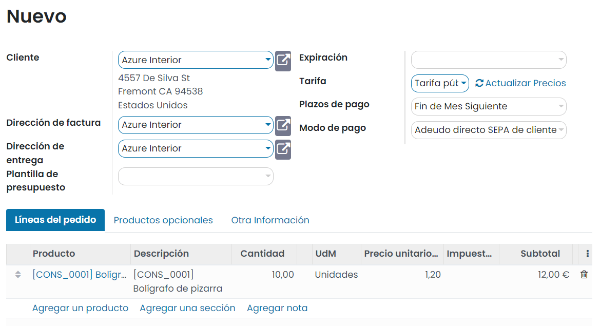

Entrega del pedido
==================

A continuación, navega a la pantalla de entregas del pedido pulsando el botón *Entrega*:

En la pantalla de entregas, comprueba la disponibilidad de los productos a entregar mediante el botón *Comprobar disponibilidad*.

.. note::
   Si hay disponibilidad de los productos, la orden de entrega ya aparecerá pendiente de validar.
   Si no tienes disponibilidad de alguno de los productos a entregar, o si el stock no está actualizado en el sistema,
   realiza las compras, fabricaciones o ajustes de inventario necesarios.

El siguiente paso consiste en registrar las cantidades entregadas. Deberás indicar que has entregado una cantidad
superior a la reservada, por ejemplo, 20 unidades:

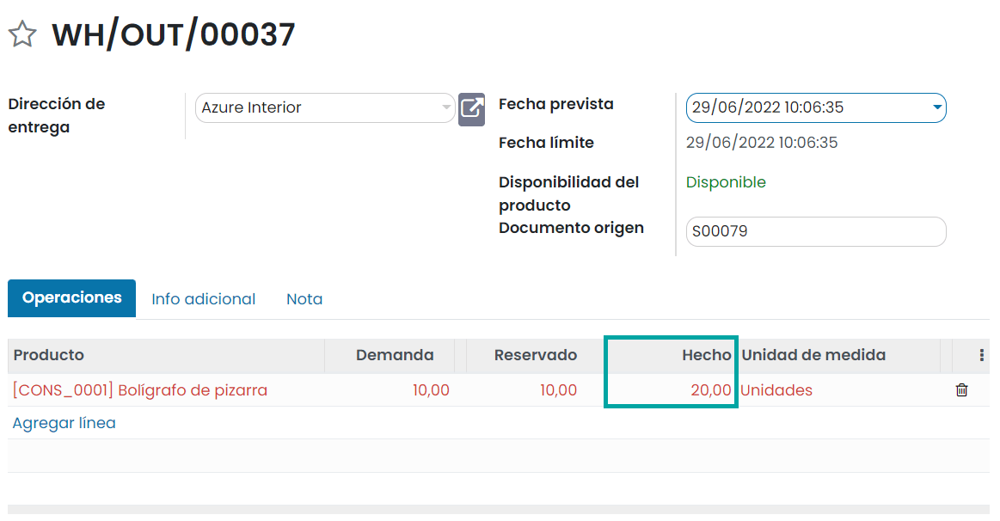

Por último, pulsa el botón *Validar* a nivel de la entrega:

Facturación del pedido de venta
===============================

Una vez el pedido ha sido entregado, crea la factura correspondiente desde el detalle del pedido en la pantalla
:menuselection:`Ventas --> Pedidos --> Pedidos`:

El sistema muestra una ventana en donde poder seleccionar las opciones a facturar:

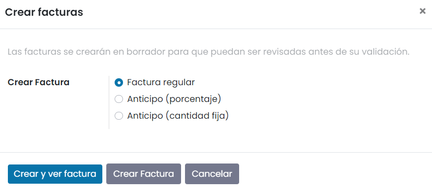

Una vez seleccionada la opción correspondiente, pulsa el botón *Crear y ver factura*. La factura creada se procesa en
base a la cantidad pactada y no a la entregada:

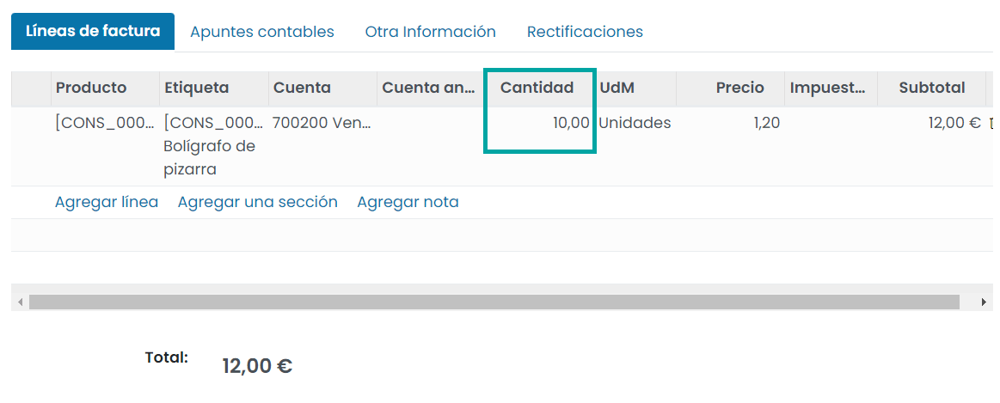

Creación de la oportunidad de ampliación de venta
=================================================

Una vez creada la factura (independientemente de su estado), la aplicación detecta que existe un descuadre (se ha pactado
con el cliente una venta de 10 unidades, y se han entregado 20). En ese momento, la aplicación crea automáticamente una
oportunidad de ampliación de venta y planifica una actividad al comercial. Esta actividad se puede consultar desde el
apartado de *chatter* del formulario del pedido de venta:

Si accedes a la pantalla :menuselection:`Ventas --> A facturar --> Pedidos para aumentar las ventas`, puedes consultar
un listado con todas las oportunidades de ampliación de ventas generadas por el sistema:

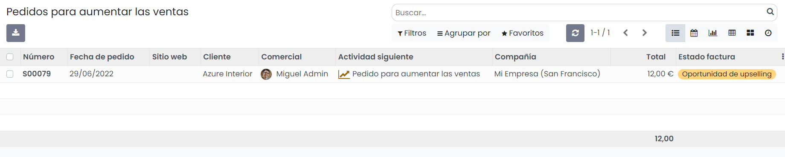

Gestión de la oportunidad de ampliación de venta
================================================

Para gestionar una oportunidad de ampliación de ventas, navega al detalle de la misma, y valida que la cantidad pedida
no se corresponde con la entregada:

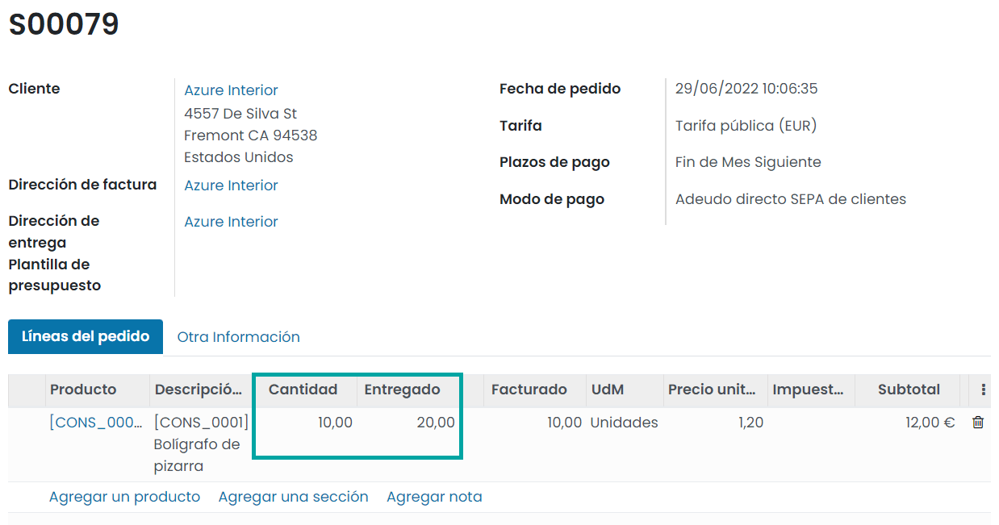

A continuación, edita el pedido y sobre la línea que genera el desajuste, incorpora como cantidad pedida la cantidad
entregada:

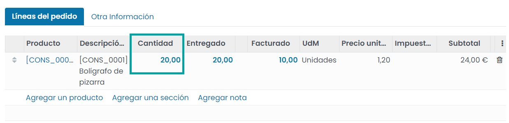

Al guardar el pedido, puedes observar que la cantidad pedida se corresponde con la entregada, pero la cantidad facturada
sigue sin ajustarse. Esto es debido a que todavía no has facturado la cantidad que se ha entregado de más. Para facturar,
pulsa de nuevo el botón *Crear Factura*:

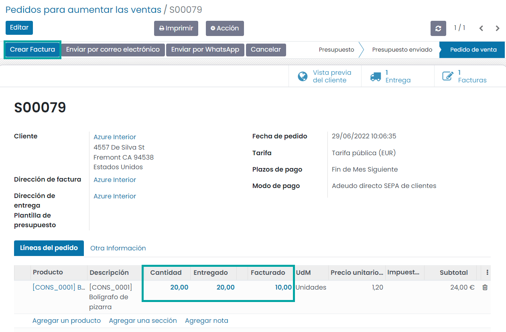

El sistema muestra una ventana en donde poder seleccionar las opciones a facturar. Una vez seleccionada la opción
correspondiente, pulsa el botón *Crear y ver factura*. El sistema navegará a un listado en donde mostrará todas las
facturas asociadas al pedido, incluyendo la factura recién creada.

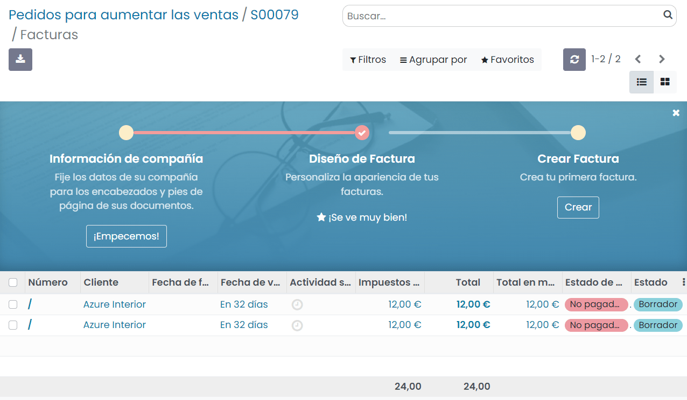

A partir de ese momento, si navegas a la pantalla :menuselection:`Ventas --> A facturar --> Pedidos para aumentar las ventas`,
puedes observar que el registro ya no se encuentra disponible:

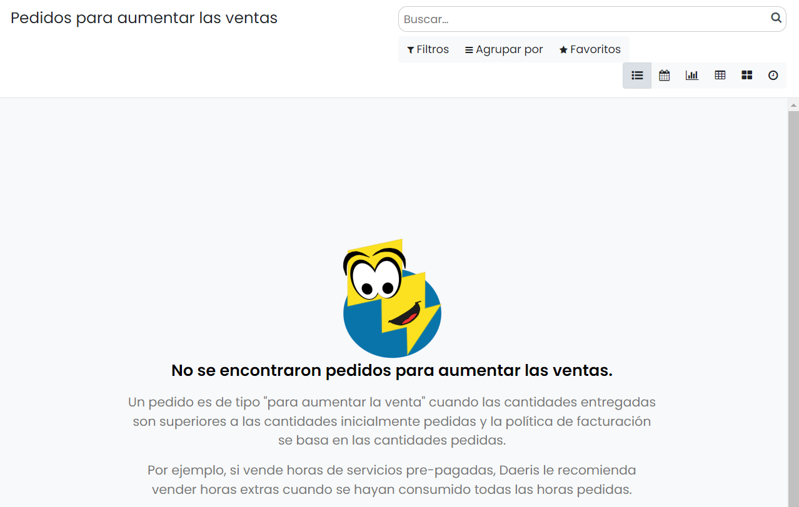

Por último, si accedes al detalle del pedido de venta, puedes observar que dispone de dos facturas asociadas y que la
cantidad pedida, entregada y facturada se encuentra alineada:

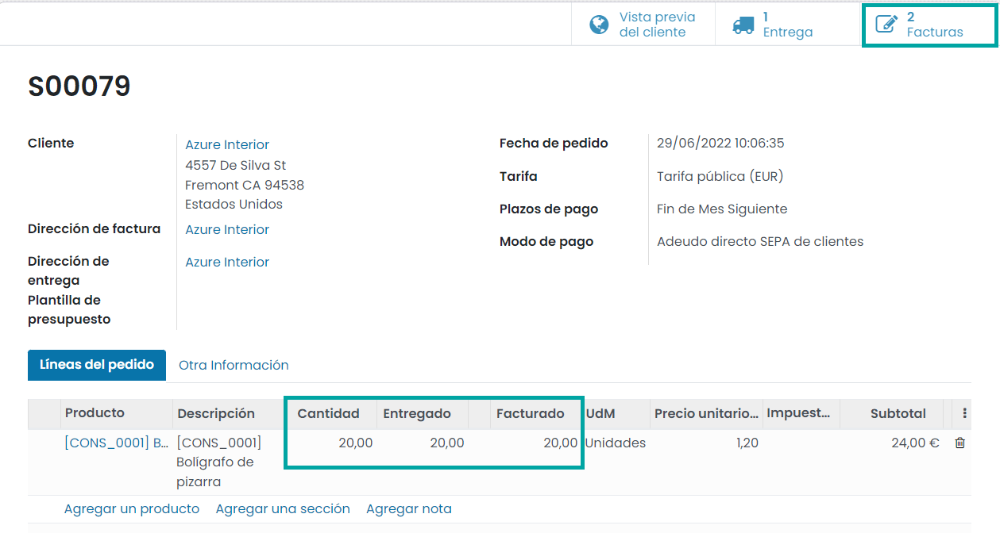