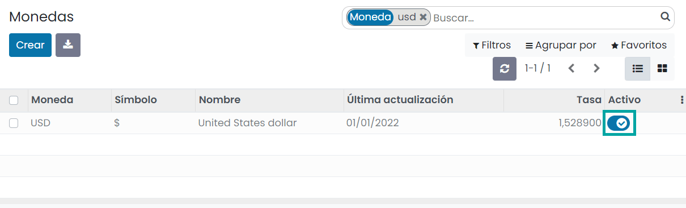
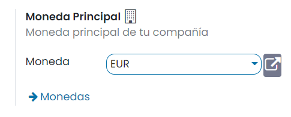
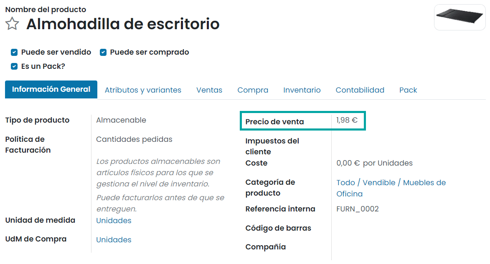
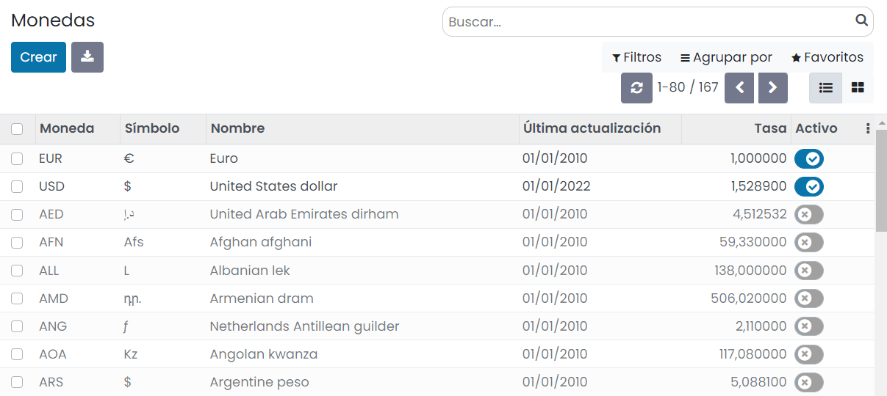
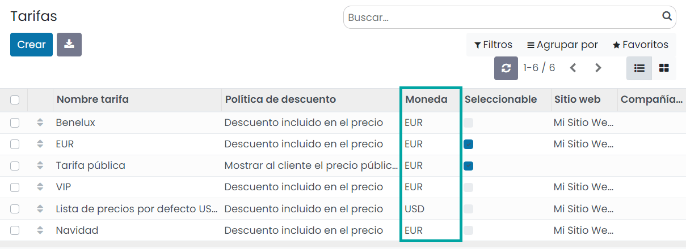
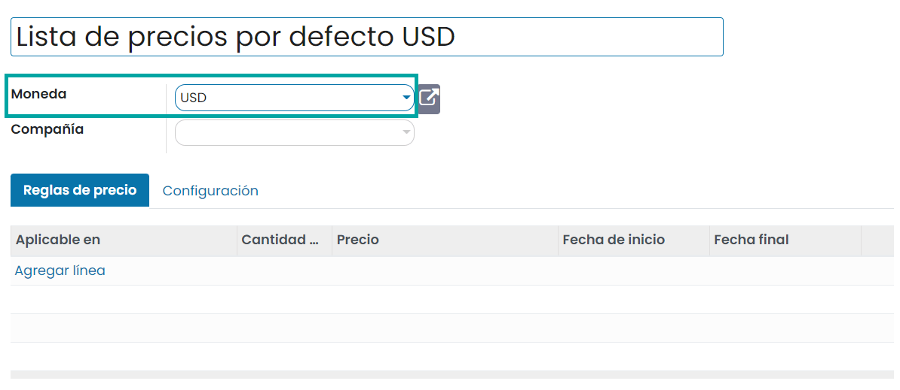
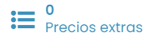
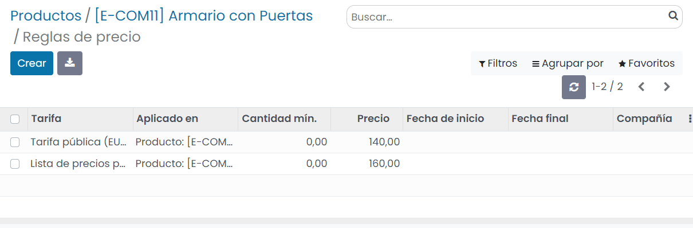

==================================
Cómo vender en monedas extranjeras
==================================

Configuración
=============

Activar una nueva moneda
------------------------

Para activar una nueva moneda, navega a la pantalla :menuselection:`Facturación / Contabilidad --> Configuración --> Monedas`
y haz clic en el botón de activación:

A partir de ese momento aparecerá en las listas desplegables de monedas.

Seleccionar la moneda principal de la compañía
----------------------------------------------

La moneda principal de la compañía se puede seleccionar desde la pantalla :menuselection:`Facturación / Contabilidad --> Configuración --> Ajustes`:

.. note::
   En el desplegable solamente aparecerán las monedas activas.

Conversión automática del precio público
========================================

El precio público de tu empresa se establece en tu moneda principal y se informa en el formulario del producto:

Puedes encontrar los tipos de conversión en :menuselection:`Facturación / Contabilidad --> Configuración --> Monedas`:

Los precios de los productos en divisas diferentes a la moneda principal de la empresa, se actualizan de forma
automática si se cambia el precio público de un producto, en función de la tasa de conversión definida en la pantalla
de administración de monedas.

Establece tus propios precios
=============================

Si prefieres establecer tus propios precios en función de cada una de las monedas activas, navega a la pantalla
:menuselection:`Ventas --> Productos --> Tarifas` y crea distintas tarifas para cada una de las monedas:

Al crear una tarifa o editar una tarifa existente, el sistema navega a la pantalla de detalle, donde será posible
incorporar la moneda que aplicará a la tarifa en cuestión:

Una vez hecho esto, navega al detalle de un producto desde la pantalla :menuselection:`Ventas --> Productos --> Productos`
y pulsa el botón *Precios extras*:

Incorpora la tarifa y el precio sobre el producto. En este caso, el precio del producto es de 140€ en la tarifa en EUR,
pero para la tarifa en USD el precio será de $160:

