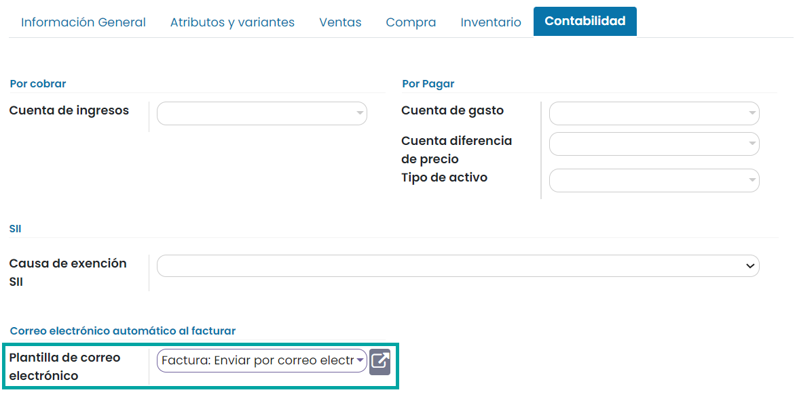

==============
Gestión básica
==============

Configuración
=============

.. _ventas/ventas/productos_precios/productos/unidades_medida:

Vender productos en diferentes unidades de medida
-------------------------------------------------

Una **unidad de medida** es una cantidad estandarizada de una determinada magnitud física, definida y adoptada por
convención o por ley. Cualquier valor de una cantidad física puede expresarse como un múltiplo de la unidad de medida.

Para vender productos en diferentes unidades de medida, navega a la pantalla
:menuselection:`Ventas --> Configuración --> Ajustes` y activa la opción de **Unidades de medida**:

Una vez activado, pulsa el botón *Guardar* de la pantalla de ajustes.

Las unidades de medida de los productos se agrupan en categorías. De este modo, puedes disponer de una categoría (por
ejemplo, peso) que engloba varias unidades de medida (por ejemplo, gramos, kilos o toneladas).

Para gestionar las categorías de las unidades de medida, navega a la pantalla :menuselection:`Ventas --> Configuración --> Categorías de las unidades de medida`.
Por defecto, dispones de las siguientes categorías:

-  Unidad

-  Peso

-  Horario de trabajo

-  Longitud/Distancia

-  Superficie

-  Volumen

Para gestionar las unidades de medida, navega al formulario de detalle de una categoría:

Al editar o crear una nueva unidad de medida, puedes encontrar los siguientes campos:

-  **Unidad de medida**: Nombre de la unidad de medida.

-  **Tipo**: Dispones de las siguientes opciones:

   -  **Unidad de medida de referencia para esta categoría**

   -  **Más pequeña que la unidad de medida de referencia**: Si seleccionas este valor, deberás informar la ratio entre esta
      unidad y la de referencia en el campo *Proporción*.

   -  **Más grande que la unidad de medida de referencia**: Si seleccionas este valor, deberás informar la ratio entre esta
      unidad y la de referencia en el campo *Proporción*.

-  **Precisión de redondeo**: Número máximo de decimales hasta realizar el redondeo.

Una vez hayas configurado las unidades de medida de los productos, al editar un producto desde la pantalla
:menuselection:`Ventas --> Productos --> Productos`, podrás seleccionar las unidades de medida del producto de venta
mediante el campo **Unidad de medida**:

Entregar contenido por correo electrónico
-----------------------------------------

Es posible configurar la aplicación para que se envíe un correo electrónico específico del producto una vez que se confirme
la factura. Al confirmar una factura de venta, se enviará un correo electrónico al cliente basado en una plantilla. El
cliente recibirá un correo electrónico por cada producto vinculado a una plantilla de correo electrónico.

Para configurar esta funcionalidad, navega a la pantalla :menuselection:`Ventas --> Configuración --> Ajustes` y activa
la opción **Entregar Contenido por Correo Electrónico**:

A continuación, pulsa el botón *Guardar* de la pantalla de ajustes.

Para asociar una plantilla a un producto, navega a la pantalla de detalle de un producto desde la vista
:menuselection:`Ventas --> Productos --> Productos`, y haz clic en la pestaña de *Contabilidad*. Informa el campo
**Plantilla de correo electrónico** con la plantilla que quieres que se envíe a los clientes cuando se paque una
factura de venta con este producto asociado:

A partir de ese momento, cada vez que se confirme una factura de cliente que contenga un producto con una plantilla de
correo asociada, se enviará un correo electrónico al cliente utilizando dicha plantilla de correo.

Vender productos empaquetados
-----------------------------

El **empaquetado** es el contenedor físico que protege a tu producto. Por ejemplo, si vendes ordenadores, el empaquetado
contiene el ordenador y los cables de energía.

Para activar esta función, navega a la pantalla :menuselection:`Ventas --> Configuración --> Ajustes` y activa
la opción de **Empaquetados del producto**:

A continuación, pulsa el botón *Guardar* de la pantalla de ajustes.

En Daeris, los empaquetados se utilizan en los pedidos de venta con propósitos informativos. Se pueden configurar dichos
empaquetados en el formulario de detalle de los productos, desde la vista :menuselection:`Ventas --> Productos --> Productos`,
en la pestaña de *Inventario*:

Una vez hecho esto, al crear un presupuesto de venta, será posible informar el empaquetado del producto mediante el
campo **Empaquetado**:

.. note::
   Otro uso útil de los empaquetados es para la recepción de productos. Al escanear el código de barras del empaquetado,
   Daeris agrega el número de unidades contenidas en el empaquetado al inventario.

.. _ventas/ventas/productos_precios/crear_producto_venta:

Crear un producto de venta
==========================

Para crear un producto de venta navega a la pantalla :menuselection:`Ventas --> Productos --> Productos` y pulsa el botón
*Crear*:

Desde el formulario de detalle del producto, para indicar que se trata de un producto de venta, asegúrate de que esté
marcada la opción **Puede ser vendido**:

En la pestaña de *Información General*, puedes definir el precio del producto y los impuestos que se aplicarán al cliente:

Por otro lado, desde la pestaña de *Ventas*, puedes incluir la siguiente información:

-  **Descripción de Ventas**: Nota que aparecerá en los pedidos de venta y en las facturas.

-  **Cantidad mínima de pedido**: En caso de tener informada una cantidad mínima mayor a 1, los presupuestos de venta
   creados para este producto deberán disponer, como mínimo, de las unidades aquí especificadas.

Una vez configurado el producto, pulsa el botón *Guardar*.

A partir de ese momento, ya podrá ser seleccionado al crear un nuevo presupuesto desde la pantalla
:menuselection:`Ventas --> Pedidos --> Presupuestos`:

Utilizar lotes y números de serie en la venta de productos
==========================================================

Si quieres realizar el seguimiento de productos por lotes y números de serie, navega al detalle del producto desde la
pantalla :menuselection:`Ventas --> Productos --> Productos`, y desde la pestaña de *Inventario*, modifica el campo
**Seguimiento**.

En este ejemplo, se modifica un producto para poder hacer seguimiento por número de serie, de manera que cada producto
vendido deberá disponer de un número de serie único:

Por otro lado, se modifica otro producto para poder hacer seguimiento por lotes:

Además, debes asegurarte de que este producto es **Almacenable**, cosa que puedes indicar desde la pestaña de *Información General*:

.. note::
   La diferencia entre números de serie y lotes es, básicamente, que un número de serie solamente puede ser asignado a
   un único producto (una sola cantidad de producto), mientras que un número de lote puede estar asignado a una cierta
   cantidad de producto (varios elementos pertenecen al mismo lote).

A continuación, genera un nuevo presupuesto de venta desde la pantalla :menuselection:`Ventas --> Pedidos --> Presupuestos`.
Selecciona los productos correspondientes y pulsa el botón *Guardar*:

Una vez validado que todos los datos del pedido son correctos, procede a confirmar el pedido mediante el botón
correspondiente. Una vez confirmado el pedido, el sistema genera una entrega del pedido:

.. image:: gestion_basica/entrega-pedido.png
   :align: center
   :alt: Entrega del pedido de venta

La entrega del pedido se puede consultar desde ese mismo botón:

A continuación, registra las cantidades entregadas en cada una de las líneas del pedido y valida la entrega del pedido
mediante el botón *Validar*.

.. note::
   Si alguno de los productos no dispone del número de serie o de lote asociado, el sistema solicitará asignar el
   número antes de proceder con la validación. Esto se puede hacer desde el mismo listado de productos, en la pestaña
   de *Operaciones*, haciendo clic sobre el icono de operaciones detalladas.

Una vez validada la entrega, puedes consultar el informe de trazabilidad desde el botón ubicado en la parte superior
derecha del formulario:

En este informe puedes consultar todos productos vendidos, junto con sus números de lote y de serie:

.. image:: gestion_basica/informe-trazabilidad-entrega-pedido.png
   :align: center
   :alt: Informe de trazabilidad de la entrega del pedido de venta