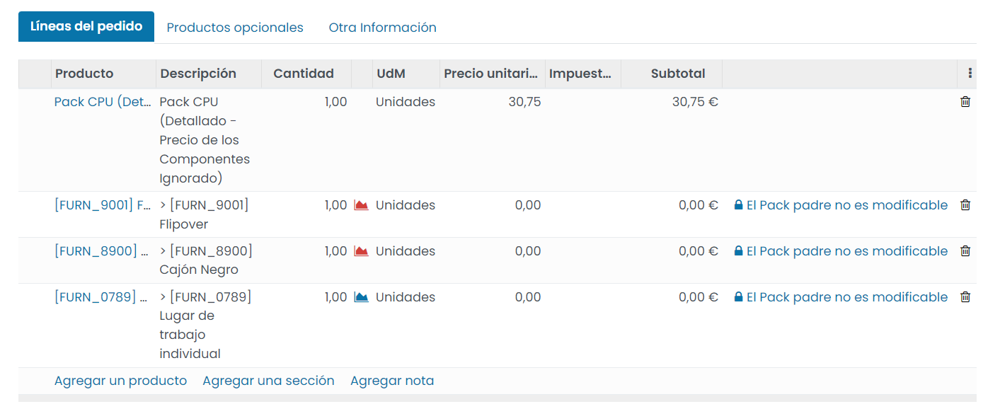

==========================
Crear un pack de productos
==========================

Los **packs de productos** te permiten agrupar varios productos en un pack y ponerlos a la venta de modo conjunto, de
forma que el cliente que adquiere el pack, adquiere todos los productos que lo conforman.

Mediante los packs de productos es posible controlar el stock del propio pack, así como el stock de cada uno de los
productos del pack, de forma que, si vendes packs de productos, estos se restarán del inventario una vez se hayan
completado las transferencias asociadas.

Crear el producto de tipo pack
==============================

Para crear un pack de productos, navega a la pantalla :menuselection:`Ventas --> Productos --> Productos`, y pulsa el
botón *Crear*. El producto debe disponer de la marca *Es un Pack?* informada:

A continuación, establece un nombre para el producto, una imagen, y desde la pestaña de *Información General*, define el
precio del producto y los impuestos que se aplicarán al cliente:

.. image:: pack_productos/informacion-general.png
   :align: center
   :alt: Información general del pack de productos

Desde la pestaña *Pack*, puedes definir la lista de productos asociados al pack, así como la forma de gestionar su precio:

-  **Tipo de Pack**

   -  **Detallado**: Muestra los componentes individualmente en las líneas de los pedidos de venta. Permite seleccionar
      el campo *Precio de los componentes*.

   -  **No detallado**: No muestra los componentes individualmente en las líneas de los pedidos de venta, solo el
      pack de productos. El precio será el precio del pack más la suma de precios de todos los componentes.

-  **Precio de los componentes**

   -  **Detallado por componente**: Mostrará cada componente y su precio, incluyendo el pack de productos en sí mismo
      junto con su precio.

   -  **Totalizado en el producto principal**: Mostrará cada componente pero no mostrará los precios de los componentes.
      El pack de productos será el único que tenga precio y este será su propio precio más la suma de los precios de todos
      los componentes.

   -  **Ignorado**: Mostrará cada componente pero no mostrará los precios de los componentes. El pack de productos será el
      único que tenga precio y este será el precio establecido en el producto de tipo pack.

-  **Pack modificable**: Al marcar esta casilla, será posible editar las líneas de pedidos de venta relativas a sus
   componentes. Esta opción solo se habilita cuando el precio de los componentes es detallado por componente.

-  **Productos del pack**: Listado de productos asociados al pack.

Una vez configurado el pack, pulsa el botón *Guardar*.

Utilizar el pack de productos en un pedido de venta
===================================================

A partir de ese momento, el pack ya podrá ser seleccionado al crear un nuevo presupuesto desde la pantalla
:menuselection:`Ventas --> Pedidos --> Presupuestos`. Una vez seleccionado el pack, guarda el presupuesto para que el
sistema realice las acciones correspondientes al pack en función del tipo de pack y el precio de los componentes definido:

.. note::
   En caso de ser necesario, puedes eliminar el pack de productos de las líneas del pedido y volver a guardar el registro.
   Esto eliminará también el resto de líneas del pedido asociadas al pack.